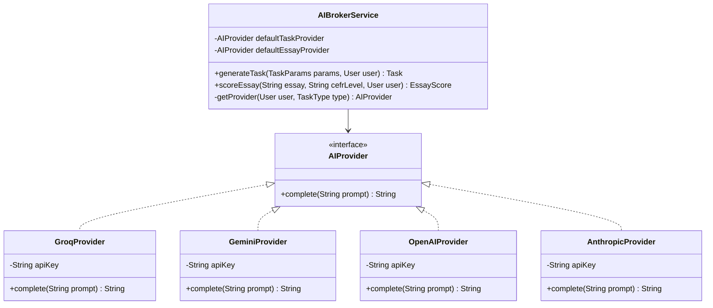
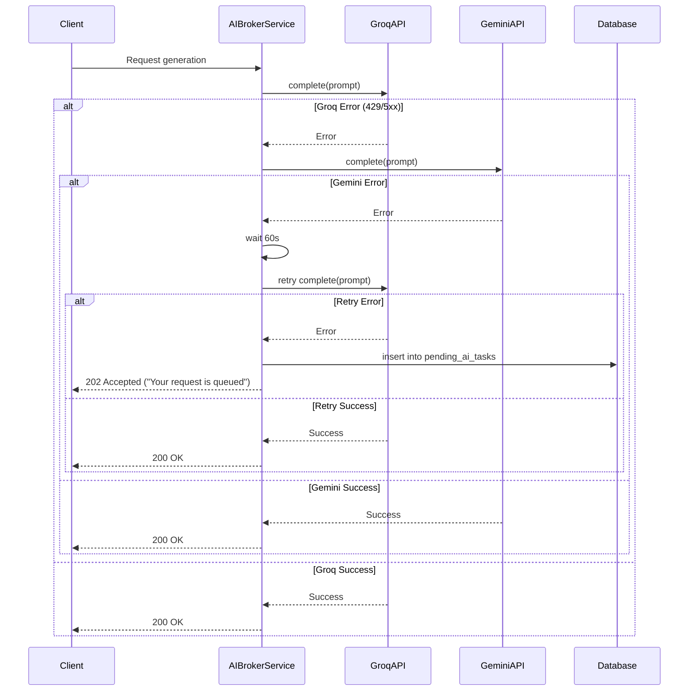
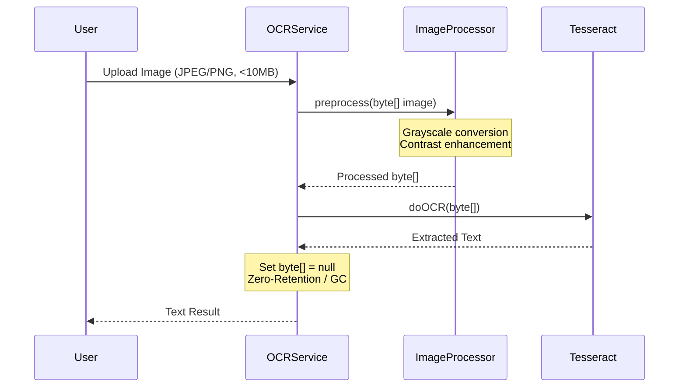

# Lingua Optima: Интеграция ИИ (AI Integration)

> 📚 **Навигация по документации**: [Главный обзор (README.md)](./README.md) | [Backend (BACKEND.md)](./BACKEND.md) | [Frontend (FRONTEND.md)](./FRONTEND.md) | [AI & OCR (AI_INTEGRATION.md)](./AI_INTEGRATION.md) | [DevOps (DEVOPS.md)](./DEVOPS.md) | 📊 **[Открыть презентацию (presentation.html)](./presentation.html)** | 📘 [Doxygen HTML](./generated/html/index.html)

Данный документ описывает архитектуру интеграции искусственного интеллекта для образовательной платформы Lingua Optima.

## Контекст
Платформа использует внешние AI API. Мы не используем self-hosted модели и fine-tuning (бюджет $0).

## AI Provider Strategy
- **Task Generation (grammar exercises):** Groq API → Llama 3.1 70B (free tier: 14,400 req/day)
- **Essay Scoring + Grammar Check:** Google Gemini 1.5 Flash (free tier: 1,500 req/day)
- **OCR:** Tesseract via `tess4j` (local, внутри Java Docker контейнера)
- **User's own key:** Если пользователь предоставляет свой API ключ (OpenAI/Anthropic/Groq/Gemini), система использует его вместо системных ключей.

---

## 1. Архитектура AIBrokerService

Основным компонентом для взаимодействия с LLM является `AIBrokerService`. Он использует интерфейс `AIProvider` с единым методом `complete(String prompt): String`.

Доступны 4 реализации: `GroqProvider`, `GeminiProvider`, `OpenAIProvider`, `AnthropicProvider`.

**Логика выбора провайдера:**
1. Есть пользовательский ключ? → Используем провайдер пользователя.
2. Нет ключа? → Используем системный дефолт (Groq для задач, Gemini для эссе).



---

## 2. Fallback Chain (Цепочка отказоустойчивости)

Критически важный механизм для бесперебойной работы бесплатных тарифов.

**Логика:**
- Groq падает (429/5xx) → пробуем Gemini.
- Gemini падает → ждем 60s и пробуем Groq снова.
- Все падают → добавляем задачу в БД (таблица `pending_ai_tasks`) → возвращаем `202 Accepted` с сообщением "Your request is queued".



---

## 3. Prompt Templates

Точные шаблоны промптов для различных задач.

### Task Generation (Grammar Exercises)
```json
{
  "system": "You are an expert English teacher creating targeted exercises.",
  "prompt": "Generate an English grammar exercise based on the following parameters:\n- CEFR Level: {cefrLevel}\n- Grammar Topic: {grammarTopic}\n- Domain/Context: {domain}\n- Task Type: {taskType}\n- Difficulty: {difficulty}\n- Number of Questions: {numberOfQuestions}\n\nReturn ONLY a valid JSON object with the following structure:\n{\n  \"questions\": [ { \"id\": 1, \"text\": \"...\", \"options\": [\"a\", \"b\", \"c\", \"d\"] } ],\n  \"answerKey\": [ { \"questionId\": 1, \"correctOption\": \"a\", \"explanation\": \"...\" } ]\n}"
}
```

### Essay Scoring
```json
{
  "system": "You are a strict Cambridge/IELTS English examiner.",
  "prompt": "Evaluate the following English essay for a student at the {cefrLevel} level.\n\nEssay:\n{essayText}\n\nEvaluate based on the standard rubric (0-10 scale). Return ONLY a valid JSON object with this structure:\n{\n  \"taskAchievement\": 8.0,\n  \"coherence\": 7.5,\n  \"lexicalResource\": 7.0,\n  \"grammarRange\": 8.5,\n  \"overallScore\": 7.75,\n  \"feedback\": \"Detailed general feedback here...\",\n  \"corrections\": [\n    { \"original\": \"bad sentence\", \"corrected\": \"good sentence\", \"explanation\": \"why it was wrong\" }\n  ]\n}"
}
```

### Grammar Checking (OCR Submissions)
```json
{
  "system": "You are an automated grading assistant.",
  "prompt": "Compare the student's text against the official answer key and score it.\n\nStudent Text: {studentText}\nAnswer Key: {answerKey}\n\nIdentify mistakes, provide corrections, and calculate a score from 0 to 100. Return ONLY a valid JSON object:\n{\n  \"score\": 85,\n  \"errors\": [ { \"type\": \"grammar/spelling\", \"description\": \"...\" } ],\n  \"corrections\": [ { \"original\": \"...\", \"corrected\": \"...\" } ]\n}"
}
```

---

## 4. Стратегия кэширования (Caching Strategy)

Для оптимизации использования бесплатных API применяется кэширование.

- **Redis key:** `ai_cache:{sha256(prompt)}` → хранит JSON response.
- **TTL:** 1 hour.
- **Правила кэширования:**
  - Кэшируем: **Task Generation** (одинаковые параметры порождают идентичные задачи, что приемлемо для разных пользователей).
  - НЕ кэшируем: **Essay Scoring** (каждое эссе уникально, оценка должна быть индивидуальной).

```mermaid
flowchart TD
    A[Request Task Generation] --> B{Calculate SHA256 of Prompt}
    B --> C[Check Redis key: ai_cache:{hash}]
    C -->|Cache Hit| D[Return Cached JSON]
    C -->|Cache Miss| E[Call AIProvider.complete()]
    E --> F[Save JSON to Redis TTL 1h]
    F --> G[Return JSON]
```

---

## 5. Rate Limiting (Ограничение запросов)

Управление лимитами состоит из нескольких уровней:

- **Per-user limit (Redis):** Хранится в ключе `rate_limit:{userId}:ai`, представляет собой счетчик с `TTL=24h`.
- **Ограничения бесплатного тарифа (PostgreSQL):** Пользователям на free tier доступно только 10 проверок (evaluations) в неделю. Отслеживается через таблицу `usage_counters` в БД, а не в Redis.
- **System-level limits:** Системные квоты Groq и Gemini отслеживаются отдельно для предотвращения глобального бана.
- **Реакция на превышение лимита:** При достижении квоты выбрасывается `QuotaExceededException`, которое транслируется в HTTP код `429 Too Many Requests` и вызывает отображение `UpgradeWall` на frontend-е.

---

## 6. OCR Pipeline (Tesseract)

OCR для распознавания выполненных письменных работ.

- **Библиотека:** `tess4j` (Java wrapper для Tesseract).
- **Архитектура:** НЕ микросервис на Python. Модуль интегрирован непосредственно в единый Java Docker контейнер.
- **Image Preprocessing:** Конвертация в grayscale, улучшение контрастности (contrast enhancement).
- **Zero-Retention policy:** Изображение хранится как `byte[]` в RAM → обрабатывается → ссылка обнуляется (`null`) → очищается Garbage Collector-ом (GC).
- **Обработка ошибок:** Выбрасывается `OcrException` с понятными пользователю сообщениями (например, "Изображение размыто", "Слишком темно", "Неподдерживаемый формат").
- **Поддерживаемые форматы:** JPEG, PNG.
- **Максимальный размер файла:** 10MB.



---

## 7. Adaptive Algorithm (CAT)

Компьютерное адаптивное тестирование (Computer Adaptive Testing) для автоматической подстройки сложности вопросов под уровень пользователя.

- **Initial difficulty:** MEDIUM (2)
- **Correct answer:** difficulty += 1 (максимум 4 = EXPERT)
- **Wrong answer:** difficulty -= 1 (минимум 1 = EASY), ошибка записывается для соответствующего топика грамматики.
- **Завершение сессии:** После 10 вопросов сессия завершается и рассчитывается взвешенный балл.
- **Mastery score formula:** `(sum of correctly_answered_difficulty_levels) / (sum of all_difficulty_levels)`

```mermaid
flowchart TD
    A[Start Session] --> B[Set Difficulty = MEDIUM 2]
    B --> C[Ask Question]
    C --> D{Is Answer Correct?}
    D -- Yes --> E[Difficulty = min(Difficulty + 1, 4)]
    D -- No --> F[Difficulty = max(Difficulty - 1, 1)]
    F --> G[Record Error for Topic]
    E --> H{Questions Answered == 10?}
    G --> H
    H -- No --> C
    H -- Yes --> I[Calculate Mastery Score]
    I --> J[End Session]
```

---

## 8. CEFR Auto-Leveling (Автоматическое повышение уровня)

Система может автоматически предлагать пользователю повысить уровень владения языком.

- **Trigger:** Срабатывает после каждого отправленного задания (submission).
- **Check:** Условие выполняется, если 80%+ грамматических топиков текущего уровня CEFR имеют показатель `mastery >= 0.85`.
- **Action:** Отправляется уведомление "Ready to level up?". Если пользователь подтверждает, выполняется запрос: `UPDATE users SET cefr_level = next`.
- **Cooldown:** Если пользователь отказался, предложение не повторяется в течение 7 дней.

---

## 9. Детали рубрикатора эссе (Essay Rubric Details)

Оценка эссе базируется на стандартах IELTS/Cambridge assessment. Каждый критерий оценивается по шкале 0-10.

- **Task Achievement (0-10):** Насколько полно эссе раскрывает заданную тему?
- **Coherence & Cohesion (0-10):** Логика повествования, разбиение на абзацы, использование слов-связок (linking words).
- **Lexical Resource (0-10):** Разнообразие словарного запаса, его точность и соответствие заявленному уровню CEFR.
- **Grammatical Range & Accuracy (0-10):** Разнообразие грамматических конструкций и частота ошибок.
- **Overall Score:** Взвешенное среднее по всем критериям оценки.
