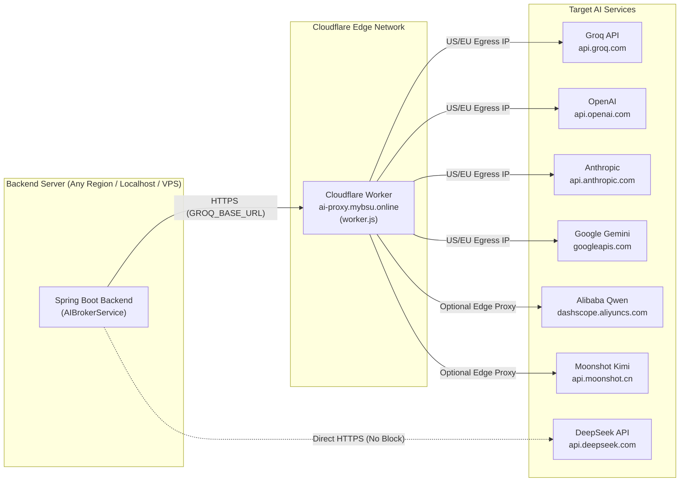
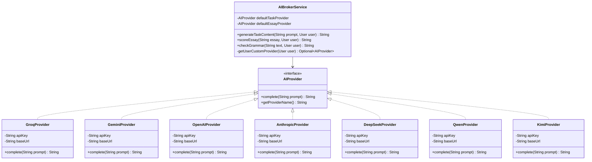
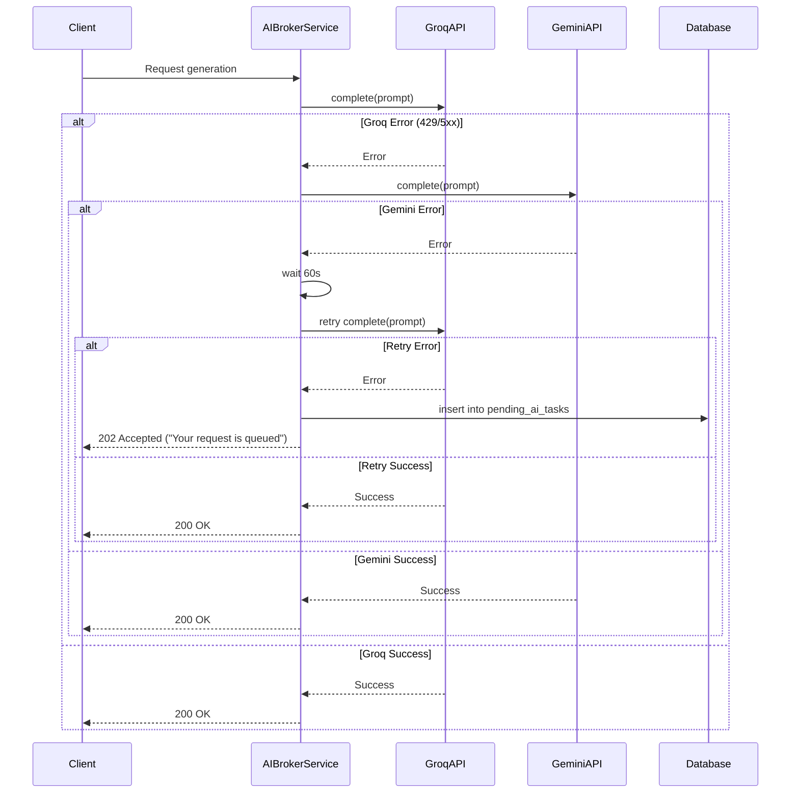
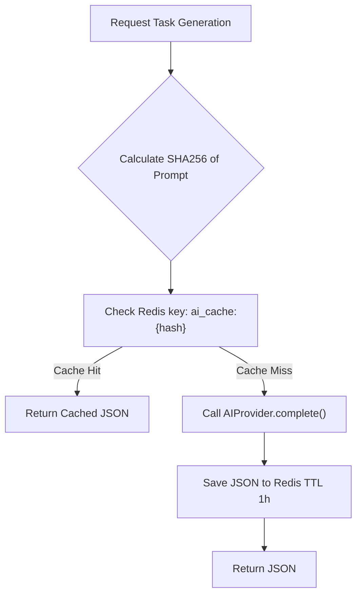
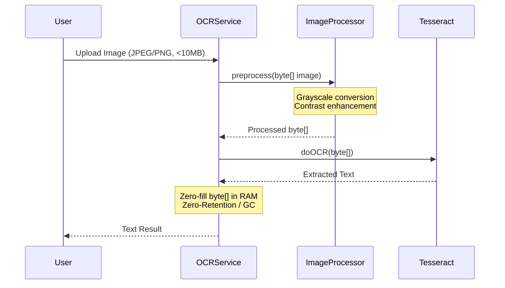
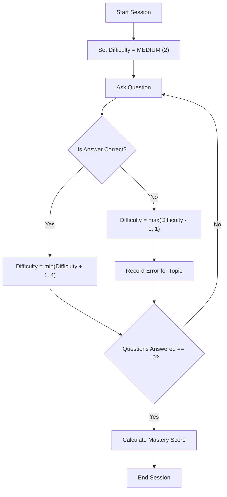

# Lingua Optima: AI Integration Documentation

> 📚 **Documentation Navigation**: [Main Overview (README.md)](./README.md) | [Backend (BACKEND.md)](./BACKEND.md) | [Frontend (FRONTEND.md)](./FRONTEND.md) | [AI & OCR (AI_INTEGRATION.md)](./AI_INTEGRATION.md) | [DevOps (DEVOPS.md)](./DEVOPS.md) | 📊 **[Open Presentation (presentation.html)](./presentation.html)** | 📘 [Doxygen HTML](index.html)

This document describes the artificial intelligence and OCR integration architecture for the Lingua Optima educational platform.

## Context
The platform leverages external AI APIs. We do not use self-hosted models or fine-tuning ($0 infrastructure budget).

## AI Provider Strategy
- **Task Generation (grammar exercises):** Groq API → Llama 3.1 70B (free tier: 14,400 req/day, proxied via Cloudflare Edge to bypass Cloudflare GeoIP restrictions).
- **Essay Scoring + Grammar Check:** Google Gemini 1.5 Flash (free tier: 1,500 req/day, direct or proxied).
- **OCR:** Tesseract via `tess4j` (local in-memory zero-retention execution inside Java container).
- **User's own key (BYOK):** Supports 7 distinct providers:
  - **Western Providers:** OpenAI (`gpt-4o-mini`), Anthropic (`claude-3-5-sonnet`), Groq (`llama-3.1-70b`), Google Gemini (`gemini-1.5-flash`).
  - **Chinese Providers (No Geo-blocks for RU/BY):**
    - **DeepSeek** (`deepseek-chat` / DeepSeek-V3 & `deepseek-reasoner` / R1): Direct access without VPN from RU/BY, state-of-the-art reasoning, ultra-low cost (~$0.14/1M tokens).
    - **Alibaba Qwen (DashScope)** (`qwen-plus` / `qwen-turbo` / `qwen-max`): Full OpenAI compatibility, high throughput.
    - **Moonshot Kimi** (`moonshot-v1-8k` / `32k` / `128k`): Exceptional long-context comprehension.

---

## 1. Cloudflare Edge Reverse-Proxy Architecture

To guarantee high availability and bypass regional geo-blocking (e.g. Cloudflare GeoIP blocks affecting Groq in certain countries or host IP restrictions on OpenAI/Anthropic), Lingua Optima integrates a **dedicated Cloudflare Worker reverse-proxy** (`cloudflare-proxy/worker.js` bound to `ai-proxy.mybsu.online` or `*.workers.dev`).

### Proxy Routing Table

| Local Provider Route | Upstream Provider API | .env Parameter | Default Value |
| :--- | :--- | :--- | :--- |
| `https://ai-proxy.mybsu.online/groq/*` | `https://api.groq.com/*` | `GROQ_BASE_URL` | `https://api.groq.com/openai/v1` |
| `https://ai-proxy.mybsu.online/gemini/*` | `https://generativelanguage.googleapis.com/*` | `GEMINI_BASE_URL` | `https://generativelanguage.googleapis.com` |
| `https://ai-proxy.mybsu.online/openai/*` | `https://api.openai.com/*` | `OPENAI_BASE_URL` | `https://api.openai.com/v1` |
| `https://ai-proxy.mybsu.online/anthropic/*` | `https://api.anthropic.com/*` | `ANTHROPIC_BASE_URL` | `https://api.anthropic.com/v1` |
| `https://ai-proxy.mybsu.online/deepseek/*` | `https://api.deepseek.com/*` | `DEEPSEEK_BASE_URL` | `https://api.deepseek.com` |
| `https://ai-proxy.mybsu.online/qwen/*` | `https://dashscope-intl.aliyuncs.com/*` | `QWEN_BASE_URL` | `https://dashscope-intl.aliyuncs.com/compatible-mode/v1` |
| `https://ai-proxy.mybsu.online/kimi/*` | `https://api.moonshot.cn/*` | `KIMI_BASE_URL` | `https://api.moonshot.cn/v1` |

### Proxy Topology & Security Mechanics

1. **Origin IP Sanitization:** The Cloudflare Worker explicitly strips origin client headers (`cf-connecting-ip`, `x-real-ip`, `x-forwarded-for`).
2. **Egress IP Geolocation:** Outbound requests originate from Cloudflare's US/EU data center edge IPs.
3. **Zero Retention:** The proxy does not log request payloads or API keys; transactions stream ephemerally through RAM.



---

## 2. AIBrokerService Architecture

The central component for interacting with Large Language Models is `AIBrokerService`. It relies on the `AIProvider` interface exposing a single unified method `complete(String prompt): String`.

Seven provider implementations are available: `GroqProvider`, `GeminiProvider`, `OpenAIProvider`, `AnthropicProvider`, `DeepSeekProvider`, `QwenProvider`, and `KimiProvider`.

**Provider Selection Logic:**
1. Does the user have a custom API key configured? → Route to the user's configured provider (AES-256-GCM decrypted at runtime).
2. No custom key? → Route to the system default provider (Groq for task generation, Gemini for essay scoring).



---

## 2. Fallback Chain (Resilience Pipeline)

A critical resilience mechanism ensuring uninterrupted service on free-tier API quotas.

**Execution Logic:**
- Groq fails (HTTP 429 / 5xx) → automatically fall back to Gemini.
- Gemini fails → wait 60s and retry Groq once more.
- All providers fail → persist the request in the database (`pending_ai_tasks` table) → return `202 Accepted` with the message `"Your request is queued"`.



---

## 3. Prompt Templates

Exact structured prompt templates used across AI evaluation workflows.

### Task Generation (Grammar Exercises)
```json
{
  "system": "You are an expert English teacher creating targeted exercises.",
  "prompt": "Generate an English grammar exercise based on the following parameters:\n- CEFR Level: {cefrLevel}\n- Grammar Topic: {grammarTopic}\n- Domain/Context: {domain}\n- Task Type: {taskType}\n- Difficulty: {difficulty}\n- Number of Questions: {numberOfQuestions}\n\nReturn ONLY a valid JSON object with the following structure:\n{\n  \"questions\": [ { \"id\": 1, \"text\": \"...\", \"options\": [\"a\", \"b\", \"c\", \"d\"] } ],\n  \"answerKey\": [ { \"questionId\": 1, \"correctOption\": \"a\", \"explanation\": \"...\" } ]\n}"
}
```

### Essay Scoring
```json
{
  "system": "You are a strict Cambridge/IELTS English examiner.",
  "prompt": "Evaluate the following English essay for a student at the {cefrLevel} level.\n\nEssay:\n{essayText}\n\nEvaluate based on the standard rubric (0-10 scale). Return ONLY a valid JSON object with this structure:\n{\n  \"taskAchievement\": 8.0,\n  \"coherence\": 7.5,\n  \"lexicalResource\": 7.0,\n  \"grammarRange\": 8.5,\n  \"overallScore\": 7.75,\n  \"feedback\": \"Detailed general feedback here...\",\n  \"corrections\": [\n    { \"original\": \"bad sentence\", \"corrected\": \"good sentence\", \"explanation\": \"why it was wrong\" }\n  ]\n}"
}
```

### Grammar Checking (OCR Submissions)
```json
{
  "system": "You are an automated grading assistant.",
  "prompt": "Compare the student's text against the official answer key and score it.\n\nStudent Text: {studentText}\nAnswer Key: {answerKey}\n\nIdentify mistakes, provide corrections, and calculate a score from 0 to 100. Return ONLY a valid JSON object:\n{\n  \"score\": 85,\n  \"errors\": [ { \"type\": \"grammar/spelling\", \"description\": \"...\" } ],\n  \"corrections\": [ { \"original\": \"...\", \"corrected\": \"...\" } ]\n}"
}
```

---

## 4. Caching Strategy

To optimize usage of free-tier LLM APIs, content-addressable caching is applied.

- **Redis key:** `ai_cache:{sha256(prompt)}` → stores the serialized JSON response.
- **TTL:** 1 hour.
- **Caching Rules:**
  - **Cached:** **Task Generation** (identical parameters produce reusable exercises suitable across different users).
  - **NOT Cached:** **Essay Scoring** (every student essay is unique and requires individualized evaluation).



---

## 5. Rate Limiting

Rate limiting and quota enforcement operate across multiple tiers:

- **Per-user limit (Redis):** Stored under the key `rate_limit:{userId}:ai` as an atomic counter with `TTL = 24h`.
- **Free-tier weekly limits (PostgreSQL):** Users on the `FREE` tier receive 10 AI evaluations and 3 OCR uploads per week. Tracked persistently via the `usage_counters` table in PostgreSQL rather than volatile Redis keys.
- **System-level limits:** Global quotas for Groq and Gemini are monitored to prevent upstream rate-limit bans.
- **Quota Exceeded Behavior:** When a user's quota is exhausted, `QuotaExceededException` is thrown, translated into HTTP `429 Too Many Requests`, and triggers the `UpgradeWall` modal on the frontend.

---

## 6. OCR Pipeline (Tesseract)

Optical Character Recognition pipeline for grading handwritten homework photos.

- **Library:** `tess4j` (Java JNA wrapper for native Tesseract OCR).
- **Architecture:** NOT a separate Python microservice. The OCR engine is integrated directly inside the single Java backend container.
- **Image Preprocessing:** Grayscale conversion and contrast enhancement prior to recognition.
- **Zero-Retention Policy:** Uploaded image bytes are held strictly as a `byte[]` buffer in RAM → processed → explicitly overwritten with zeros (`Arrays.fill(bytes, (byte) 0)`) inside a `finally` block → reclaimed by the Garbage Collector (GC).
- **Error Handling:** Throws `OcrException` with clear, user-facing diagnostics (e.g., `"Image is blurry"`, `"Image is too dark"`, `"Unsupported image format"`).
- **Supported Formats:** JPEG, PNG.
- **Maximum File Size:** 10MB.



---

## 7. Adaptive Algorithm (CAT)

Computerized Adaptive Testing (CAT) dynamically adjusts question difficulty in real time to match the learner's proficiency level.

- **Initial difficulty:** MEDIUM (2)
- **Correct answer:** `difficulty += 1` (capped at maximum 4 = EXPERT)
- **Wrong answer:** `difficulty -= 1` (floored at minimum 1 = EASY), and an error is recorded for the corresponding grammar topic.
- **Session completion:** After 10 questions, the session concludes and a difficulty-weighted mastery score is calculated.
- **Mastery score formula:** `(sum of correctly_answered_difficulty_levels) / (sum of all_difficulty_levels)`



---

## 8. CEFR Auto-Leveling

The system automatically recommends advancing to the next CEFR proficiency level when a student demonstrates consistent mastery.

- **Trigger:** Evaluated automatically after each completed submission.
- **Condition:** Triggered when all grammar topics in the student's current CEFR level reach `mastery >= 80%`.
- **Action:** Dispatches a `"Ready to level up?"` notification. If the student accepts, their profile is upgraded (`UPDATE users SET cefr_level = next`).
- **Cooldown:** If the student declines or dismisses the prompt, the recommendation is suppressed for 7 days.

---

## 9. Essay Rubric Details

Essay evaluation is modeled after official IELTS and Cambridge English assessment standards. Each criterion is scored on a 0–10 scale:

- **Task Achievement (0–10):** How thoroughly and accurately does the essay address the prompt?
- **Coherence & Cohesion (0–10):** Logical progression of ideas, paragraphing, and effective use of cohesive devices (linking words).
- **Lexical Resource (0–10):** Breadth, precision, and register appropriateness of vocabulary relative to the target CEFR level.
- **Grammatical Range & Accuracy (0–10):** Variety of complex syntactic structures and error-free sentence production.
- **Overall Score:** Weighted average across all four rubric criteria.
