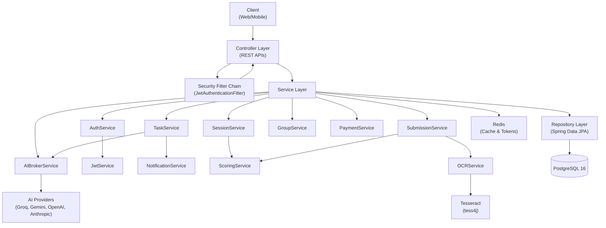
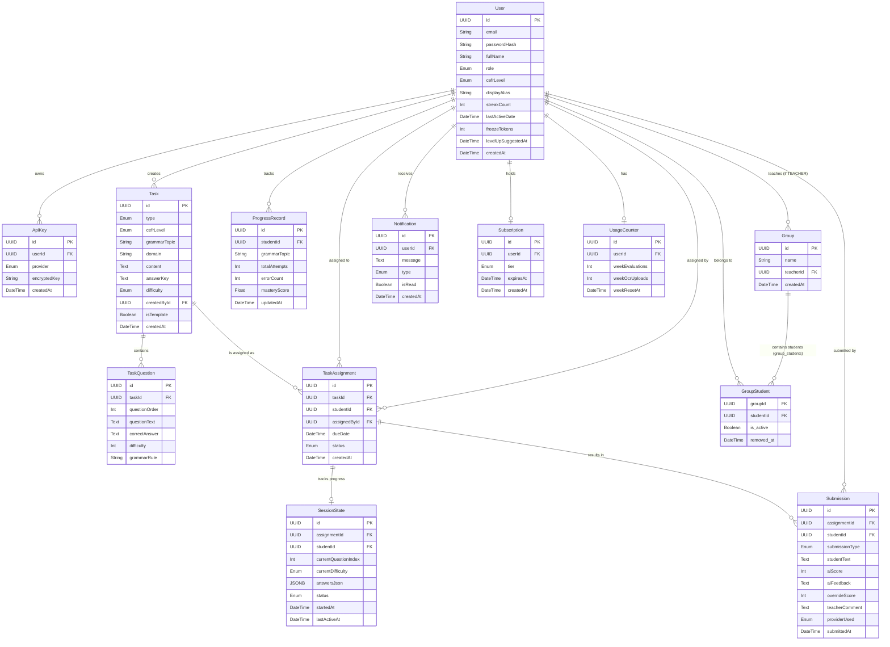
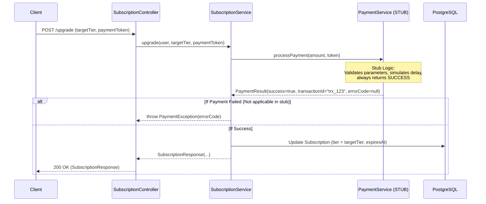
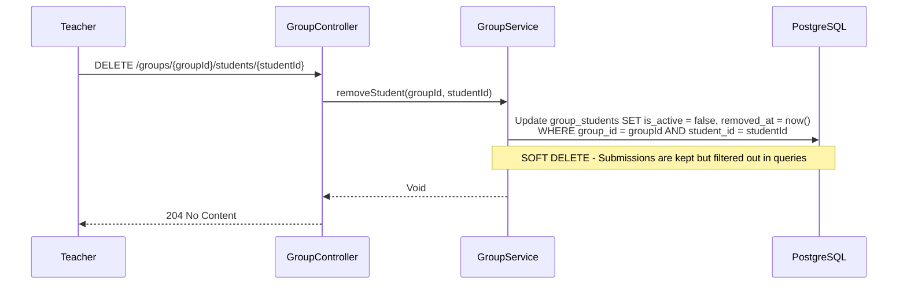

# Lingua Optima: Backend Documentation

> 📚 **Documentation Navigation**: [Main Overview (README.md)](./README.md) | [Backend (BACKEND.md)](./BACKEND.md) | [Frontend (FRONTEND.md)](./FRONTEND.md) | [AI & OCR (AI_INTEGRATION.md)](./AI_INTEGRATION.md) | [DevOps (DEVOPS.md)](./DEVOPS.md) | 📊 **[Open Presentation (presentation.html)](./presentation.html)** | 📘 [Doxygen HTML](index.html)

This is a comprehensive guide to the server-side (Backend) architecture of the Lingua Optima platform — an AI-powered English language mastery service.

## Tech Stack
- **Java 21**
- **Spring Boot 3**
- **Spring Security (JWT)**
- **Spring Data JPA (Hibernate)**
- **PostgreSQL 16**
- **Redis 7**

---

## Key Design Decisions

> **IMPORTANT:** The following architectural decisions are strictly enforced across the system.

1. **NO global leaderboard.** Only an intra-group leaderboard within a specific teacher's student group is provided.
2. **Soft delete from group.** When a student is removed from a group, the teacher can NO LONGER view their historical submissions (they are hidden from group queries). However, if the student is later re-added to the same group, their submission history is RESTORED and becomes visible again. Soft deletion is implemented via the `group_students` table columns `is_active` and `removed_at`.
3. **Payment is a MOCK STUB.** All surrounding billing logic operates end-to-end (error handling infrastructure, subscription tiers, upgrades/downgrades), while the actual payment processor (`PaymentService` stub) always returns a successful status (`success`). This is designed for testing. Error codes (`PAYMENT_FAILED`, `CARD_DECLINED`, `INSUFFICIENT_FUNDS`, `EXPIRED_CARD`, `NETWORK_ERROR`, `PROVIDER_ERROR`) are fully supported by the exception and response pipeline, though the stub never returns them in normal execution.
4. **Subscription tiers:**
    - `FREE`: 10 evaluations/week, 3 OCR uploads/week.
    - `PREMIUM`: unlimited evaluations and OCR uploads, all CEFR levels, priority queue.
    - `EDUCATOR`: everything in Premium + student groups up to 200 members, task deployment, manual grade overrides, report exports, and API key access.
5. **Self-service tasks:** When a student independently generates a task for themselves, the system automatically creates a `TaskAssignment` entity with the `assigned_by` field pointing to the student themselves (self-assignment).
6. **Session resume:** `GET /api/sessions/active` returns the user's current unfinished adaptive testing session (if one exists).
7. **OCR error handling:** `OcrException` is translated into an HTTP 422 response with a clear, user-friendly diagnostic message.
8. **Zero-Retention OCR:** Uploaded image bytes are processed exclusively in volatile memory (RAM) and are never persisted to disk.
9. **AI keys encryption:** User-supplied BYOK AI provider keys are encrypted using AES-256-GCM before being persisted to the database.
10. **JWT configuration:** The access token is valid for 15 minutes. The refresh token is valid for 30 days (stored in an `HttpOnly` cookie), and its SHA-256 hash is stored in Redis to support immediate server-side revocation.

---

## Complete File Structure

```text
backend/
├── build.gradle
├── settings.gradle
├── Dockerfile
├── src/main/java/com/linguaoptima/api/
│   ├── LinguaOptimaApplication.java
│   │
│   ├── config/
│   │   ├── SecurityConfig.java        — Spring Security filter chain, CORS, CSRF disabled, JWT filter registration
│   │   ├── JwtAuthenticationFilter.java — OncePerRequestFilter: extracts Bearer token, validates, sets SecurityContext
│   │   ├── RedisConfig.java           — RedisTemplate, connection factory, serializers
│   │   ├── CorsConfig.java            — Allowed origins (localhost:5173 dev, production domain)
│   │   ├── SchedulingConfig.java      — @EnableScheduling
│   │   └── WebConfig.java             — Multipart file size limit (10MB)
│   │
│   ├── controller/
│   │   ├── AuthController.java        — POST /register, /login, /google, /refresh, /logout, /logout-all, /forgot-password
│   │   ├── UserController.java        — GET /me, PUT /me, PUT /me/password, DELETE /me (GDPR)
│   │   ├── TaskController.java        — POST /generate, /preview, /{id}/assign, /template; GET / (list), /{id}
│   │   ├── SessionController.java     — POST /start; GET /active, /{id}/next-question; POST /{id}/answer, /{id}/complete
│   │   ├── SubmissionController.java  — POST /text, /image; GET /{id}, /my; PUT /{id}/override
│   │   ├── GroupController.java       — GET /, /{id}; POST /; POST /{id}/students; DELETE /{id}/students/{uid}, /{id}
│   │   ├── ProgressController.java    — GET /me, /student/{id}, /group/{id}
│   │   ├── NotificationController.java — GET /stream (SSE), /unread-count; PATCH /{id}/read
│   │   ├── SubscriptionController.java — GET /me; POST /upgrade, /downgrade; GET /usage
│   │   ├── ApiKeyController.java      — GET /, POST /, DELETE /{id}
│   │   ├── LeaderboardController.java — GET /group/{groupId} (group-only leaderboard, NO global)
│   │   └── ExportController.java      — GET /report/group/{id}, /report/student/{id}
│   │
│   ├── dto/
│   │   ├── request/
│   │   │   ├── RegisterRequest.java    — email, password, fullName, role
│   │   │   ├── LoginRequest.java       — email, password
│   │   │   ├── GoogleAuthRequest.java  — credential, role
│   │   │   ├── TaskParamsRequest.java  — cefrLevel, grammarTopic, domain, taskType, difficulty
│   │   │   ├── AssignTaskRequest.java  — groupIds[], dueDate
│   │   │   ├── TextSubmissionRequest.java — text, assignmentId, type (GRAMMAR/ESSAY)
│   │   │   ├── OverrideRequest.java    — overrideScore, teacherComment
│   │   │   ├── AnswerRequest.java      — questionId, answer
│   │   │   ├── CreateGroupRequest.java — name
│   │   │   ├── AddStudentRequest.java  — email
│   │   │   ├── CreateApiKeyRequest.java — provider, rawKey
│   │   │   ├── UpgradeRequest.java     — targetTier, paymentToken (stub)
│   │   │   ├── ChangePasswordRequest.java — oldPassword, newPassword
│   │   │   └── ForgotPasswordRequest.java — email
│   │   │
│   │   └── response/
│   │       ├── TokenResponse.java     — accessToken, user info
│   │       ├── UserResponse.java      — id, email, fullName, role, cefrLevel, displayAlias, streakCount
│   │       ├── TaskResponse.java      — id, type, cefrLevel, content, questions
│   │       ├── QuestionResponse.java  — id, questionText, options (for MCQ), difficulty
│   │       ├── AnswerFeedbackResponse.java — isCorrect, correctAnswer, explanation, newDifficulty
│   │       ├── SubmissionResultResponse.java — originalText, corrections, score, feedback, rubric breakdown
│   │       ├── ProgressResponse.java  — grammarTopic, totalAttempts, errorCount, masteryScore
│   │       ├── GroupResponse.java     — id, name, studentCount, avgScore
│   │       ├── LeaderboardEntryResponse.java — rank, displayAlias, weeklyScore, cefrLevel
│   │       ├── SubscriptionResponse.java — tier, expiresAt, usageRemaining
│   │       ├── UsageResponse.java     — weekEvaluations (used), weekOcrUploads (used), limits
│   │       ├── NotificationResponse.java — id, message, type, isRead, createdAt
│   │       ├── PaymentResultResponse.java — success, transactionId, errorCode, errorMessage
│   │       └── ErrorResponse.java     — status, message, timestamp, errors[]
│   │
│   ├── domain/
│   │   ├── User.java                  — id, email, passwordHash, fullName, role, cefrLevel, displayAlias, streakCount, lastActiveDate, freezeTokens, levelUpSuggestedAt, createdAt
│   │   ├── ApiKey.java                — id, user, provider (enum), encryptedKey, createdAt
│   │   ├── Task.java                  — id, type, cefrLevel, grammarTopic, domain, content, answerKey, difficulty, createdBy, isTemplate, createdAt
│   │   ├── TaskQuestion.java          — id, task, questionOrder, questionText, correctAnswer, difficulty (1-4), grammarRule
│   │   ├── TaskAssignment.java        — id, task, student, assignedBy, dueDate, status (PENDING/IN_PROGRESS/SUBMITTED/GRADED), createdAt
│   │   ├── SessionState.java          — id, assignment, student, currentQuestionIndex, currentDifficulty, answersJson, status (IN_PROGRESS/COMPLETED), startedAt, lastActiveAt
│   │   ├── Submission.java            — id, assignment, student, submissionType (TEXT/IMAGE), studentText, aiScore, aiFeedback, overrideScore, teacherComment, providerUsed, submittedAt
│   │   ├── ProgressRecord.java        — id, student, grammarTopic, totalAttempts, errorCount, masteryScore, updatedAt
│   │   ├── Group.java                 — id, name, teacher, createdAt, groupStudents
│   │   ├── Notification.java          — id, user, message, type (TASK/GRADE/SYSTEM/CONTEXTUAL), isRead, createdAt
│   │   ├── Subscription.java          — id, user, tier (FREE/PREMIUM/EDUCATOR), expiresAt, createdAt
│   │   ├── UsageCounter.java          — id, user, weekEvaluations, weekOcrUploads, weekResetAt
│   │   └── enums/
│   │       ├── Role.java              — STUDENT, TEACHER, ADMIN
│   │       ├── CefrLevel.java         — B1, B2, C1
│   │       ├── TaskType.java          — MCQ, GAP_FILL, ESSAY, REWRITE, SHORT_ANSWER
│   │       ├── DifficultyLevel.java   — EASY, MEDIUM, HARD, EXPERT
│   │       ├── SubmissionType.java    — TEXT, IMAGE
│   │       ├── AssignmentStatus.java  — PENDING, IN_PROGRESS, SUBMITTED, GRADED
│   │       ├── SubscriptionTier.java  — FREE, PREMIUM, EDUCATOR
│   │       ├── AIProvider.java        — GROQ, GEMINI, OPENAI, ANTHROPIC, DEEPSEEK, QWEN, KIMI
│   │       ├── NotificationType.java  — TASK, GRADE, SYSTEM, CONTEXTUAL
│   │       └── PaymentErrorCode.java  — PAYMENT_FAILED, CARD_DECLINED, INSUFFICIENT_FUNDS, EXPIRED_CARD, NETWORK_ERROR, PROVIDER_ERROR
│   │
│   ├── repository/
│   │   ├── UserRepository.java        — findByEmail(), existsByEmail()
│   │   ├── ApiKeyRepository.java      — findByUserAndProvider(), findAllByUser()
│   │   ├── TaskRepository.java        — findByCreatedBy(), findTemplates()
│   │   ├── TaskQuestionRepository.java — findByTaskIdOrderByQuestionOrder()
│   │   ├── TaskAssignmentRepository.java — findByStudentAndStatus(), findByTaskId(), findByStudentAndTask()
│   │   ├── SessionStateRepository.java — findByStudentAndStatus(IN_PROGRESS)
│   │   ├── SubmissionRepository.java  — findByStudent(), findByAssignment(), findByAssignmentStudentInAndAssignmentTaskIn()
│   │   ├── ProgressRecordRepository.java — findByStudent(), findByStudentAndGrammarTopic(), findByStudentAndMasteryScoreLessThan()
│   │   ├── GroupRepository.java       — findByTeacher(), findByTeacherAndStudentsContaining()
│   │   ├── NotificationRepository.java — findByUserAndIsReadFalse(), countByUserAndIsReadFalse()
│   │   ├── SubscriptionRepository.java — findByUser()
│   │   └── UsageCounterRepository.java — findByUser()
│   │
│   ├── service/
│   │   ├── AuthService.java           — register(), login(), googleLogin(), refreshToken(), logout(), logoutAll(), forgotPassword()
│   │   ├── JwtService.java            — generateToken(15min), generateRefreshToken(30d), extractEmail(), isTokenValid()
│   │   ├── UserService.java           — getCurrentUser(), updateUser(), changePassword(), deleteAccount() (GDPR cascade)
│   │   ├── TaskService.java           — generateTask() (calls AIBroker), previewTask() (no save), assignTask() (creates TaskAssignments + notifications), saveAsTemplate(), getTasksForUser()
│   │   ├── SessionService.java        — startSession() (creates SessionState), getNextQuestion() (CAT algorithm: adjusts difficulty), submitAnswer(), completeSession() (→ creates Submission), getActiveSession()
│   │   ├── SubmissionService.java     — submitText(), submitImage() (calls OCR then Scoring), overrideScore()
│   │   ├── ScoringService.java        — scoreGrammarTask() (compares with answerKey via AI), scoreEssay() (rubric: TA, Coherence, LR, GR)
│   │   ├── OCRService.java            — extractText(byte[]) via Tesseract (tess4j), zero-retention RAM wipe. Throws OcrException on failure.
│   │   ├── ProgressService.java       — updateFromSubmission(), updateFromOverride(), getGapsForStudent(), getGroupProgress(), checkCefrLevelUp()
│   │   ├── GroupService.java          — createGroup(), addStudent() (checks if student was previously in group and reactivates them), removeStudent() (SOFT DELETE: sets is_active=false, removed_at=now()), deleteGroup()
│   │   ├── NotificationService.java   — send(), sendToGroup(), getUnreadCount(), markAsRead(), SSE emitter management
│   │   ├── GamificationService.java   — onSubmissionCompleted() (streak +1, freeze token every 7 days), applyDailyStreakCheck() (called by scheduler)
│   │   ├── SubscriptionService.java   — getSubscription(), upgrade() (calls PaymentService), downgrade(), checkQuota(), isFeatureAllowed()
│   │   ├── PaymentService.java        — processPayment() — STUB: always returns success. Has full PaymentResult with transactionId and error handling infrastructure.
│   │   ├── UsageService.java          — incrementEvaluation(), incrementOcr(), getRemainingUsage(), resetWeeklyCounters() (called by scheduler)
│   │   ├── ExportService.java         — generateGroupReport(format), generateStudentReport(format) — PDF via OpenPDF, CSV via OpenCSV. Streamed, not persisted.
│   │   ├── ApiKeyService.java         — saveKey(encrypt), getDecryptedKey(), deleteKey()
│   │   ├── EncryptionService.java     — encrypt(AES-256-GCM), decrypt(). Key from env variable.
│   │   ├── LeaderboardService.java    — getGroupLeaderboard(groupId) — queries submissions within group for current week, returns ranked list
│   │   └── ai/
│   │       ├── AIBrokerService.java    — generateTaskContent(), scoreEssay(), checkGrammar(). Selects provider (own key → user's, else system). Fallback chain: Groq → Gemini → retry → queue. Caches identical prompts in Redis (1h TTL). Rate limits per user.
│   │       ├── AIProvider.java        — Interface: complete(prompt) → String
│   │       ├── GroqProvider.java       — Implements AIProvider. REST client for Groq API (Llama 3.1 70B, proxied via Cloudflare)
│   │       ├── GeminiProvider.java     — Implements AIProvider. REST client for Gemini 1.5 Flash (direct or proxied)
│   │       ├── OpenAIProvider.java     — Implements AIProvider. For user-provided BYOK keys (GPT-4o mini)
│   │       ├── AnthropicProvider.java  — Implements AIProvider. For user-provided BYOK keys (Claude 3.5 Sonnet)
│   │       ├── DeepSeekProvider.java   — Implements AIProvider. For user-provided BYOK keys (DeepSeek-V3 / R1)
│   │       ├── QwenProvider.java       — Implements AIProvider. For user-provided BYOK keys (Alibaba Qwen-Plus)
│   │       └── KimiProvider.java       — Implements AIProvider. For user-provided BYOK keys (Moonshot Kimi v1-8k)
│   │
│   ├── scheduler/
│   │   ├── StreakScheduler.java        — @Scheduled(cron='0 0 1 * * *') daily: check last_active_date, apply freeze or reset streak
│   │   ├── UsageResetScheduler.java   — @Scheduled(cron='0 0 0 * * MON') weekly Monday: reset usage_counters
│   │   └── NotificationScheduler.java — @Scheduled(cron='0 0 9 * * *') daily 9AM: contextual notifications for weak topics (mastery < 0.6)
│   │
│   ├── exception/
│   │   ├── GlobalExceptionHandler.java — @ControllerAdvice, handles all exceptions, returns ErrorResponse
│   │   ├── OcrException.java          — 422: 'Image is unclear, please try again'
│   │   ├── AIServiceException.java    — 503: 'AI service temporarily unavailable'
│   │   ├── QuotaExceededException.java — 429: 'Weekly evaluation limit reached'
│   │   ├── PaymentException.java      — 402: payment-related errors (CARD_DECLINED etc.)
│   │   ├── ResourceNotFoundException.java — 404
│   │   ├── UnauthorizedException.java — 401
│   │   └── ForbiddenException.java    — 403: wrong role or not group member
│   │
│   └── util/
│       ├── PromptTemplates.java       — Static prompt strings for task generation, essay scoring, grammar checking
│       └── CefrTopicRegistry.java     — Static map of CEFR levels to grammar topics and domains
│
├── src/main/resources/
│   ├── application.yml                — DB, Redis, JWT secret, AI keys config
│   ├── application-dev.yml
│   └── application-prod.yml
│
└── src/test/java/com/linguaoptima/api/
    ├── controller/                    — Controller unit tests
    ├── scheduler/                     — Scheduler unit tests
    └── service/                       — Service unit tests with 100% coverage
```

---

## 1. Layer Architecture

Diagram illustrating the interaction between core backend layers and external services.



---

## 2. Complete REST API

Reference table of all backend endpoints, required roles, request payloads, and response types.

| Controller | Method | Path | Auth | Role | Request Body | Response | Description |
|---|---|---|---|---|---|---|---|
| **Auth** | POST | `/api/auth/register` | No | ALL | `RegisterRequest` | `TokenResponse` | Register a new user with email and password |
| **Auth** | POST | `/api/auth/login` | No | ALL | `LoginRequest` | `TokenResponse` | Authenticate with email and password and issue tokens |
| **Auth** | POST | `/api/auth/google` | No | ALL | `GoogleAuthRequest` | `TokenResponse` | Authenticate or auto-register via Google OAuth2 ID Token |
| **Auth** | POST | `/api/auth/refresh` | No | ALL | (Refresh Cookie) | `TokenResponse` | Refresh the short-lived access token |
| **Auth** | POST | `/api/auth/logout` | Yes | ALL | — | 200 OK | Log out from the current device |
| **Auth** | DELETE | `/api/auth/logout-all` | Yes | ALL | — | 200 OK | Log out from all active devices |
| **Auth** | POST | `/api/auth/forgot-password` | No | ALL | `ForgotPasswordRequest` | 200 OK | Request a password reset link |
| **User** | GET | `/api/users/me` | Yes | ALL | — | `UserResponse` | Retrieve the current authenticated user's profile |
| **User** | PUT | `/api/users/me` | Yes | ALL | `UpdateProfileRequest` | `UserResponse` | Update user profile details |
| **User** | PUT | `/api/users/me/password` | Yes | ALL | `ChangePasswordRequest` | 200 OK | Change account password |
| **User** | DELETE | `/api/users/me` | Yes | ALL | — | 204 No Content | Delete account and anonymize data (GDPR) |
| **Task** | GET | `/api/tasks` | Yes | ALL | — | `List<TaskResponse>` | List accessible tasks for the current user |
| **Task** | GET | `/api/tasks/{id}` | Yes | ALL | — | `TaskResponse` | Retrieve task details by ID |
| **Task** | POST | `/api/tasks/generate` | Yes | ALL | `TaskParamsRequest` | `TaskResponse` | Generate and persist a new AI task |
| **Task** | POST | `/api/tasks/preview` | Yes | ALL | `TaskParamsRequest` | `TaskResponse` | Preview an AI-generated task without persisting |
| **Task** | POST | `/api/tasks/template` | Yes | TEACHER | `TaskParamsRequest` | `TaskResponse` | Save a task as a reusable template |
| **Task** | POST | `/api/tasks/{id}/assign` | Yes | TEACHER | `AssignTaskRequest` | 200 OK | Assign a task to student groups |
| **Session** | POST | `/api/sessions/start` | Yes | STUDENT | `assignmentId` | `SessionStateResponse` | Start an adaptive test session |
| **Session** | GET | `/api/sessions/active` | Yes | STUDENT | — | `SessionStateResponse` | Retrieve the active unfinished session (resume) |
| **Session** | GET | `/api/sessions/{id}/next-question` | Yes | STUDENT | — | `QuestionResponse` | Fetch the next question via the CAT algorithm |
| **Session** | POST | `/api/sessions/{id}/answer` | Yes | STUDENT | `AnswerRequest` | `AnswerFeedbackResponse` | Submit an answer to the current question |
| **Session** | POST | `/api/sessions/{id}/complete` | Yes | STUDENT | — | `SubmissionResultResponse` | Complete the adaptive session and calculate score |
| **Submissions** | POST | `/api/submissions/text` | Yes | STUDENT | `TextSubmissionRequest` | `SubmissionResultResponse` | Submit text or an essay for AI grading |
| **Submissions** | POST | `/api/submissions/image` | Yes | STUDENT | `MultipartFile` | `SubmissionResultResponse` | Upload a handwritten response image (OCR) |
| **Submissions** | GET | `/api/submissions/{id}` | Yes | ALL | — | `SubmissionResultResponse` | Retrieve submission evaluation details |
| **Submissions** | GET | `/api/submissions/my` | Yes | STUDENT | — | `List<SubmissionResultResponse>` | List all submissions by the current student |
| **Submissions** | PUT | `/api/submissions/{id}/override` | Yes | TEACHER | `OverrideRequest` | `SubmissionResultResponse` | Override AI score and add teacher feedback |
| **Group** | GET | `/api/groups` | Yes | TEACHER | — | `List<GroupResponse>` | List the teacher's groups |
| **Group** | GET | `/api/groups/{id}` | Yes | TEACHER | — | `GroupResponse` | Retrieve group details |
| **Group** | POST | `/api/groups` | Yes | TEACHER | `CreateGroupRequest` | `GroupResponse` | Create a new student group |
| **Group** | POST | `/api/groups/{id}/students` | Yes | TEACHER | `AddStudentRequest` | 200 OK | Add a student to a group |
| **Group** | DELETE | `/api/groups/{id}/students/{uid}` | Yes | TEACHER | — | 204 No Content | Remove a student from a group (soft delete) |
| **Group** | DELETE | `/api/groups/{id}` | Yes | TEACHER | — | 204 No Content | Delete a group |
| **Progress** | GET | `/api/progress/me` | Yes | STUDENT | — | `List<ProgressResponse>` | Retrieve personal grammar mastery progress |
| **Progress** | GET | `/api/progress/student/{id}` | Yes | TEACHER | — | `List<ProgressResponse>` | Retrieve progress for a specific student |
| **Progress** | GET | `/api/progress/group/{id}` | Yes | TEACHER | — | `List<ProgressResponse>` | Retrieve aggregated progress for a group |
| **Notifications** | GET | `/api/notifications/stream` | Yes | ALL | — | SSE Stream | Subscribe to real-time notifications (Server-Sent Events) |
| **Notifications** | GET | `/api/notifications/unread-count` | Yes | ALL | — | `Integer` | Retrieve unread notification count |
| **Notifications** | PATCH | `/api/notifications/{id}/read` | Yes | ALL | — | 200 OK | Mark a notification as read |
| **Subscriptions** | GET | `/api/subscriptions/me` | Yes | ALL | — | `SubscriptionResponse` | Retrieve the user's current subscription |
| **Subscriptions** | POST | `/api/subscriptions/upgrade` | Yes | ALL | `UpgradeRequest` | `PaymentResultResponse` | Upgrade subscription tier |
| **Subscriptions** | POST | `/api/subscriptions/downgrade` | Yes | ALL | — | 200 OK | Downgrade subscription tier |
| **Subscriptions** | GET | `/api/subscriptions/usage` | Yes | ALL | — | `UsageResponse` | Retrieve weekly quota usage (evaluations, OCR) |
| **API Keys** | GET | `/api/api-keys` | Yes | ALL | — | `List<ApiKeyResponse>` | List saved BYOK API keys |
| **API Keys** | POST | `/api/api-keys` | Yes | ALL | `CreateApiKeyRequest` | 200 OK | Save and encrypt a new API key |
| **API Keys** | DELETE | `/api/api-keys/{id}` | Yes | ALL | — | 204 No Content | Delete a saved API key |
| **Leaderboard** | GET | `/api/leaderboard/group/{id}` | Yes | ALL | — | `List<LeaderboardEntryResponse>` | Intra-group weekly leaderboard (NO global) |
| **Export** | GET | `/api/export/report/group/{id}` | Yes | TEACHER | — | File (PDF/CSV) | Export a group performance report |
| **Export** | GET | `/api/export/report/student/{id}` | Yes | TEACHER | — | File (PDF/CSV) | Export an individual student report |

---

## 3. Entity Relationship Diagram (Database Schema)

Schema of all database entities, their attributes, and relationships.



---

## 4. Redis Key Schema (Caching & Tokens)

Data structures stored in Redis along with their Time-To-Live (TTL) policies.

| Pattern | Type | TTL | Description |
|---|---|---|---|
| `refresh_token:<hash>` | String | 30 days | SHA-256 hash used to validate refresh tokens and reject revoked sessions. |
| `ai:prompt_cache:<hash>` | String | 1 hour | Cached LLM responses to save API calls for identical task generation prompts. |
| `rate_limit:user:<id>` | Counter | 1 minute | Per-user request rate limiting counter. |

---

## 5. Payment Stub Flow

Sequence diagram for the subscription upgrade workflow. Note that the error handling pipeline is fully implemented, while `PaymentService` (stub) always approves the transaction.



---

## 6. Group Soft-Delete Flow

System behavior when a teacher removes a student from a group (historical submissions are hidden from group views but preserved and restorable upon re-adding).



---

## 7. Scheduler CRON Table (Background Jobs)

The system registers 3 scheduled background jobs (`@Scheduled`).

| Scheduler Class | CRON Expression | Schedule | Action |
|---|---|---|---|
| `StreakScheduler` | `0 0 1 * * *` | Daily (01:00) | Inspects `last_active_date`. If the user missed a day, consumes 1 `freeze_token` or resets `streak_count` to 0. |
| `UsageResetScheduler` | `0 0 0 * * MON` | Weekly (Monday, 00:00) | Resets the `week_evaluations` and `week_ocr_uploads` counters in `UsageCounter`. |
| `NotificationScheduler` | `0 0 9 * * *` | Daily (09:00) | Analyzes `ProgressRecord` entries and dispatches contextual notifications (SSE) when `masteryScore < 0.6` to recommend targeted practice. |

---

## 8. Exception Handling Table

`GlobalExceptionHandler` maps custom domain exceptions into standardized HTTP error responses.

| Exception | HTTP Status | Description / Typical Message |
|---|---|---|
| `OcrException` | `422 Unprocessable Entity` | "Image is unclear, please try again." (Failed to extract legible text from image) |
| `QuotaExceededException` | `429 Too Many Requests` | "Weekly evaluation limit reached." (Free-tier weekly quota exhausted) |
| `AIServiceException` | `503 Service Unavailable` | "AI service temporarily unavailable." (All providers in the fallback chain failed) |
| `PaymentException` | `402 Payment Required` | Payment processing errors (`CARD_DECLINED`, `INSUFFICIENT_FUNDS`, etc.) |
| `UnauthorizedException` | `401 Unauthorized` | Missing, expired, or invalid JWT / OAuth2 token |
| `ForbiddenException` | `403 Forbidden` | Insufficient permissions (e.g., attempting to modify another teacher's group) |
| `ResourceNotFoundException` | `404 Not Found` | Requested entity (`Task`, `Group`, `User`, etc.) does not exist |
