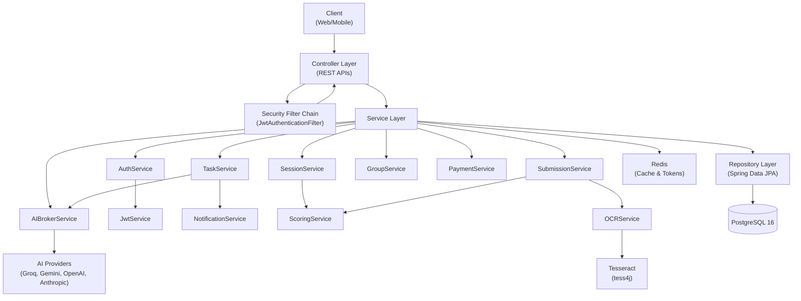
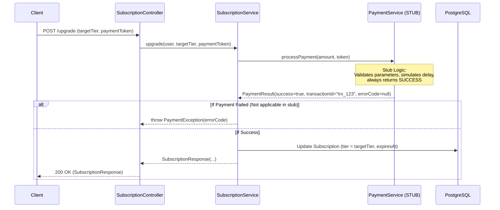
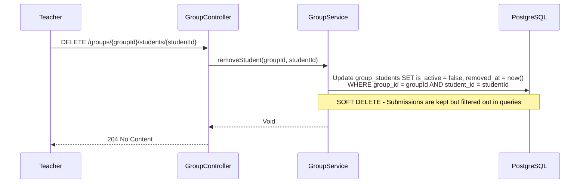

# Lingua Optima: Backend Documentation

> 📚 **Навигация по документации**: [Главный обзор (README.md)](./README.md) | [Backend (BACKEND.md)](./BACKEND.md) | [Frontend (FRONTEND.md)](./FRONTEND.md) | [AI & OCR (AI_INTEGRATION.md)](./AI_INTEGRATION.md) | [DevOps (DEVOPS.md)](./DEVOPS.md) | 📊 **[Открыть презентацию (presentation.html)](./presentation.html)** | 📘 [Doxygen HTML](./generated/html/index.html)

Это подробное руководство по серверной части (Backend) платформы Lingua Optima — сервиса для изучения английского языка с использованием ИИ.

## Технологический стек (Tech Stack)
- **Java 21**
- **Spring Boot 3**
- **Spring Security (JWT)**
- **Spring Data JPA (Hibernate)**
- **PostgreSQL 16**
- **Redis 7**

---

## Ключевые архитектурные решения (Key Design Decisions)

> **ВАЖНО:** Данные решения являются обязательными к исполнению.

1. **NO global leaderboard.** Предусмотрен только групповой лидерборд внутри группы конкретного преподавателя.
2. **Soft delete from group.** При удалении студента из группы, преподаватель больше НЕ МОЖЕТ видеть его старые ответы (они скрываются). Однако при повторном добавлении студента в ту же группу его история ВОССТАНАВЛИВАЕТСЯ и снова становится видимой. Используется soft delete: таблица `group_students` содержит поля `is_active` и `removed_at`.
3. **Payment is a MOCK STUB.** Вся внешняя логика работает (обработка ошибок, уровни подписки, апгрейд/даунгрейд), но реальный обработчик платежей (stub) всегда возвращает успешный статус (success). Это сделано для тестирования. Поддерживаются коды ошибок (`PAYMENT_FAILED`, `CARD_DECLINED`, `INSUFFICIENT_FUNDS`, `EXPIRED_CARD`, `NETWORK_ERROR`), но stub их никогда не возвращает на практике.
4. **Subscription tiers (Уровни подписки):**
    - `FREE`: 10 evals/week, 3 OCR/week.
    - `PREMIUM`: без ограничений, все уровни CEFR, приоритетная очередь.
    - `EDUCATOR`: всё из Premium + группы до 200 человек, deploy, ручное изменение оценок (override), экспорт отчетов, доступ к API.
5. **Self-service tasks:** Когда студент самостоятельно генерирует себе задание, система автоматически создает сущность `TaskAssignment` с полем `assigned_by`, указывающим на самого студента (self-assignment).
6. **Session resume:** `GET /sessions/active` возвращает текущую незавершенную сессию пользователя (если она существует).
7. **OCR error handling:** Исключение `OcrException` преобразуется в HTTP 422 с понятным для пользователя сообщением.
8. **Zero-Retention OCR:** Байты изображений обрабатываются исключительно в оперативной памяти (RAM) и никогда не сохраняются на диск.
9. **AI keys encryption:** Пользовательские ключи для ИИ-сервисов шифруются алгоритмом AES-256-GCM перед сохранением в базу данных.
10. **JWT configuration:** Access token действует 15 минут. Refresh token действует 30 дней (хранится в HttpOnly cookie), а его хеш дополнительно сохраняется в Redis для возможности инвалидации.

---

## Полная структура файлов (Complete File Structure)

```text
backend/
├── build.gradle
├── settings.gradle
├── Dockerfile
├── src/main/java/com/linguaoptima/api/
│   ├── LinguaOptimaApplication.java
│   │
│   ├── config/
│   │   ├── SecurityConfig.java        — Spring Security filter chain, CORS, CSRF disabled, JWT filter registration
│   │   ├── JwtAuthenticationFilter.java — OncePerRequestFilter: extracts Bearer token, validates, sets SecurityContext
│   │   ├── RedisConfig.java           — RedisTemplate, connection factory, serializers
│   │   ├── CorsConfig.java            — Allowed origins (localhost:5173 dev, production domain)
│   │   ├── SchedulingConfig.java      — @EnableScheduling
│   │   └── WebConfig.java             — Multipart file size limit (10MB)
│   │
│   ├── controller/
│   │   ├── AuthController.java        — POST /register, /login, /refresh, /logout, /logout-all, /forgot-password
│   │   ├── UserController.java        — GET /me, PUT /me, PUT /me/password, DELETE /me (GDPR)
│   │   ├── TaskController.java        — POST /generate, /preview, /{id}/assign, /template; GET / (list), /{id}
│   │   ├── SessionController.java     — POST /start; GET /active, /{id}/next-question; POST /{id}/answer, /{id}/complete
│   │   ├── SubmissionController.java  — POST /text, /image; GET /{id}, /my; PUT /{id}/override
│   │   ├── GroupController.java       — GET /, /{id}; POST /; POST /{id}/students; DELETE /{id}/students/{uid}, /{id}
│   │   ├── ProgressController.java    — GET /me, /student/{id}, /group/{id}
│   │   ├── NotificationController.java — GET /stream (SSE), /unread-count; PATCH /{id}/read
│   │   ├── SubscriptionController.java — GET /me; POST /upgrade, /downgrade; GET /usage
│   │   ├── ApiKeyController.java      — GET /, POST /, DELETE /{id}
│   │   ├── LeaderboardController.java — GET /group/{groupId} (group-only leaderboard, NO global)
│   │   └── ExportController.java      — GET /report/group/{id}, /report/student/{id}
│   │
│   ├── dto/
│   │   ├── request/
│   │   │   ├── RegisterRequest.java    — email, password, fullName, role
│   │   │   ├── LoginRequest.java       — email, password
│   │   │   ├── TaskParamsRequest.java  — cefrLevel, grammarTopic, domain, taskType, difficulty
│   │   │   ├── AssignTaskRequest.java  — groupIds[], dueDate
│   │   │   ├── TextSubmissionRequest.java — text, assignmentId, type (GRAMMAR/ESSAY)
│   │   │   ├── OverrideRequest.java    — overrideScore, teacherComment
│   │   │   ├── AnswerRequest.java      — questionId, answer
│   │   │   ├── CreateGroupRequest.java — name
│   │   │   ├── AddStudentRequest.java  — email
│   │   │   ├── CreateApiKeyRequest.java — provider, rawKey
│   │   │   ├── UpgradeRequest.java     — targetTier, paymentToken (stub)
│   │   │   ├── ChangePasswordRequest.java — oldPassword, newPassword
│   │   │   └── ForgotPasswordRequest.java — email
│   │   │
│   │   └── response/
│   │       ├── TokenResponse.java     — accessToken, user info
│   │       ├── UserResponse.java      — id, email, fullName, role, cefrLevel, displayAlias, streakCount
│   │       ├── TaskResponse.java      — id, type, cefrLevel, content, questions
│   │       ├── QuestionResponse.java  — id, questionText, options (for MCQ), difficulty
│   │       ├── AnswerFeedbackResponse.java — isCorrect, correctAnswer, explanation, newDifficulty
│   │       ├── SubmissionResultResponse.java — originalText, corrections, score, feedback, rubric breakdown
│   │       ├── ProgressResponse.java  — grammarTopic, totalAttempts, errorCount, masteryScore
│   │       ├── GroupResponse.java     — id, name, studentCount, avgScore
│   │       ├── LeaderboardEntryResponse.java — rank, displayAlias, weeklyScore, cefrLevel
│   │       ├── SubscriptionResponse.java — tier, expiresAt, usageRemaining
│   │       ├── UsageResponse.java     — weekEvaluations (used), weekOcrUploads (used), limits
│   │       ├── NotificationResponse.java — id, message, type, isRead, createdAt
│   │       ├── PaymentResultResponse.java — success, transactionId, errorCode, errorMessage
│   │       └── ErrorResponse.java     — status, message, timestamp, errors[]
│   │
│   ├── domain/
│   │   ├── User.java                  — id, email, passwordHash, fullName, role, cefrLevel, displayAlias, streakCount, lastActiveDate, freezeTokens, levelUpSuggestedAt, createdAt
│   │   ├── ApiKey.java                — id, user, provider (enum), encryptedKey, createdAt
│   │   ├── Task.java                  — id, type, cefrLevel, grammarTopic, domain, content, answerKey, difficulty, createdBy, isTemplate, createdAt
│   │   ├── TaskQuestion.java          — id, task, questionOrder, questionText, correctAnswer, difficulty (1-4), grammarRule
│   │   ├── TaskAssignment.java        — id, task, student, assignedBy, dueDate, status (PENDING/IN_PROGRESS/SUBMITTED/GRADED), createdAt
│   │   ├── SessionState.java          — id, assignment, student, currentQuestionIndex, currentDifficulty, answersJson, status (IN_PROGRESS/COMPLETED), startedAt, lastActiveAt
│   │   ├── Submission.java            — id, assignment, student, submissionType (TEXT/IMAGE), studentText, aiScore, aiFeedback, overrideScore, teacherComment, providerUsed, submittedAt
│   │   ├── ProgressRecord.java        — id, student, grammarTopic, totalAttempts, errorCount, masteryScore, updatedAt
│   │   ├── Group.java                 — id, name, teacher, createdAt. @ManyToMany students
│   │   ├── Notification.java          — id, user, message, type (TASK/GRADE/SYSTEM/CONTEXTUAL), isRead, createdAt
│   │   ├── Subscription.java          — id, user, tier (FREE/PREMIUM/EDUCATOR), expiresAt, createdAt
│   │   ├── UsageCounter.java          — id, user, weekEvaluations, weekOcrUploads, weekResetAt
│   │   └── enums/
│   │       ├── Role.java              — STUDENT, TEACHER, ADMIN
│   │       ├── CefrLevel.java         — B1, B2, C1
│   │       ├── TaskType.java          — MCQ, GAP_FILL, ESSAY, REWRITE, SHORT_ANSWER
│   │       ├── DifficultyLevel.java   — EASY, MEDIUM, HARD, EXPERT
│   │       ├── SubmissionType.java    — TEXT, IMAGE
│   │       ├── AssignmentStatus.java  — PENDING, IN_PROGRESS, SUBMITTED, GRADED
│   │       ├── SubscriptionTier.java  — FREE, PREMIUM, EDUCATOR
│   │       ├── AIProvider.java        — GROQ, GEMINI, OPENAI, ANTHROPIC
│   │       ├── NotificationType.java  — TASK, GRADE, SYSTEM, CONTEXTUAL
│   │       └── PaymentErrorCode.java  — PAYMENT_FAILED, CARD_DECLINED, INSUFFICIENT_FUNDS, EXPIRED_CARD, NETWORK_ERROR, PROVIDER_ERROR
│   │
│   ├── repository/
│   │   ├── UserRepository.java        — findByEmail(), existsByEmail()
│   │   ├── ApiKeyRepository.java      — findByUserAndProvider(), findAllByUser()
│   │   ├── TaskRepository.java        — findByCreatedBy(), findTemplates()
│   │   ├── TaskQuestionRepository.java — findByTaskIdOrderByQuestionOrder()
│   │   ├── TaskAssignmentRepository.java — findByStudentAndStatus(), findByTaskId(), findByStudentAndTask()
│   │   ├── SessionStateRepository.java — findByStudentAndStatus(IN_PROGRESS)
│   │   ├── SubmissionRepository.java  — findByStudent(), findByAssignment(), findByAssignmentStudentInAndAssignmentTaskIn()
│   │   ├── ProgressRecordRepository.java — findByStudent(), findByStudentAndGrammarTopic(), findByStudentAndMasteryScoreLessThan()
│   │   ├── GroupRepository.java       — findByTeacher(), findByTeacherAndStudentsContaining()
│   │   ├── NotificationRepository.java — findByUserAndIsReadFalse(), countByUserAndIsReadFalse()
│   │   ├── SubscriptionRepository.java — findByUser()
│   │   └── UsageCounterRepository.java — findByUser()
│   │
│   ├── service/
│   │   ├── AuthService.java           — register(), login(), refreshToken(), logout(), logoutAll(), forgotPassword(), resetPassword()
│   │   ├── JwtService.java            — generateToken(15min), generateRefreshToken(30d), extractEmail(), isTokenValid()
│   │   ├── UserService.java           — getCurrentUser(), updateUser(), changePassword(), deleteAccount() (GDPR cascade)
│   │   ├── TaskService.java           — generateTask() (calls AIBroker), previewTask() (no save), assignTask() (creates TaskAssignments + notifications), saveAsTemplate(), getTasksForUser()
│   │   ├── SessionService.java        — startSession() (creates SessionState), getNextQuestion() (CAT algorithm: adjusts difficulty), submitAnswer(), completeSession() (→ creates Submission), getActiveSession()
│   │   ├── SubmissionService.java     — submitText(), submitImage() (calls OCR then Scoring), overrideScore()
│   │   ├── ScoringService.java        — scoreGrammarTask() (compares with answerKey via AI), scoreEssay() (rubric: TA, Coherence, LR, GR)
│   │   ├── OCRService.java            — extractText(byte[]) via Tesseract (tess4j), purgeImage(). Throws OcrException on failure.
│   │   ├── ProgressService.java       — updateFromSubmission(), updateFromOverride(), getGapsForStudent(), getGroupProgress(), checkCefrLevelUp()
│   │   ├── GroupService.java          — createGroup(), addStudent() (checks if student was previously in group and reactivates them), removeStudent() (SOFT DELETE: sets is_active=false, removed_at=now()), deleteGroup()
│   │   ├── NotificationService.java   — send(), sendToGroup(), getUnreadCount(), markAsRead(), SSE emitter management
│   │   ├── GamificationService.java   — onSubmissionCompleted() (streak +1, freeze token every 7 days), applyDailyStreakCheck() (called by scheduler)
│   │   ├── SubscriptionService.java   — getSubscription(), upgrade() (calls PaymentService), downgrade(), checkQuota(), isFeatureAllowed()
│   │   ├── PaymentService.java        — processPayment() — STUB: always returns success. Has full PaymentResult with transactionId, error handling infrastructure. Returns PaymentResult with all fields but success=true always.
│   │   ├── UsageService.java          — incrementEvaluation(), incrementOcr(), getRemainingUsage(), resetWeeklyCounters() (called by scheduler)
│   │   ├── ExportService.java         — generateGroupReport(format), generateStudentReport(format) — PDF via iText, CSV via OpenCSV. Streamed, not persisted.
│   │   ├── ApiKeyService.java         — saveKey(encrypt), getDecryptedKey(), deleteKey()
│   │   ├── EncryptionService.java     — encrypt(AES-256-GCM), decrypt(). Key from env variable.
│   │   ├── LeaderboardService.java    — getGroupLeaderboard(groupId) — queries submissions within group for current week, returns ranked list
│   │   └── ai/
│   │       ├── AIBrokerService.java    — generateTaskContent(), scoreEssay(), checkGrammar(). Selects provider (own key → user's, else system). Fallback chain: Groq → Gemini → retry → queue. Caches identical prompts in Redis (1h TTL). Rate limits per user.
│   │       ├── AIProvider.java        — Interface: complete(prompt) → String
│   │       ├── GroqProvider.java       — Implements AIProvider. REST client for Groq API (Llama 3.1 70B)
│   │       ├── GeminiProvider.java     — Implements AIProvider. REST client for Gemini 1.5 Flash
│   │       ├── OpenAIProvider.java     — Implements AIProvider. For user-provided keys
│   │       └── AnthropicProvider.java  — Implements AIProvider. For user-provided keys
│   │
│   ├── scheduler/
│   │   ├── StreakScheduler.java        — @Scheduled(cron='0 0 1 * * *') daily: check last_active_date, apply freeze or reset streak
│   │   ├── UsageResetScheduler.java   — @Scheduled(cron='0 0 0 * * MON') weekly Monday: reset usage_counters
│   │   └── NotificationScheduler.java — @Scheduled(cron='0 0 9 * * *') daily 9AM: contextual notifications for weak topics (mastery < 0.6)
│   │
│   ├── exception/
│   │   ├── GlobalExceptionHandler.java — @ControllerAdvice, handles all exceptions, returns ErrorResponse
│   │   ├── OcrException.java          — 422: 'Image is unclear, please try again'
│   │   ├── AIServiceException.java    — 503: 'AI service temporarily unavailable'
│   │   ├── QuotaExceededException.java — 429: 'Weekly evaluation limit reached'
│   │   ├── PaymentException.java      — 402: payment-related errors (CARD_DECLINED etc.)
│   │   ├── ResourceNotFoundException.java — 404
│   │   ├── UnauthorizedException.java — 401
│   │   └── ForbiddenException.java    — 403: wrong role or not group member
│   │
│   └── util/
│       ├── PromptTemplates.java       — Static prompt strings for task generation, essay scoring, grammar checking
│       └── CefrTopicRegistry.java     — Static map of CEFR levels to grammar topics and domains
│
├── src/main/resources/
│   ├── application.yml                — DB, Redis, JWT secret, AI keys config
│   ├── application-dev.yml
│   └── application-prod.yml
│
└── src/test/java/com/linguaoptima/api/
    ├── controller/                    — @WebMvcTest for each controller
    ├── service/                       — Unit tests with mocks
    └── integration/                   — @SpringBootTest with Testcontainers
```

---

## 1. Layer Architecture (Архитектура слоев)

Диаграмма, показывающая взаимодействие основных компонентов системы и внешних сервисов.



---

## 2. Complete REST API (Полный список REST API)

Таблица всех конечных точек системы, требуемых ролей и ожидаемых данных.

| Controller | Method | Path | Auth | Role | Request Body | Response | Description |
|---|---|---|---|---|---|---|---|
| **Auth** | POST | `/api/auth/register` | No | ALL | `RegisterRequest` | `TokenResponse` | Регистрация нового пользователя по Email и паролю |
| | POST | `/api/auth/login` | No | ALL | `LoginRequest` | `TokenResponse` | Авторизация по Email и паролю и выдача токенов |
| | POST | `/api/auth/google` | No | ALL | `GoogleAuthRequest` | `TokenResponse` | Авторизация / авторегистрация через Google OAuth2 ID Token |
| | POST | `/api/auth/refresh` | No | ALL | (Refresh Cookie) | `TokenResponse` | Обновление access-токена |

| | POST | `/api/auth/logout` | Yes | ALL | | 200 OK | Выход с текущего устройства |
| | POST | `/api/auth/logout-all` | Yes | ALL | | 200 OK | Выход со всех устройств |
| | POST | `/api/auth/forgot-password` | No | ALL | `ForgotPasswordRequest` | 200 OK | Сброс пароля |
| **User** | GET | `/api/users/me` | Yes | ALL | | `UserResponse` | Получение профиля текущего пользователя |
| | PUT | `/api/users/me` | Yes | ALL | `UserResponse` | `UserResponse` | Обновление профиля |
| | PUT | `/api/users/me/password` | Yes | ALL | `ChangePasswordRequest` | 200 OK | Смена пароля |
| | DELETE | `/api/users/me` | Yes | ALL | | 204 No Content | Удаление аккаунта (GDPR) |
| **Task** | GET | `/api/tasks` | Yes | ALL | | `List<TaskResponse>` | Список заданий пользователя |
| | GET | `/api/tasks/{id}` | Yes | ALL | | `TaskResponse` | Детали задания |
| | POST | `/api/tasks/generate` | Yes | ALL | `TaskParamsRequest` | `TaskResponse` | Генерация нового задания (сохраняется) |
| | POST | `/api/tasks/preview` | Yes | ALL | `TaskParamsRequest` | `TaskResponse` | Предпросмотр задания (без сохранения) |
| | POST | `/api/tasks/template` | Yes | TEACHER | `TaskParamsRequest` | `TaskResponse` | Сохранение задания как шаблона |
| | POST | `/api/tasks/{id}/assign` | Yes | TEACHER | `AssignTaskRequest` | 200 OK | Назначение задания группам |
| **Session**| POST | `/api/sessions/start` | Yes | STUDENT | `TaskAssignment` ID | `SessionState` | Начало выполнения задания |
| | GET | `/api/sessions/active` | Yes | STUDENT | | `SessionState` | Получение активной сессии (resume) |
| | GET | `/api/sessions/{id}/next-question` | Yes | STUDENT | | `QuestionResponse` | Следующий вопрос (CAT алгоритм) |
| | POST | `/api/sessions/{id}/answer` | Yes | STUDENT | `AnswerRequest` | `AnswerFeedbackResponse` | Отправка ответа на текущий вопрос |
| | POST | `/api/sessions/{id}/complete` | Yes | STUDENT | | `SubmissionResultResponse` | Завершение сессии |
| **Submissions**| POST | `/api/submissions/text` | Yes | STUDENT | `TextSubmissionRequest` | `SubmissionResultResponse` | Отправка текста (написание эссе) |
| | POST | `/api/submissions/image` | Yes | STUDENT | `MultipartFile` | `SubmissionResultResponse` | Загрузка изображения с ответом (OCR) |
| | GET | `/api/submissions/{id}` | Yes | ALL | | `SubmissionResultResponse` | Результат проверки ответа |
| | GET | `/api/submissions/my` | Yes | STUDENT | | `List<SubmissionResultResponse>` | Все ответы текущего студента |
| | PUT | `/api/submissions/{id}/override` | Yes | TEACHER | `OverrideRequest` | `SubmissionResultResponse` | Переопределение оценки преподавателем |
| **Group** | GET | `/api/groups` | Yes | TEACHER | | `List<GroupResponse>` | Мои группы |
| | GET | `/api/groups/{id}` | Yes | TEACHER | | `GroupResponse` | Детали группы |
| | POST | `/api/groups` | Yes | TEACHER | `CreateGroupRequest` | `GroupResponse` | Создание новой группы |
| | POST | `/api/groups/{id}/students` | Yes | TEACHER | `AddStudentRequest` | 200 OK | Добавление студента в группу |
| | DELETE | `/api/groups/{id}/students/{uid}` | Yes | TEACHER | | 204 No Content | Удаление студента из группы |
| | DELETE | `/api/groups/{id}` | Yes | TEACHER | | 204 No Content | Удаление группы |
| **Progress**| GET | `/api/progress/me` | Yes | STUDENT | | `List<ProgressResponse>` | Личный прогресс |
| | GET | `/api/progress/student/{id}` | Yes | TEACHER | | `List<ProgressResponse>` | Прогресс конкретного студента |
| | GET | `/api/progress/group/{id}` | Yes | TEACHER | | `List<ProgressResponse>` | Прогресс группы (агрегированный) |
| **Notifications**| GET | `/api/notifications/stream` | Yes | ALL | | SSE Stream | Поток уведомлений (Server-Sent Events) |
| | GET | `/api/notifications/unread-count` | Yes | ALL | | `Integer` | Количество непрочитанных |
| | PATCH| `/api/notifications/{id}/read` | Yes | ALL | | 200 OK | Пометить прочитанным |
| **Subscriptions**| GET | `/api/subscriptions/me` | Yes | ALL | | `SubscriptionResponse` | Текущая подписка пользователя |
| | POST | `/api/subscriptions/upgrade` | Yes | ALL | `UpgradeRequest` | `PaymentResultResponse` | Повышение уровня подписки |
| | POST | `/api/subscriptions/downgrade` | Yes | ALL | | 200 OK | Понижение уровня (отмена премиума) |
| | GET | `/api/subscriptions/usage` | Yes | ALL | | `UsageResponse` | Использование лимитов (evals, OCR) |
| **API Keys** | GET | `/api/apikeys` | Yes | EDUCATOR| | `List<ApiKey>` | Список сохраненных ключей |
| | POST | `/api/apikeys` | Yes | EDUCATOR| `CreateApiKeyRequest` | 200 OK | Сохранение нового ключа (шифруется) |
| | DELETE | `/api/apikeys/{id}` | Yes | EDUCATOR| | 204 No Content | Удаление ключа |
| **Leaderboard**| GET | `/api/leaderboards/group/{id}`| Yes | ALL | | `List<LeaderboardEntryResponse>` | Рейтинг внутри группы (NO global) |
| **Export** | GET | `/api/exports/report/group/{id}`| Yes | EDUCATOR| | File (PDF/CSV) | Экспорт отчета по группе |
| | GET | `/api/exports/report/student/{id}`| Yes | EDUCATOR| | File (PDF/CSV) | Экспорт отчета по студенту |

---

## 3. Entity Relationship Diagram (Структура базы данных)

Схема всех сущностей БД, их атрибутов и связей друг с другом.


---

## 4. Redis Key Schema (Кэширование и токены)

Структура данных в Redis, включая время жизни (TTL).

| Pattern | Type | TTL | Description |
|---|---|---|---|
| `refresh_token:<hash>` | String | 30 days | Хеш для валидации refresh-токенов (запрет отозванных сессий). |
| `ai:prompt_cache:<hash>` | String | 1 hour | Кэш ответов LLM (экономия запросов для идентичных текстов). |
| `rate_limit:user:<id>` | Counter | 1 minute | Ограничение количества запросов к API для одного пользователя. |

---

## 5. Payment Stub Flow (Процесс фиктивной оплаты)

Диаграмма последовательности для модуля подписок. Обратите внимание, что обработка ошибок реализована полноценно, но `PaymentService` (stub) всегда разрешает платеж.



---

## 6. Group Soft-Delete Flow (Процесс удаления студента из группы)

Поведение системы при удалении студента преподавателем (старые ответы скрываются, но могут быть восстановлены).



---

## 7. Scheduler CRON Table (Фоновые задачи)

В системе зарегистрировано 3 планировщика задач (`@Scheduled`).

| Класс Scheduler | CRON Выражение | Расписание | Действие |
|---|---|---|---|
| `StreakScheduler` | `0 0 1 * * *` | Ежедневно (01:00) | Проверяет `last_active_date`. Если пользователь не заходил: списывает 1 `freeze_token` или обнуляет `streak_count`. |
| `UsageResetScheduler` | `0 0 0 * * MON` | Еженедельно (Пн, 00:00) | Сбрасывает счетчики `week_evaluations` и `week_ocr_uploads` в `UsageCounter`. |
| `NotificationScheduler`| `0 0 9 * * *` | Ежедневно (09:00) | Анализирует `ProgressRecord`. Отправляет контекстные уведомления (SSE), если `masteryScore < 0.6` (рекомендует практику). |

---

## 8. Exception Handling Table (Глобальная обработка ошибок)

Класс `GlobalExceptionHandler` мапит кастомные исключения в стандартные HTTP-ответы.

| Исключение (Exception) | HTTP Status | Описание / Типичное сообщение |
|---|---|---|
| `OcrException` | `422 Unprocessable Entity` | "Image is unclear, please try again." (Не удалось извлечь текст) |
| `QuotaExceededException` | `429 Too Many Requests` | "Weekly evaluation limit reached." (Лимит по тарифу исчерпан) |
| `AIServiceException` | `503 Service Unavailable` | "AI service temporarily unavailable." (Fallback-цепочка провайдеров не справилась) |
| `PaymentException` | `402 Payment Required` | Ошибки оплаты (`CARD_DECLINED`, `INSUFFICIENT_FUNDS`) |
| `UnauthorizedException` | `401 Unauthorized` | Отсутствует, просрочен или невалиден JWT-токен |
| `ForbiddenException` | `403 Forbidden` | Нет прав доступа (например, попытка удалить чужую группу) |
| `ResourceNotFoundException`| `404 Not Found` | Запрашиваемая сущность (Task, Group, User) не существует |
