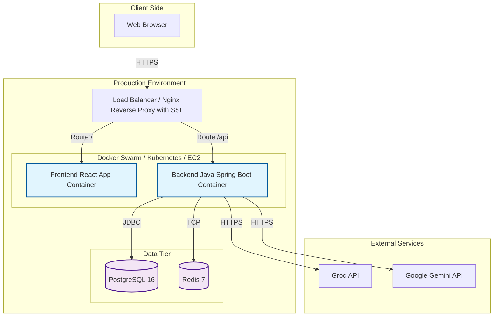

# Lingua Optima: DevOps & Deployment Documentation

> 📚 **Documentation Navigation**: [Main Overview (README.md)](./README.md) | [Backend (BACKEND.md)](./BACKEND.md) | [Frontend (FRONTEND.md)](./FRONTEND.md) | [AI & OCR (AI_INTEGRATION.md)](./AI_INTEGRATION.md) | [DevOps (DEVOPS.md)](./DEVOPS.md) | 📊 **[Open Presentation (presentation.html)](./presentation.html)** | 📘 [Doxygen HTML](index.html)

This document describes the deployment architecture, CI/CD pipelines, Docker container infrastructure, and security and monitoring policies for the Lingua Optima platform.

## Tech Stack
- Java 21 + Spring Boot 3 (backend)
- React + TypeScript + Vite (frontend)
- PostgreSQL 16
- Redis 7
- Tesseract OCR (`tess4j` inside the Java container)
- Docker + Docker Compose

---

## 1. Docker Architecture

Below is the complete `docker-compose.yml` configuration for deploying all platform services locally.

```yaml
version: '3.8'

services:
  db:
    image: postgres:16-alpine
    container_name: lingua_optima_db
    environment:
      POSTGRES_USER: ${POSTGRES_USER:-postgres}
      POSTGRES_PASSWORD: ${POSTGRES_PASSWORD:-postgres}
      POSTGRES_DB: ${POSTGRES_DB:-lingua_optima}
    volumes:
      - postgres_data:/var/lib/postgresql/data
    ports:
      - "5432:5432"
    healthcheck:
      test: ["CMD-SHELL", "pg_isready -U ${POSTGRES_USER:-postgres} -d ${POSTGRES_DB:-lingua_optima}"]
      interval: 5s
      timeout: 5s
      retries: 5
    networks:
      - lingua_network

  redis:
    image: redis:7-alpine
    container_name: lingua_optima_redis
    ports:
      - "6379:6379"
    healthcheck:
      test: ["CMD", "redis-cli", "ping"]
      interval: 5s
      timeout: 3s
      retries: 5
    networks:
      - lingua_network

  backend:
    build:
      context: ./backend
      dockerfile: Dockerfile
    container_name: lingua_optima_backend
    ports:
      - "8080:8080"
    environment:
      - SPRING_DATASOURCE_URL=jdbc:postgresql://db:5432/${POSTGRES_DB:-lingua_optima}
      - SPRING_DATASOURCE_USERNAME=${POSTGRES_USER:-postgres}
      - SPRING_DATASOURCE_PASSWORD=${POSTGRES_PASSWORD:-postgres}
      - SPRING_REDIS_HOST=redis
      - SPRING_REDIS_PORT=6379
      - JWT_SECRET=${JWT_SECRET}
      - GROQ_API_KEY=${GROQ_API_KEY}
      - GEMINI_API_KEY=${GEMINI_API_KEY}
      - ENCRYPTION_KEY=${ENCRYPTION_KEY}
      - CORS_ORIGINS=${CORS_ORIGINS:-http://localhost:5173}
    depends_on:
      db:
        condition: service_healthy
      redis:
        condition: service_healthy
    networks:
      - lingua_network

  frontend:
    build:
      context: ./frontend
      dockerfile: Dockerfile
    container_name: lingua_optima_frontend
    ports:
      - "5173:80"
    environment:
      - VITE_API_URL=${VITE_API_URL:-http://localhost:8080}
    depends_on:
      - backend
    networks:
      - lingua_network

  adminer:
    image: adminer
    container_name: lingua_optima_adminer
    restart: always
    ports:
      - "8081:8080"
    depends_on:
      db:
        condition: service_healthy
    networks:
      - lingua_network

volumes:
  postgres_data:

networks:
  lingua_network:
    driver: bridge
```

---

## 2. Dockerfile for Backend

The backend application uses a multi-stage Docker build. In the second stage, the native `tesseract-ocr` package and English traineddata are installed for `tess4j`.

```dockerfile
# Stage 1: Build
FROM gradle:8-jdk21 AS build
WORKDIR /app
COPY build.gradle settings.gradle ./
COPY src ./src
RUN gradle build --no-daemon -x test

# Stage 2: Run
FROM eclipse-temurin:21-jre-alpine
WORKDIR /app
# Install Tesseract OCR and the English language pack
RUN apk add --no-cache tesseract-ocr tesseract-ocr-eng
COPY --from=build /app/build/libs/*.jar app.jar
EXPOSE 8080
ENTRYPOINT ["java", "-jar", "app.jar"]
```

---

## 3. Dockerfile for Frontend

The frontend uses Vite to compile static production assets, which are then served via Nginx.

```dockerfile
# Stage 1: Build
FROM node:20-alpine AS build
WORKDIR /app
COPY package*.json ./
RUN npm install
COPY . .
RUN npm run build

# Stage 2: Serve
FROM nginx:alpine
# Copy compiled assets to the Nginx html directory
COPY --from=build /app/dist /usr/share/nginx/html
# Copy custom Nginx configuration for Single-Page Application (SPA) routing
COPY nginx.conf /etc/nginx/conf.d/default.conf
EXPOSE 80
CMD ["nginx", "-g", "daemon off;"]
```

*Example `nginx.conf` (for SPA routing):*
```nginx
server {
    listen 80;
    location / {
        root /usr/share/nginx/html;
        index index.html index.htm;
        try_files $uri $uri/ /index.html;
    }
}
```

---

## 4. Environment Variables

Complete reference table of all environment variables used across the system:

### Backend
| Variable | Description |
|---|---|
| `DB_URL` | PostgreSQL JDBC connection URL (e.g. `jdbc:postgresql://db:5432/lingua_optima`) |
| `DB_USER` | Database username |
| `DB_PASS` | Database password |
| `REDIS_HOST` | Redis server hostname |
| `JWT_SECRET` | Secret key used for signing and verifying JWT tokens |
| `GOOGLE_CLIENT_ID` | OAuth 2.0 Client ID from Google Cloud Console used to verify the `aud` claim in Google ID tokens |
| `GOOGLE_CLIENT_SECRET` | OAuth 2.0 Client Secret from Google Cloud Console |
| `GROQ_API_KEY` | API key for Groq (Llama 3.1 LLM) |
| `GEMINI_API_KEY` | API key for Google Gemini (Multimodal & Essay AI) |
| `ENCRYPTION_KEY` | AES-256-GCM encryption key used to protect user-supplied API keys at rest |
| `CORS_ORIGINS` | Allowed origins for Cross-Origin Resource Sharing (e.g. `http://localhost:5173`) |

### Frontend
| Variable | Description |
|---|---|
| `VITE_API_URL` | Base URL for the backend REST API (e.g. `http://localhost:8080` or `/api`) |
| `VITE_GOOGLE_CLIENT_ID` | OAuth 2.0 Client ID for the Google Identity Services sign-in button |


### PostgreSQL
| Variable | Description |
|---|---|
| `POSTGRES_USER` | Database superuser name |
| `POSTGRES_PASSWORD` | Database superuser password |
| `POSTGRES_DB` | Name of the database created on initialization |

---

## 5. CI/CD Pipeline

GitHub Actions workflow configuration (`.github/workflows/ci.yml`):

```yaml
name: CI/CD Pipeline

on:
  push:
    branches: [ "main" ]
  pull_request:
    branches: [ "main" ]

jobs:
  build-and-test:
    runs-on: ubuntu-latest
    steps:
      - name: Checkout code
        uses: actions/checkout@v3

      - name: Set up JDK 21
        uses: actions/setup-java@v3
        with:
          java-version: '21'
          distribution: 'temurin'
          cache: gradle

      - name: Set up Node.js 20
        uses: actions/setup-node@v3
        with:
          node-version: '20'
          cache: 'npm'
          cache-dependency-path: frontend/package-lock.json

      - name: Build & Test Backend
        working-directory: ./backend
        run: |
          chmod +x gradlew
          ./gradlew build

      - name: Install & Lint Frontend
        working-directory: ./frontend
        run: |
          npm ci
          npm run lint
          npm run test --if-present

  docker-push:
    needs: build-and-test
    if: github.event_name == 'push' && github.ref == 'refs/heads/main'
    runs-on: ubuntu-latest
    steps:
      - name: Checkout code
        uses: actions/checkout@v3

      - name: Login to Docker Hub
        uses: docker/login-action@v2
        with:
          username: ${{ secrets.DOCKERHUB_USERNAME }}
          password: ${{ secrets.DOCKERHUB_TOKEN }}

      - name: Build and push Backend image
        uses: docker/build-push-action@v4
        with:
          context: ./backend
          push: true
          tags: username/lingua-backend:latest

      - name: Build and push Frontend image
        uses: docker/build-push-action@v4
        with:
          context: ./frontend
          push: true
          tags: username/lingua-frontend:latest
```

---

## 6. Deployment Diagram



---

## 7. Database Migrations

Database schema versioning is managed via **Flyway**, integrated directly into Spring Boot. All migration scripts reside in `backend/src/main/resources/db/migration/`.

**Naming convention:** `V<Version>__<Description>.sql` (note the double underscore separator).

### Migration List
- `V1__create_users.sql` — Creation of the users table and user preferences.
- `V2__create_user_api_keys.sql` — Table for storing encrypted user-supplied API keys.
- `V3__create_materials.sql` — Table of study materials and curriculum templates.
- `V4__create_exercises.sql` — Table of exercises and AI-generated tasks.
- `V5__create_user_progress.sql` — Table of mastery statistics, progress history, and submission results.
- `V6__create_vocabulary.sql` — Personal vocabulary and queued AI task state (`V1__init_schema.sql` .. `V4__create_pending_ai_tasks.sql` in production).

---

## 8. Monitoring & Logging

- **Spring Boot Actuator:** Exposes operational endpoints for health checks (`/actuator/health`), metrics collection (`/actuator/metrics`), and build information (`/actuator/info`).
- **Structured JSON Logging:** In production, Logback outputs structured JSON logs to streamline ingestion and indexing in centralized log aggregation stacks such as ELK (Elasticsearch, Logstash, Kibana) or Grafana Loki.
- **Key metrics to monitor:**
  - AI response time (request latency for Groq and Gemini calls)
  - OCR processing time (image preprocessing and text extraction duration in `tess4j`)
  - Active sessions (active JWT sessions and open SSE notification streams)
  - Error rates (frequency of HTTP 5xx responses and unhandled exceptions)

---

## 9. Security Checklist

- [x] **HTTPS only in production:** All traffic between clients and the load balancer is encrypted via TLS.
- [x] **CORS whitelist:** Only trusted origins are permitted to perform cross-origin API requests.
- [x] **Rate limiting (Redis):** Request rate limiting protects authentication and AI endpoints against brute-force and DoS attacks.
- [x] **SQL injection prevention:** Parameterized queries enforced via Spring Data JPA / Hibernate.
- [x] **XSS prevention:** React automatic output escaping combined with strict Content Security Policy (CSP) headers.
- [x] **JWT in memory:** Access tokens are held exclusively in JS memory (and refresh tokens in `HttpOnly` cookies), avoiding insecure `localStorage` token persistence.
- [x] **API keys encrypted at rest:** User-supplied BYOK API keys are encrypted in PostgreSQL using AES-256-GCM.
- [x] **Zero-Retention OCR:** Homework images uploaded for OCR are processed strictly in RAM and immediately zeroed out (`0x00`), never touching disk storage.
- [x] **GDPR - delete account cascade:** Complete erasure of PII and anonymization of historical records upon account deletion.

---

## 10. Local Development Setup

Step-by-step guide to running the project locally:

1. **Prerequisites:** Ensure Java 21, Node.js 20, and Docker (with Docker Compose) are installed.
2. **Clone repo:** Clone the project repository.
   ```bash
   git clone <repo-url> lingua_optima
   cd lingua_optima
   ```
3. **Start infrastructure:** Launch PostgreSQL and Redis in the background.
   ```bash
   docker compose up db redis -d
   ```
4. **Backend:** Start the Spring Boot application.
   ```bash
   cd backend
   ./gradlew bootRun
   ```
5. **Frontend:** Start the Vite development server in a separate terminal.
   ```bash
   cd frontend
   npm install
   npm run dev
   ```
6. **Access:** Open the application in your browser:
   - Frontend: `http://localhost:5173`
   - Backend API: `http://localhost:8080`

---

## 11. Project Directory Structure

```text
lingua_optima/
├── backend/                — Java 21 + Spring Boot 3
├── frontend/               — React 18 + TypeScript + Vite
├── docker-compose.yml      — All services orchestration
├── docs/                   — Documentation & presentation
│   ├── presentation.html   — Interactive pitch deck
│   ├── README.md           — Master index
│   ├── BACKEND.md
│   ├── FRONTEND.md
│   ├── AI_INTEGRATION.md
│   └── DEVOPS.md
├── .github/
│   └── workflows/
│       └── ci.yml
├── .env.example
└── .gitignore
```
