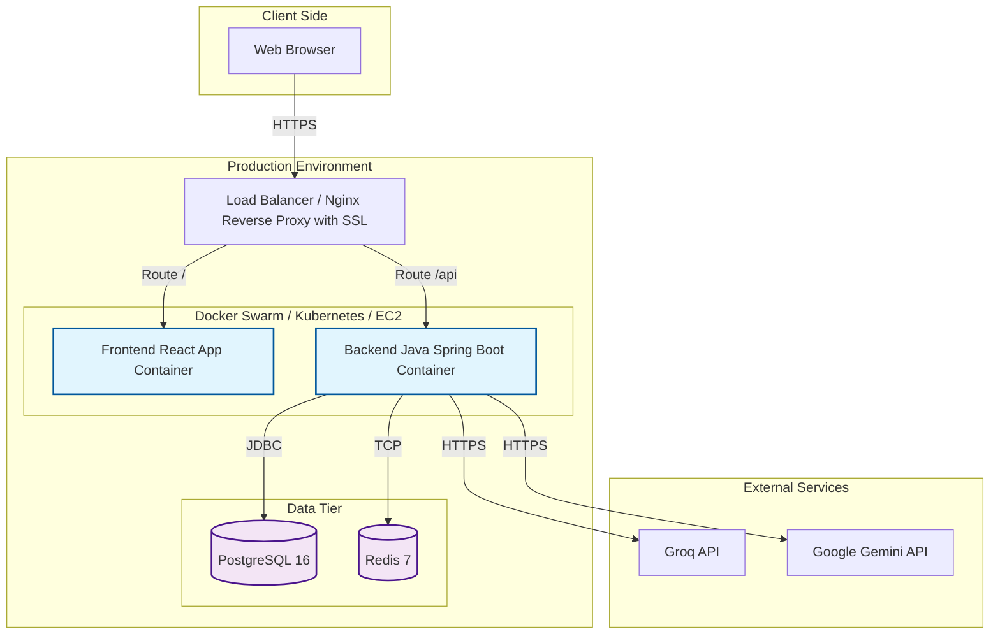

# Lingua Optima: DevOps & Deployment Documentation

> 📚 **Навигация по документации**: [Главный обзор (README.md)](./README.md) | [Backend (BACKEND.md)](./BACKEND.md) | [Frontend (FRONTEND.md)](./FRONTEND.md) | [AI & OCR (AI_INTEGRATION.md)](./AI_INTEGRATION.md) | [DevOps (DEVOPS.md)](./DEVOPS.md) | 📊 **[Открыть презентацию (presentation.html)](./presentation.html)** | 📘 [Doxygen HTML](./generated/html/index.html)

В данном документе описывается архитектура развертывания, процессы CI/CD, инфраструктура Docker, а также политики безопасности и мониторинга для платформы Lingua Optima.

## Tech Stack
- Java 21 + Spring Boot 3 (backend)
- React + TypeScript + Vite (frontend)
- PostgreSQL 16
- Redis 7
- Tesseract OCR (tess4j inside Java container)
- Docker + Docker Compose

---

## 1. Docker Architecture

Ниже представлен полный файл `docker-compose.yml` для локального развертывания всех сервисов.

```yaml
version: '3.8'

services:
  db:
    image: postgres:16-alpine
    container_name: lingua_optima_db
    environment:
      POSTGRES_USER: ${POSTGRES_USER:-postgres}
      POSTGRES_PASSWORD: ${POSTGRES_PASSWORD:-postgres}
      POSTGRES_DB: ${POSTGRES_DB:-lingua_optima}
    volumes:
      - postgres_data:/var/lib/postgresql/data
    ports:
      - "5432:5432"
    healthcheck:
      test: ["CMD-SHELL", "pg_isready -U ${POSTGRES_USER:-postgres} -d ${POSTGRES_DB:-lingua_optima}"]
      interval: 5s
      timeout: 5s
      retries: 5
    networks:
      - lingua_network

  redis:
    image: redis:7-alpine
    container_name: lingua_optima_redis
    ports:
      - "6379:6379"
    healthcheck:
      test: ["CMD", "redis-cli", "ping"]
      interval: 5s
      timeout: 3s
      retries: 5
    networks:
      - lingua_network

  backend:
    build:
      context: ./backend
      dockerfile: Dockerfile
    container_name: lingua_optima_backend
    ports:
      - "8080:8080"
    environment:
      - SPRING_DATASOURCE_URL=jdbc:postgresql://db:5432/${POSTGRES_DB:-lingua_optima}
      - SPRING_DATASOURCE_USERNAME=${POSTGRES_USER:-postgres}
      - SPRING_DATASOURCE_PASSWORD=${POSTGRES_PASSWORD:-postgres}
      - SPRING_REDIS_HOST=redis
      - SPRING_REDIS_PORT=6379
      - JWT_SECRET=${JWT_SECRET}
      - GROQ_API_KEY=${GROQ_API_KEY}
      - GEMINI_API_KEY=${GEMINI_API_KEY}
      - ENCRYPTION_KEY=${ENCRYPTION_KEY}
      - CORS_ORIGINS=${CORS_ORIGINS:-http://localhost:5173}
    depends_on:
      db:
        condition: service_healthy
      redis:
        condition: service_healthy
    networks:
      - lingua_network

  frontend:
    build:
      context: ./frontend
      dockerfile: Dockerfile
    container_name: lingua_optima_frontend
    ports:
      - "5173:80"
    environment:
      - VITE_API_URL=${VITE_API_URL:-http://localhost:8080}
    depends_on:
      - backend
    networks:
      - lingua_network

  adminer:
    image: adminer
    container_name: lingua_optima_adminer
    restart: always
    ports:
      - "8081:8080"
    depends_on:
      db:
        condition: service_healthy
    networks:
      - lingua_network

volumes:
  postgres_data:

networks:
  lingua_network:
    driver: bridge
```

---

## 2. Dockerfile for Backend

Backend приложение использует multi-stage сборку. Во втором stage устанавливается пакет `tesseract-ocr` для работы библиотеки tess4j.

```dockerfile
# Stage 1: Build
FROM gradle:8-jdk21 AS build
WORKDIR /app
COPY build.gradle settings.gradle ./
COPY src ./src
RUN gradle build --no-daemon -x test

# Stage 2: Run
FROM eclipse-temurin:21-jre-alpine
WORKDIR /app
# Устанавливаем Tesseract OCR и английский языковой пакет
RUN apk add --no-cache tesseract-ocr tesseract-ocr-eng
COPY --from=build /app/build/libs/*.jar app.jar
EXPOSE 8080
ENTRYPOINT ["java", "-jar", "app.jar"]
```

---

## 3. Dockerfile for Frontend

Frontend использует Vite и собирается в статические файлы, которые затем раздаются через Nginx.

```dockerfile
# Stage 1: Build
FROM node:20-alpine AS build
WORKDIR /app
COPY package*.json ./
RUN npm install
COPY . .
RUN npm run build

# Stage 2: Serve
FROM nginx:alpine
# Копируем собранные файлы в директорию nginx
COPY --from=build /app/dist /usr/share/nginx/html
# Копируем конфигурацию nginx для корректного роутинга SPA
COPY nginx.conf /etc/nginx/conf.d/default.conf
EXPOSE 80
CMD ["nginx", "-g", "daemon off;"]
```

*Пример `nginx.conf` (для роутинга SPA):*
```nginx
server {
    listen 80;
    location / {
        root /usr/share/nginx/html;
        index index.html index.htm;
        try_files $uri $uri/ /index.html;
    }
}
```

---

## 4. Environment Variables

Таблица всех используемых переменных окружения:

### Backend
| Variable | Description |
|---|---|
| `DB_URL` | URL подключения к PostgreSQL (e.g. `jdbc:postgresql://db:5432/lingua_optima`) |
| `DB_USER` | Пользователь базы данных |
| `DB_PASS` | Пароль базы данных |
| `REDIS_HOST` | Хост сервера Redis |
| `JWT_SECRET` | Секретный ключ для подписи JWT токенов |
| `GOOGLE_CLIENT_ID` | OAuth 2.0 Client ID из Google Cloud Console для проверки `aud` в ID-токене |
| `GOOGLE_CLIENT_SECRET` | OAuth 2.0 Client Secret из Google Cloud Console |
| `GROQ_API_KEY` | API ключ для Groq (LLM) |
| `GEMINI_API_KEY` | API ключ для Google Gemini (Multimodal AI) |
| `ENCRYPTION_KEY` | AES-256-GCM ключ шифрования для API ключей пользователей |
| `CORS_ORIGINS` | Разрешенные origin'ы для CORS (e.g. `http://localhost:5173`) |

### Frontend
| Variable | Description |
|---|---|
| `VITE_API_URL` | URL для API backend (e.g. `http://localhost:8080` или `/api`) |
| `VITE_GOOGLE_CLIENT_ID` | OAuth 2.0 Client ID для кнопки входа через Google Identity Services |


### PostgreSQL
| Variable | Description |
|---|---|
| `POSTGRES_USER` | Суперпользователь СУБД |
| `POSTGRES_PASSWORD` | Пароль суперпользователя |
| `POSTGRES_DB` | Название создаваемой базы данных |

---

## 5. CI/CD Pipeline

Конфигурация GitHub Actions (`.github/workflows/ci.yml`):

```yaml
name: CI/CD Pipeline

on:
  push:
    branches: [ "main" ]
  pull_request:
    branches: [ "main" ]

jobs:
  build-and-test:
    runs-on: ubuntu-latest
    steps:
      - name: Checkout code
        uses: actions/checkout@v3

      - name: Set up JDK 21
        uses: actions/setup-java@v3
        with:
          java-version: '21'
          distribution: 'temurin'
          cache: gradle

      - name: Set up Node.js 20
        uses: actions/setup-node@v3
        with:
          node-version: '20'
          cache: 'npm'
          cache-dependency-path: frontend/package-lock.json

      - name: Build & Test Backend
        working-directory: ./backend
        run: |
          chmod +x gradlew
          ./gradlew build

      - name: Install & Lint Frontend
        working-directory: ./frontend
        run: |
          npm ci
          npm run lint
          npm run test --if-present

  docker-push:
    needs: build-and-test
    if: github.event_name == 'push' && github.ref == 'refs/heads/main'
    runs-on: ubuntu-latest
    steps:
      - name: Checkout code
        uses: actions/checkout@v3

      - name: Login to Docker Hub
        uses: docker/login-action@v2
        with:
          username: ${{ secrets.DOCKERHUB_USERNAME }}
          password: ${{ secrets.DOCKERHUB_TOKEN }}

      - name: Build and push Backend image
        uses: docker/build-push-action@v4
        with:
          context: ./backend
          push: true
          tags: username/lingua-backend:latest

      - name: Build and push Frontend image
        uses: docker/build-push-action@v4
        with:
          context: ./frontend
          push: true
          tags: username/lingua-frontend:latest
```

---

## 6. Deployment Diagram



---

## 7. Database Migrations

Для управления схемой БД используется **Flyway**, интегрированный в Spring Boot. Все миграции должны лежать в `backend/src/main/resources/db/migration/`.

**Naming convention:** `V<Version>__<Description>.sql` (обратите внимание на два нижних подчеркивания).

### Список миграций
- `V1__create_users.sql` — Создание таблицы пользователей и их настроек.
- `V2__create_user_api_keys.sql` — Таблица для хранения зашифрованных API ключей пользователей.
- `V3__create_materials.sql` — Таблица учебных материалов (тексты, аудио).
- `V4__create_exercises.sql` — Таблица упражнений и заданий (генерируемых AI).
- `V5__create_user_progress.sql` — Таблица статистики, истории прогресса и результатов.
- `V6__create_vocabulary.sql` — Личный словарь пользователя и флэшкарточки.

---

## 8. Monitoring & Logging

- **Spring Boot Actuator:** Настроены endpoints для проверки здоровья системы (`/actuator/health`), сбора метрик (`/actuator/metrics`) и получения информации (`/actuator/info`).
- **Structured JSON Logging:** В production используется Logback с конфигурацией для вывода логов в формате JSON. Это упрощает парсинг логов системами вроде ELK (Elasticsearch, Logstash, Kibana) или Loki.
- **Key metrics to monitor:**
  - AI response time (латентность ответов от Groq/Gemini)
  - OCR processing time (время распознавания текста в tess4j)
  - Active sessions (количество активных JWT токенов / WebSocket соединений)
  - Error rates (количество HTTP 5xx ответов и исключений в логах)

---

## 9. Security Checklist

- [x] **HTTPS only in production:** Весь трафик между клиентом и балансировщиком должен быть зашифрован TLS.
- [x] **CORS whitelist:** Только доверенные origin-адреса допускаются для кросс-доменных запросов к API.
- [x] **Rate limiting (Redis):** Ограничение частоты запросов для защиты от DDoS и брутфорс атак (через bucket4j + Redis).
- [x] **SQL injection prevention:** Использование JPA / Hibernate с параметризованными запросами.
- [x] **XSS prevention:** Механизмы React по автоматическому эскейпингу данных + строгие Content Security Policy (CSP) заголовки.
- [x] **JWT in memory:** Хранение токенов аутентификации в памяти (или HttpOnly куках), отказ от использования незащищенного `localStorage`.
- [x] **API keys encrypted at rest:** API ключи пользователей шифруются в базе данных с использованием AES-256-GCM.
- [x] **Zero-Retention OCR:** Изображения, загружаемые для OCR, обрабатываются только в оперативной памяти и нигде не сохраняются на диск.
- [x] **GDPR - delete account cascade:** Полное удаление всех связанных данных при удалении аккаунта пользователя.

---

## 10. Local Development Setup

Пошаговая инструкция для локального запуска проекта.

1. **Prerequisites:** Убедитесь, что у вас установлены Java 21, Node.js 20 и Docker (с Docker Compose).
2. **Clone repo:** Склонируйте репозиторий.
   ```bash
   git clone <repo-url> lingua_optima
   cd lingua_optima
   ```
3. **Запуск инфраструктуры:** Поднимите локально PostgreSQL и Redis.
   ```bash
   docker compose up db redis -d
   ```
4. **Backend:** Запустите Spring Boot приложение.
   ```bash
   cd backend
   ./gradlew bootRun
   ```
5. **Frontend:** Запустите Vite development server в новом терминале.
   ```bash
   cd frontend
   npm install
   npm run dev
   ```
6. **Access:** Откройте приложение:
   - Frontend: `http://localhost:5173`
   - Backend API: `http://localhost:8080`

---

## 11. Project Directory Structure

```text
lingua_optima/
├── backend/           — Java Spring Boot
├── frontend/          — React + TypeScript
├── docker-compose.yml — All services
├── docs/              — Documentation
│   ├── README.md      — Master index
│   ├── BACKEND.md
│   ├── FRONTEND.md
│   ├── AI_INTEGRATION.md
│   └── DEVOPS.md
├── .github/
│   └── workflows/
│       └── ci.yml
├── .env.example
├── .gitignore
└── presentation.html  — Original pitch deck
```
