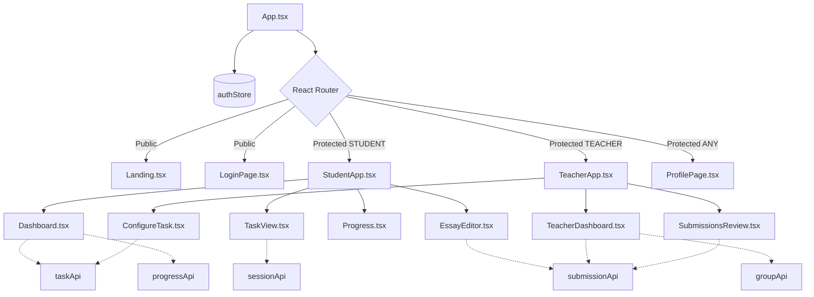
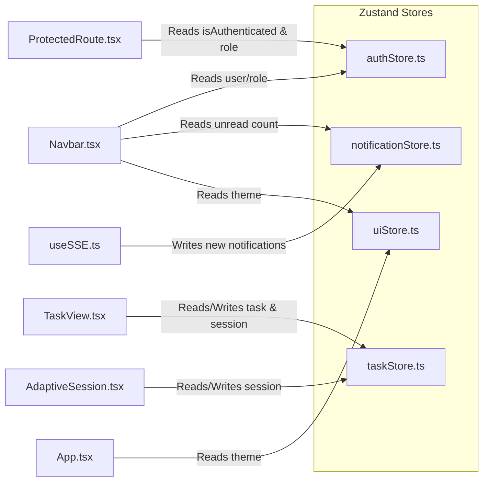

# Lingua Optima: Frontend Documentation

> 📚 **Documentation Navigation**: [Main Overview (README.md)](./README.md) | [Backend (BACKEND.md)](./BACKEND.md) | [Frontend (FRONTEND.md)](./FRONTEND.md) | [AI & OCR (AI_INTEGRATION.md)](./AI_INTEGRATION.md) | [DevOps (DEVOPS.md)](./DEVOPS.md) | 📊 **[Open Presentation (presentation.html)](./presentation.html)** | 📘 [Doxygen HTML](index.html)

Comprehensive documentation for the frontend application of **Lingua Optima** — an AI-powered English language mastery platform.

## Key Design Decisions

1. **No Global Leaderboard.** Only a group-level leaderboard is provided (strictly scoped within a specific teacher's student group).
2. **Token Storage:** The short-lived Access JWT is stored exclusively in JavaScript memory (NEVER in `localStorage`). The Refresh token is stored in a secure `HttpOnly` cookie.
3. **PWA (Progressive Web App):** Uses a Service Worker for asset and API caching, `IndexedDB` for persisting local drafts, and Background Sync for deferred submission delivery when offline.
4. **Axios Interceptor:** Implements silent JWT refresh — the response interceptor catches HTTP 401 errors, refreshes the access token in the background, and transparently retries the original request without interrupting the user experience.
5. **Real-Time Notifications:** Uses Server-Sent Events (SSE) to receive live notifications in real time.
6. **Strictly Scoped `localStorage` Usage:** Used exclusively for essay drafts (auto-saved every 30 seconds), non-sensitive UI preferences, and storing the last selected CEFR level.

## Complete File Structure

```text
frontend/
├── public/
│   ├── manifest.json          — PWA manifest (name, theme_color #4F46E5, icons)
│   ├── sw.js                  — Service Worker (cache strategies)
│   ├── favicon.svg
│   └── icons/                 — PWA icons 192x192, 512x512
├── src/
│   ├── main.tsx               — Entry point, React root
│   ├── App.tsx                — Router setup, layout wrapper
│   ├── vite-env.d.ts
│   ├── index.css              — Tailwind imports + CSS variables
│   │
│   ├── constants/             — Shared application constants
│   │   └── aiModels.ts        — Up-to-date 2026 AI provider and model catalog (DeepSeek, Qwen, Kimi, Gemini, Groq, OpenAI, Anthropic)
│   │
│   ├── api/                   — HTTP layer (all backend communication)
│   │   ├── axiosInstance.ts   — Base axios config, JWT interceptor (silent refresh), error handling
│   │   ├── authApi.ts         — login(), register(), googleLogin(), refresh(), logout()
│   │   ├── taskApi.ts         — generateTask(), getTasks(), assignTask(), previewTask()
│   │   ├── sessionApi.ts      — startSession(), getNextQuestion(), submitAnswer(), completeSession(), getActiveSession()
│   │   ├── submissionApi.ts   — submitText(), submitImage(), getSubmissions(), overrideScore()
│   │   ├── progressApi.ts     — getMyProgress(), getStudentProgress(), getGroupProgress()
│   │   ├── groupApi.ts        — getGroups(), createGroup(), addStudent(), removeStudent(), deleteGroup()
│   │   ├── notificationApi.ts — connectSSE(), markAsRead()
│   │   ├── subscriptionApi.ts — getMyTier(), getUsage(), upgradeTier()
│   │   ├── apiKeyApi.ts       — getKeys(), saveKey(provider, rawKey, modelName), deleteKey()
│   │   ├── exportApi.ts       — downloadGroupReport(), downloadStudentReport()
│   │   └── leaderboardApi.ts  — getGroupLeaderboard(groupId)
│   │
│   ├── components/
│   │   ├── common/            — Shared UI components
│   │   │   ├── Navbar.tsx     — Logo, nav links (role-based), notifications bell + counter, avatar dropdown, logout. Shows remaining evals badge
│   │   │   ├── Footer.tsx     — Privacy Policy, Terms of Service, Help Center, © Lingua Optima
│   │   │   ├── ProtectedRoute.tsx — Checks auth + role, redirects to /login
│   │   │   ├── RoleGuard.tsx  — Shows different content based on STUDENT/TEACHER role
│   │   │   ├── UpgradeWall.tsx — Modal: 'Upgrade to continue' with [Upgrade to Premium] and [Use own API key] options
│   │   │   ├── OfflineBanner.tsx — navigator.onLine indicator in Navbar
│   │   │   ├── CefrBadge.tsx  — Colored badge showing B1/B2/C1 level
│   │   │   ├── LoadingSpinner.tsx
│   │   │   ├── ErrorBoundary.tsx
│   │   │   ├── Toast.tsx      — Notification toast component
│   │   │   └── ConfirmDialog.tsx
│   │   │
│   │   ├── student/           — Student-only components
│   │   │   ├── Dashboard.tsx          — Streak counter, CEFR progress bar, active assignments list, recent tasks, grammar gaps. Buttons: [+ Generate New Task] [Submit Homework Photo]
│   │   │   ├── GenerateTask.tsx       — AI Provider & Model selector (7 providers + modern 2026 models), CEFR level selector, grammar topic select, domain select, task type (MCQ/Gap-fill/Rewrite/Essay), difficulty & question slider. Buttons: [Generate Task] [Clear]
│   │   │   ├── TaskView.tsx           — Task title + CEFR badge, sanitized task instructions, questions list (MCQ radio/inputs). Buttons: [Submit Answers] [Save Draft] [← Back]
│   │   │   ├── AdaptiveSession.tsx    — Single question at a time, difficulty indicator, progress bar, answer input. Handles resume from GET /sessions/active. Buttons: [Submit Answer] [Next]
│   │   │   ├── OcrSubmit.tsx          — Drag&drop zone / [Browse File] button, image preview, hint 'deleted after processing'. Buttons: [Analyse Photo] [Clear Photo]
│   │   │   ├── EssayEditor.tsx        — Sanitized essay prompt, CEFR target badge, textarea (min 250 words), live word counter, auto-save to localStorage every 30s. Buttons: [Submit for Scoring] [Save Draft]
│   │   │   ├── AIReview.tsx           — Original text (strikethrough red), corrected text (green highlights), tags [Rule] [Level] [Domain], essay rubric breakdown (TA/Coherence/LR/GR out of 10), overall score. Buttons: [Save to My Units] [Try Another Task] [Share Result]
│   │   │   ├── MyUnits.tsx            — Filters: CEFR/Topic/Domain/Date. Task cards with name/date/score/type. Buttons per card: [Retry Task] [Delete]
│   │   │   ├── Progress.tsx           — Grammar mastery radar chart, timeline score graph, topic/errors/mastery table, AI recommendations. Button: [Generate Targeted Task]
│   │   │   ├── GroupLeaderboard.tsx   — Group-only leaderboard (teacher assigns group). Shows rank, display_alias (auto 'Linguist #ID' or custom), weekly score. NO global leaderboard.
│   │   │   └── LevelUpModal.tsx       — Dynamic progression modal across all 6 levels (A1→A2→B1→B2→C1→C2) with [Yes, level up] [Stay on current level] buttons
│   │   │
│   │   ├── teacher/           — Teacher-only components
│   │   │   ├── TeacherDashboard.tsx   — Group summary (avg score, activity), top-5 weak topics, class progress chart, recent submissions awaiting override. Buttons: [+ Create Group] [+ Configure Task] [View All Submissions]
│   │   │   ├── StudentGroups.tsx      — Group list (name, student count). Per group: student cards (name, avg score). Buttons: [+ New Group] [+ Add Student by Email] [Remove Student] [Delete Group]
│   │   │   ├── ConfigureTask.tsx      — AI Provider & Model selector, task type, CEFR, grammar topic, domain, target group selector (multi), due date picker. Buttons: [Preview] [Deploy to Students] [Save Template]
│   │   │   ├── SubmissionsReview.tsx  — Filters: Group/Student/Task/Status. Table: Student|Task|AI Score|Status. Expandable row: AI feedback + student answer. Buttons per row: [Override Score] [Approve AI Grade] [Add Teacher Comment]
│   │   │   └── ExportReports.tsx      — Group selector, date range picker, format (CSV/PDF). Buttons: [Generate Report] [Download Last]
│   │   │
│   │   └── auth/              — Auth pages
│   │       ├── LoginPage.tsx          — Tab: Log In / Register. Email + password inputs. Buttons: [Log In] [Create Account] [Google OAuth] [Forgot Password]
│   │       └── ForgotPassword.tsx     — Email input, [Send Reset Link] button
│   │
│   ├── hooks/                 — Custom React hooks
│   │   ├── useAuth.ts         — Current user, isAuthenticated, login(), logout(), register()
│   │   ├── useSSE.ts          — SSE connection management, auto-reconnect on disconnect
│   │   ├── useUsage.ts        — Remaining evaluations, checks quota before AI calls
│   │   ├── useOnline.ts       — navigator.onLine state
│   │   ├── useDraft.ts        — localStorage draft save/load/clear
│   │   └── useDebounce.ts
│   │
│   ├── store/                 — State management (Zustand)
│   │   ├── authStore.ts       — User, tokens, role
│   │   ├── notificationStore.ts — Unread count, notification list
│   │   ├── taskStore.ts       — Current task, session state
│   │   └── uiStore.ts         — Theme, sidebar collapsed, etc.
│   │
│   ├── types/                 — TypeScript interfaces
│   │   ├── user.ts            — User, Role ('STUDENT' | 'TEACHER' | 'ADMIN'), CefrLevel ('A1' | 'A2' | 'B1' | 'B2' | 'C1' | 'C2')
│   │   ├── task.ts            — Task, TaskQuestion, TaskParams (with provider & modelName), TaskType
│   │   ├── submission.ts      — Submission, SubmissionResult, EssayScore
│   │   ├── session.ts         — SessionState, AnswerFeedback
│   │   ├── group.ts           — Group, GroupStudent
│   │   ├── subscription.ts    — SubscriptionTier, UsageCounter
│   │   ├── notification.ts    — Notification, NotificationType
│   │   └── progress.ts        — ProgressRecord, GroupProgress
│   │
│   ├── utils/                 — Utility functions
│   │   ├── formatDate.ts
│   │   ├── cefrColors.ts      — Color mapping for CEFR badges (A1 teal, A2 cyan, B1 emerald, B2 sky, C1 purple, C2 amber)
│   │   ├── wordCount.ts       — Essay word counter
│   │   ├── textSanitizer.ts   — Sanitizes task content and AI feedback to strip internal system prompt markers
│   │   └── offlineSync.ts     — IndexedDB + Background Sync logic
│   │
│   └── pages/                 — Route-level page components
│       ├── Landing.tsx        — Hero block, 6 feature cards, [Get Started] [Log In] [View Demo] buttons
│       ├── StudentApp.tsx     — Layout wrapper for student routes
│       ├── TeacherApp.tsx     — Layout wrapper for teacher routes
│       ├── ProfilePage.tsx    — Avatar, name, email, role toggle (Student ⇄ Educator), 6-level CEFR selector (A1–C2), platform FAQ guide, AI Provider & Model BYOK section (7 providers: DeepSeek, Qwen, Kimi, OpenAI, Anthropic, Gemini, Groq with modern 2026 models & AES-256-GCM encryption)
│       ├── SubscriptionPage.tsx — Free/Premium/Educator tier cards, current plan highlight, [Upgrade] buttons, payment stub
│       └── NotFound.tsx
│
├── tailwind.config.ts         — Colors (#4F46E5, #0284C7, #F8FAFC), fonts (Inter, JetBrains Mono)
├── vite.config.ts
├── tsconfig.json
├── package.json
└── .env.example               — VITE_API_URL=http://localhost:8080/api
```

## Component Interaction Diagram



## State Management Diagram



## Routing Table

| Path | Component | Role Required | Description |
|------|-----------|---------------|-------------|
| `/` | `Landing.tsx` | *None* | Public landing page for unauthenticated visitors. |
| `/login` | `LoginPage.tsx` | *None* | Sign-in and registration page (Email/Password + Google OAuth2). |
| `/student/*` | `StudentApp.tsx` | `STUDENT` | Primary student workspace (Dashboard, Tasks, CAT Sessions, Progress). |
| `/teacher/*` | `TeacherApp.tsx` | `TEACHER` | Primary educator portal (Groups, Submissions Review, Task Deployment). |
| `/profile` | `ProfilePage.tsx` | `STUDENT`, `TEACHER` | Profile management, BYOK API key configuration, and preferences. |
| `/subscription` | `SubscriptionPage.tsx` | `STUDENT`, `TEACHER` | Subscription plan management and weekly quota monitoring. |
| `*` | `NotFound.tsx` | *None* | 404 Not Found fallback page. |

## PWA Details

The application implements full Progressive Web App (PWA) support to ensure a resilient user experience on unstable network connections:

- **Service Worker:** Employs hybrid caching strategies (*Cache First* for static assets and fonts, *Network First* for critical dynamic API calls).
- **IndexedDB:** Used for local persistence of active task structures and draft responses. The client database schema includes object stores for `drafts` and `offline_submissions`.
- **Background Sync:** Built-in Service Worker capability that queues outbound submissions (such as essay submissions) while offline and automatically replays them once connectivity is restored, notifying the user that their work has been queued for synchronization.

## Design System

- **Colors:**
  - **Primary:** `#4F46E5` (Used for primary action buttons, active navigation states, and brand accents)
  - **Accent:** `#0284C7` (Used for secondary interactive actions and links)
  - **Surface:** `#F8FAFC` (Background color for cards, panels, and workspaces)
- **Typography:**
  - **UI (Headings & Body Text):** `Inter`
  - **Data (Code, Metrics & Tables):** `JetBrains Mono`
- **Accessibility:** All color contrast ratios and font sizes conform to the **WCAG AA** accessibility standard.
