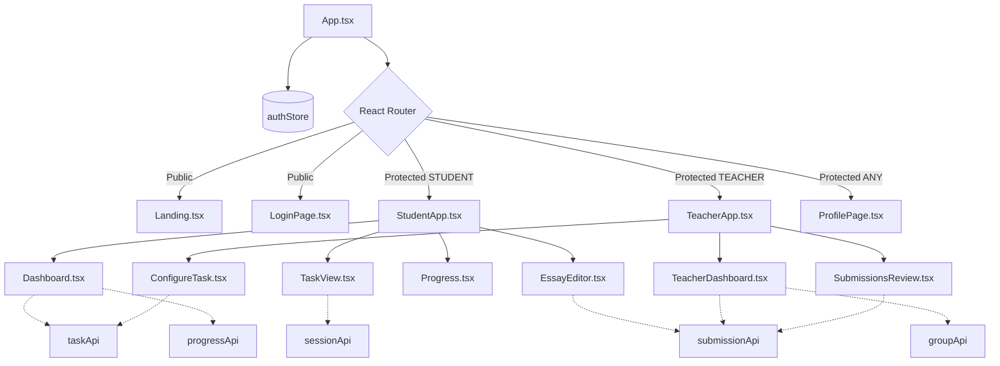
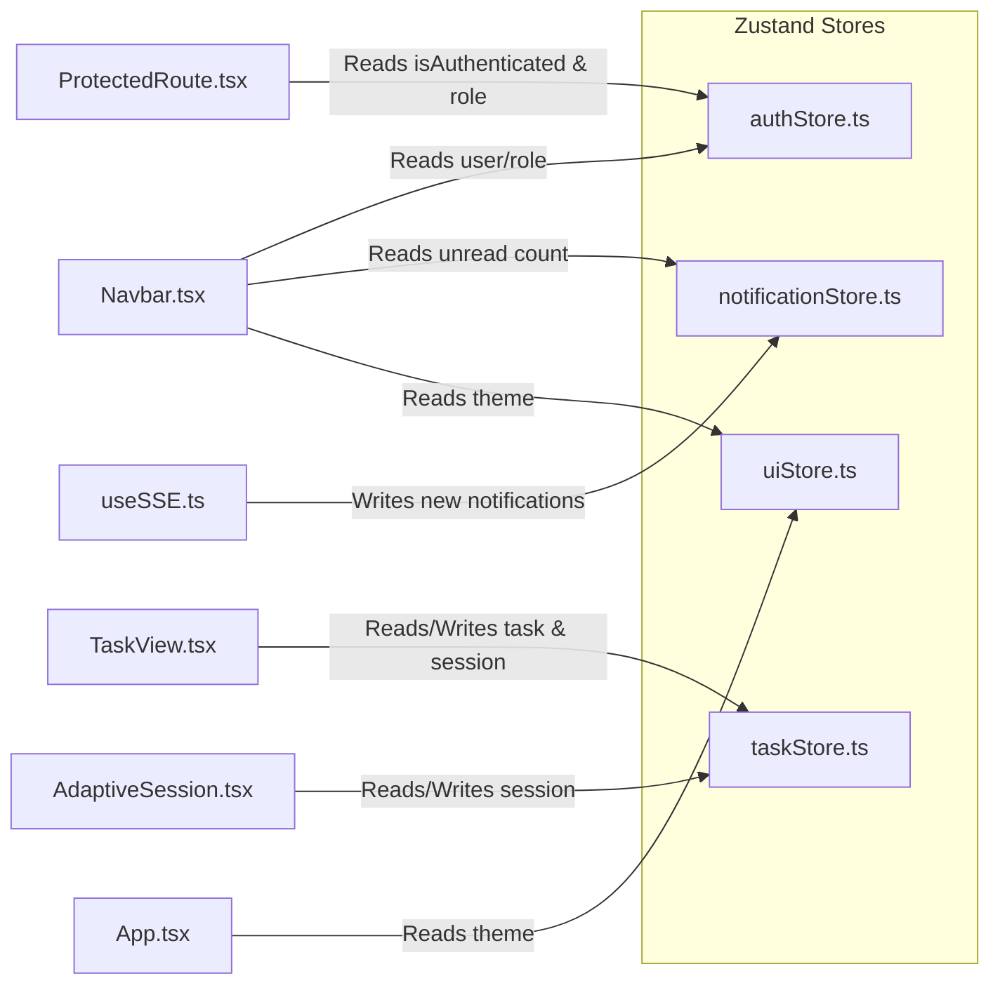

# Lingua Optima: Frontend Documentation

> 📚 **Навигация по документации**: [Главный обзор (README.md)](./README.md) | [Backend (BACKEND.md)](./BACKEND.md) | [Frontend (FRONTEND.md)](./FRONTEND.md) | [AI & OCR (AI_INTEGRATION.md)](./AI_INTEGRATION.md) | [DevOps (DEVOPS.md)](./DEVOPS.md) | 📊 **[Открыть презентацию (presentation.html)](./presentation.html)** | 📘 [Doxygen HTML](./generated/html/index.html)

Документация по фронтенд-части проекта **Lingua Optima** — платформы для изучения английского языка с использованием AI.

## Ключевые архитектурные решения (KEY DESIGN DECISIONS)

1. **Отсутствие глобального лидерборда.** Доступен только лидерборд на уровне учебной группы (внутри группы студентов конкретного преподавателя).
2. **Хранение токенов:** Access JWT хранится исключительно в памяти JS (НЕ в `localStorage`). Refresh token хранится в безопасной `HttpOnly` cookie.
3. **PWA (Progressive Web App):** Использование Service Worker для кэширования, `IndexedDB` для сохранения черновиков локально и Background Sync для отложенной отправки заданий при отсутствии интернета.
4. **Axios Interceptor:** Реализовано "тихое" обновление JWT — перехватчик отлавливает ошибки 401, обновляет токен в фоне и повторяет исходный запрос без прерывания пользовательского опыта.
5. **Real-time уведомления:** Используется технология SSE (Server-Sent Events) для получения уведомлений в реальном времени.
6. **Ограниченное использование `localStorage`:** Применяется только для черновиков эссе (автосохранение каждые 30 секунд), пользовательских настроек UI и хранения последнего выбранного уровня CEFR.

## Полная структура файлов (COMPLETE FILE STRUCTURE)

```text
frontend/
├── public/
│   ├── manifest.json          — PWA manifest (name, theme_color #4F46E5, icons)
│   ├── sw.js                  — Service Worker (cache strategies)
│   ├── favicon.svg
│   └── icons/                 — PWA icons 192x192, 512x512
├── src/
│   ├── main.tsx               — Entry point, React root
│   ├── App.tsx                — Router setup, layout wrapper
│   ├── vite-env.d.ts
│   ├── index.css              — Tailwind imports + CSS variables
│   │
│   ├── api/                   — HTTP layer (all backend communication)
│   │   ├── axiosInstance.ts   — Base axios config, JWT interceptor (silent refresh), error handling
│   │   ├── authApi.ts         — login(), register(), refresh(), logout()
│   │   ├── taskApi.ts         — generateTask(), getTasks(), assignTask(), previewTask()
│   │   ├── sessionApi.ts      — startSession(), getNextQuestion(), submitAnswer(), completeSession(), getActiveSession()
│   │   ├── submissionApi.ts   — submitText(), submitImage(), getSubmissions(), overrideScore()
│   │   ├── progressApi.ts     — getMyProgress(), getStudentProgress(), getGroupProgress()
│   │   ├── groupApi.ts        — getGroups(), createGroup(), addStudent(), removeStudent(), deleteGroup()
│   │   ├── notificationApi.ts — connectSSE(), markAsRead()
│   │   ├── subscriptionApi.ts — getMyTier(), getUsage(), upgradeTier()
│   │   ├── apiKeyApi.ts       — getKeys(), saveKey(), deleteKey()
│   │   ├── exportApi.ts       — downloadGroupReport(), downloadStudentReport()
│   │   └── leaderboardApi.ts  — getGroupLeaderboard(groupId)
│   │
│   ├── components/
│   │   ├── common/            — Shared UI components
│   │   │   ├── Navbar.tsx     — Logo, nav links (role-based), notifications bell + counter, avatar dropdown, logout. Shows remaining evals badge
│   │   │   ├── Footer.tsx     — Privacy Policy, Terms of Service, Help Center, © Lingua Optima
│   │   │   ├── ProtectedRoute.tsx — Checks auth + role, redirects to /login
│   │   │   ├── RoleGuard.tsx  — Shows different content based on STUDENT/TEACHER role
│   │   │   ├── UpgradeWall.tsx — Modal: 'Upgrade to continue' with [Upgrade to Premium] and [Use own API key] options
│   │   │   ├── OfflineBanner.tsx — navigator.onLine indicator in Navbar
│   │   │   ├── CefrBadge.tsx  — Colored badge showing B1/B2/C1 level
│   │   │   ├── LoadingSpinner.tsx
│   │   │   ├── ErrorBoundary.tsx
│   │   │   ├── Toast.tsx      — Notification toast component
│   │   │   └── ConfirmDialog.tsx
│   │   │
│   │   ├── student/           — Student-only components
│   │   │   ├── Dashboard.tsx          — Streak counter, CEFR progress bar, active assignments list, recent tasks, grammar gaps. Buttons: [+ Generate New Task] [Submit Homework Photo]
│   │   │   ├── GenerateTask.tsx       — CEFR level selector, grammar topic multiselect, domain select, task type (MCQ/Gap-fill/Rewrite/Essay), difficulty slider, own API key toggle. Buttons: [Generate Task] [Clear]
│   │   │   ├── TaskView.tsx           — Task title + CEFR badge, questions list (MCQ radio/inputs), timer (optional). Buttons: [Submit Answers] [Save Draft] [← Back]
│   │   │   ├── AdaptiveSession.tsx    — Single question at a time, difficulty indicator, progress bar, answer input. Handles resume from GET /sessions/active. Buttons: [Submit Answer] [Next]
│   │   │   ├── OcrSubmit.tsx          — Drag&drop zone / [Browse File] button, image preview, hint 'deleted after processing'. Buttons: [Analyse Photo] [Clear Photo]
│   │   │   ├── EssayEditor.tsx        — Task prompt (read-only), CEFR target badge, textarea (min 250 words), live word counter, auto-save to localStorage every 30s. Buttons: [Submit for Scoring] [Save Draft]
│   │   │   ├── AIReview.tsx           — Original text (strikethrough red), corrected text (green highlights), tags [Rule] [Level] [Domain], essay rubric breakdown (TA/Coherence/LR/GR out of 10), overall score. Buttons: [Save to My Units] [Try Another Task] [Share Result]
│   │   │   ├── MyUnits.tsx            — Filters: CEFR/Topic/Domain/Date. Task cards with name/date/score/type. Buttons per card: [Retry Task] [Delete]
│   │   │   ├── Progress.tsx           — Grammar mastery radar chart, timeline score graph, topic/errors/mastery table, AI recommendations. Button: [Generate Targeted Task]
│   │   │   ├── GroupLeaderboard.tsx   — Group-only leaderboard (teacher assigns group). Shows rank, display_alias (auto 'Linguist #ID' or custom), weekly score. NO global leaderboard.
│   │   │   └── LevelUpModal.tsx       — 'You mastered B1! Ready for B2?' with [Yes, level up] [Stay on B1] buttons
│   │   │
│   │   ├── teacher/           — Teacher-only components
│   │   │   ├── TeacherDashboard.tsx   — Group summary (avg score, activity), top-5 weak topics, class progress chart, recent submissions awaiting override. Buttons: [+ Create Group] [+ Configure Task] [View All Submissions]
│   │   │   ├── StudentGroups.tsx      — Group list (name, student count). Per group: student cards (name, avg score). Buttons: [+ New Group] [+ Add Student by Email] [Remove Student] [Delete Group]
│   │   │   ├── ConfigureTask.tsx      — Task type, CEFR, grammar topic, domain, difficulty slider, target group selector (multi), due date picker, AI provider select. Buttons: [Generate Preview] [Deploy to Students] [Save as Template]
│   │   │   ├── SubmissionsReview.tsx  — Filters: Group/Student/Task/Status. Table: Student|Task|AI Score|Status. Expandable row: AI feedback + student answer. Buttons per row: [Override Score] [Approve AI Grade] [Add Teacher Comment]
│   │   │   └── ExportReports.tsx      — Group selector, date range picker, format (CSV/PDF). Buttons: [Generate Report] [Download Last]
│   │   │
│   │   └── auth/              — Auth pages
│   │       ├── LoginPage.tsx          — Tab: Log In / Register. Email + password inputs. Buttons: [Log In] [Create Account] [Google OAuth] [Forgot Password]
│   │       └── ForgotPassword.tsx     — Email input, [Send Reset Link] button
│   │
│   ├── hooks/                 — Custom React hooks
│   │   ├── useAuth.ts         — Current user, isAuthenticated, login(), logout(), register()
│   │   ├── useSSE.ts          — SSE connection management, auto-reconnect on disconnect
│   │   ├── useUsage.ts        — Remaining evaluations, checks quota before AI calls
│   │   ├── useOnline.ts       — navigator.onLine state
│   │   ├── useDraft.ts        — localStorage draft save/load/clear
│   │   └── useDebounce.ts
│   │
│   ├── store/                 — State management (Zustand)
│   │   ├── authStore.ts       — User, tokens, role
│   │   ├── notificationStore.ts — Unread count, notification list
│   │   ├── taskStore.ts       — Current task, session state
│   │   └── uiStore.ts         — Theme, sidebar collapsed, etc.
│   │
│   ├── types/                 — TypeScript interfaces
│   │   ├── user.ts            — User, Role, CefrLevel
│   │   ├── task.ts            — Task, TaskQuestion, TaskParams, TaskType
│   │   ├── submission.ts      — Submission, SubmissionResult, EssayScore
│   │   ├── session.ts         — SessionState, AnswerFeedback
│   │   ├── group.ts           — Group, GroupStudent
│   │   ├── subscription.ts    — SubscriptionTier, UsageCounter
│   │   ├── notification.ts    — Notification, NotificationType
│   │   └── progress.ts        — ProgressRecord, GroupProgress
│   │
│   ├── utils/                 — Utility functions
│   │   ├── formatDate.ts
│   │   ├── cefrColors.ts      — Color mapping for CEFR badges
│   │   ├── wordCount.ts       — Essay word counter
│   │   └── offlineSync.ts     — IndexedDB + Background Sync logic
│   │
│   └── pages/                 — Route-level page components
│       ├── Landing.tsx        — Hero block, 6 feature cards, [Get Started] [Log In] [View Demo] buttons
│       ├── StudentApp.tsx     — Layout wrapper for student routes
│       ├── TeacherApp.tsx     — Layout wrapper for teacher routes
│       ├── ProfilePage.tsx    — Avatar, name, email, CEFR level, AI Provider section (toggle + key input + provider select), notification prefs, display_alias for leaderboard. Buttons: [Save Changes] [Change Password] [Delete Account]
│       ├── SubscriptionPage.tsx — Free/Premium/Educator tier cards, current plan highlight, [Upgrade] buttons, payment stub
│       └── NotFound.tsx
│
├── tailwind.config.ts         — Colors (#4F46E5, #0284C7, #F8FAFC), fonts (Inter, JetBrains Mono)
├── vite.config.ts
├── tsconfig.json
├── package.json
└── .env.example               — VITE_API_URL=http://localhost:8080/api
```

## Диаграмма взаимодействия компонентов (COMPONENT INTERACTION DIAGRAM)



## Диаграмма управления состоянием (STATE MANAGEMENT DIAGRAM)



## Таблица маршрутизации (ROUTING TABLE)

| Path | Component | Role Required | Description |
|------|-----------|---------------|-------------|
| `/` | `Landing.tsx` | *None* | Главная страница для неавторизованных пользователей. |
| `/login` | `LoginPage.tsx` | *None* | Страница входа и регистрации. |
| `/student/*` | `StudentApp.tsx` | `STUDENT` | Основной портал для студентов (Dashboard, Tasks, Progress). |
| `/teacher/*` | `TeacherApp.tsx` | `TEACHER` | Основной портал для преподавателей (Groups, Submissions, Config). |
| `/profile` | `ProfilePage.tsx` | `STUDENT`, `TEACHER` | Управление профилем, настройка API-ключей и предпочтений. |
| `/subscription` | `SubscriptionPage.tsx` | `STUDENT`, `TEACHER` | Управление подпиской и лимитами использования. |
| `*` | `NotFound.tsx` | *None* | Страница 404. |

## Детали PWA (PWA DETAILS)

В приложении реализована полноценная поддержка PWA для обеспечения плавного пользовательского опыта при нестабильном соединении:

- **Service Worker:** Использует кэширующие стратегии (Cache First для статики, Network First для критичных API запросов).
- **IndexedDB:** Применяется для локального хранения структуры заданий и ответов на них. Схема базы данных содержит таблицы для `drafts` и `offline_submissions`.
- **Background Sync:** Встроенная функциональность Service Worker, которая позволяет откладывать сетевые запросы (например, отправку эссе) до момента восстановления связи. Пользователь получает уведомление о том, что данные будут отправлены позже.

## Дизайн-система (DESIGN SYSTEM)

- **Цвета (Colors):**
  - **Primary:** `#4F46E5` (Используется для основных кнопок, активных элементов и брендинга)
  - **Accent:** `#0284C7` (Используется для выделения второстепенных действий и ссылок)
  - **Surface:** `#F8FAFC` (Фоновые цвета карточек и панелей)
- **Типографика (Typography):**
  - **UI (Заголовки, текст):** `Inter`
  - **Data (Код, данные, таблицы):** `JetBrains Mono`
- **Доступность:** Все цветовые контрасты и размеры шрифтов соответствуют стандарту **WCAG AA**.
