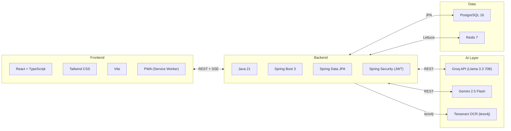
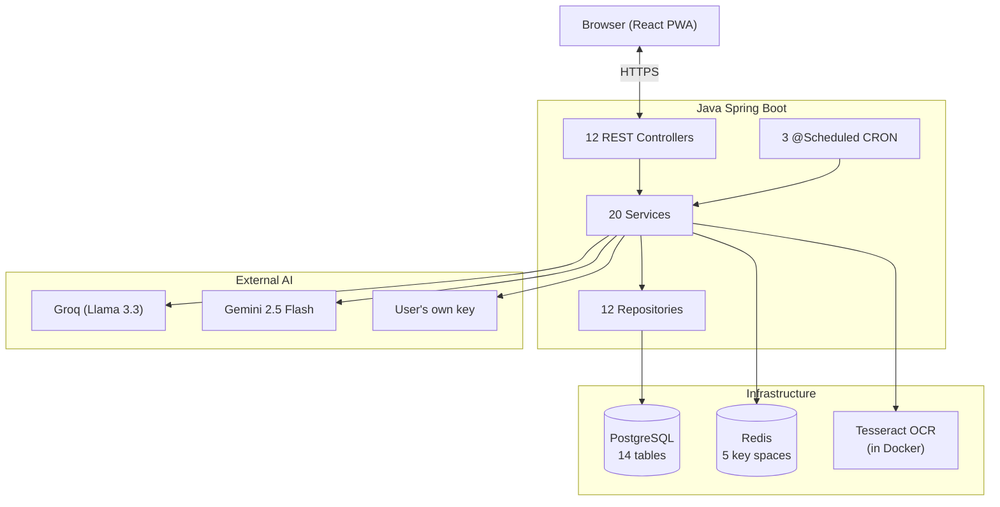
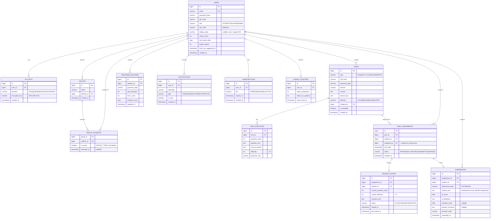
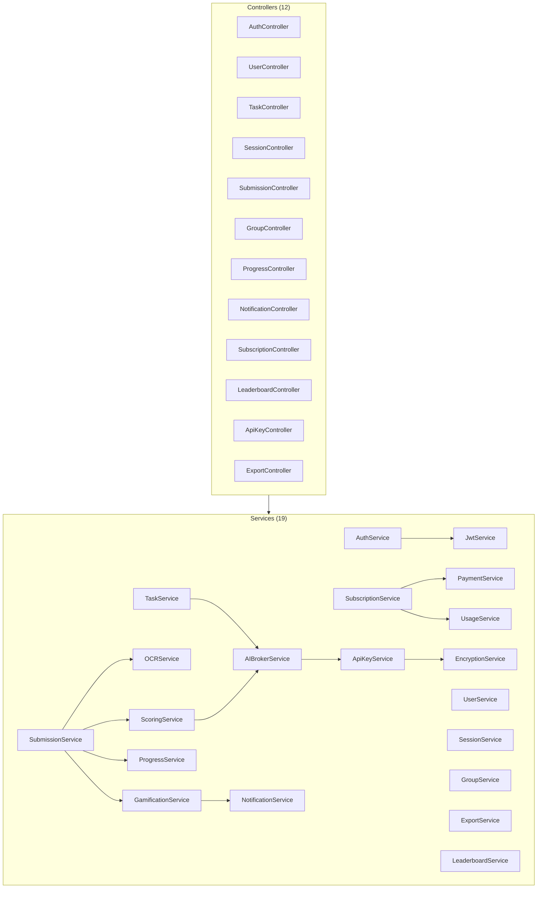
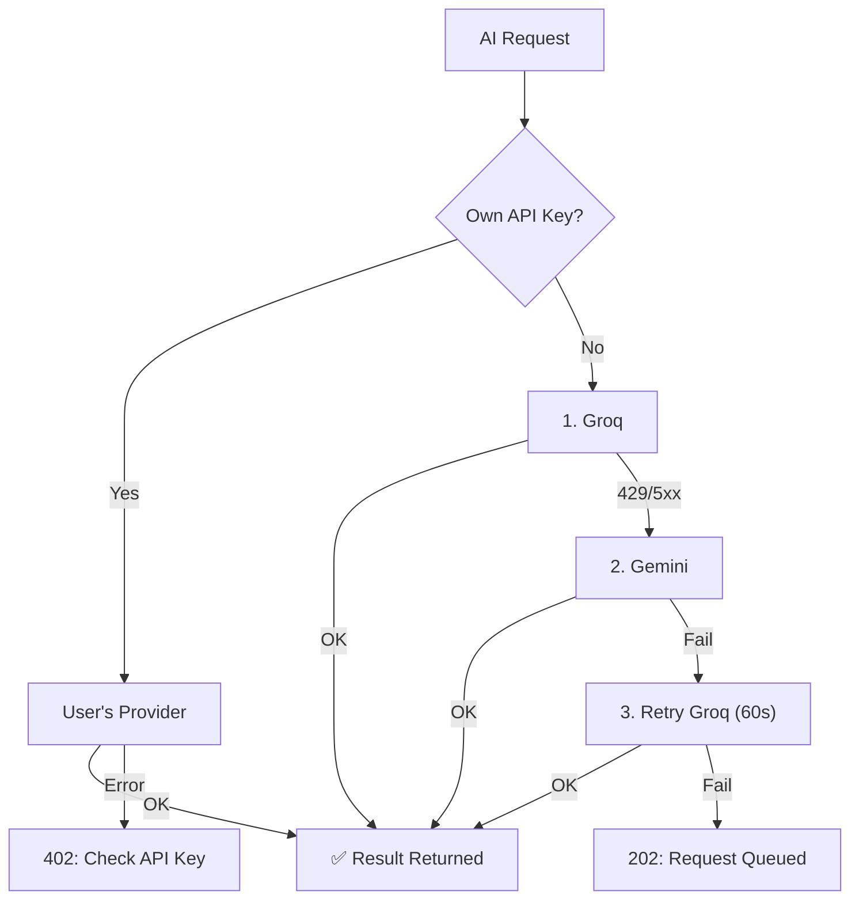

# 📚 Lingua Optima — Complete Documentation

> AI-powered platform for English language mastery. Task generation, essay evaluation, homework OCR, and computerized adaptive testing.  
> 📊 **Interactive Project Presentation**: [Open Presentation (presentation.html)](presentation.html)


### 🗂 All Documentation Files

| Documentation Section | Link | Description |
|---|---|---|
| **Main Overview (README)** | [README.md](./README.md) | Architecture, tech stack, database, REST API, and security |
| **Backend Specification** | [BACKEND.md](./BACKEND.md) | All controllers, services, repositories, DTOs, migrations, and exceptions |
| **Frontend Specification** | [FRONTEND.md](./FRONTEND.md) | React components, Zustand stores, hooks, routing, and design system |
| **AI & OCR Integration** | [AI_INTEGRATION.md](./AI_INTEGRATION.md) | Fallback chain (Groq, Gemini, BYOK), prompts, Zero-Retention OCR, and CAT |
| **DevOps & Deployment** | [DEVOPS.md](./DEVOPS.md) | Docker Compose, Nginx, CI/CD, `.env` environment variables, and monitoring |
| **Interactive Presentation** | [presentation.html](presentation.html) | Full interactive project presentation (Pitch Deck & Architecture) |
| **Doxygen API Reference** | [index.html](index.html) | Compiled Doxygen documentation covering all classes and methods |

---

## Table of Contents

1. [Project Overview](#sec1)
2. [Key Architectural Decisions](#sec2)
3. [Technology Stack](#sec3)
4. [System Architecture](#sec4)
5. [Project File Structure](#sec5)
6. [Database (ERD)](#sec6)
7. [REST API — Complete Reference Table](#sec7)
8. [Frontend — Pages & Navigation](#sec8)
9. [Backend — Layers & Classes](#sec9)
10. [AI — Providers & Prompts](#sec10)
11. [Subscriptions & Billing (Stub)](#sec11)
12. [Security](#sec12)
13. [DevOps & Deployment](#sec13)

---

## 1. Project Overview {#sec1}

**Lingua Optima** is an English language learning platform (CEFR levels B1–C1) where:

- **Students** independently generate exercises via AI, upload photos of handwritten homework (OCR), write essays, and receive instant diagnostic feedback
- **Teachers** create and deploy assignments to student groups, inspect analytics, override AI grades, and export progress reports

### 6 Core Components (from the Presentation)

| # | Component | Description |
|---|---|---|
| 1 | Self-Service Task Generator | Exercise generation via Llama 3.3 70B / Llama 4 & multi-model selector |
| 2 | Homework OCR Check | Photo upload → Tesseract OCR → AI grammar evaluation |
| 3 | AI Essay Scoring | Rubric-based grading: Task Achievement, Coherence, Lexical Resource, Grammatical Range |
| 4 | Adaptive Tests | CAT algorithm: question difficulty adapts in real time |
| 5 | Progress Dashboard | Grammar gap tracking and mastery radar chart |
| 6 | Educator Portal | Task deployment, grade overrides, and report exports |

---

## 2. Key Architectural Decisions {#sec2}

| Topic | Decision | Rationale |
|---|---|---|
| Leaderboard | **Group-only** (no global leaderboard) | Protects student privacy and focuses on the teacher's classroom group |
| Removing a student from a group | **Soft delete** (`is_active=false`). Submissions are hidden. When re-added, history is **restored** | Teachers do not lose historical records if a student returns to the group |
| Billing / Payments | **Stub** — full error handling infrastructure, while the stub always approves | Designed for testing; real payment processing requires legal and PCI compliance setup |
| AI Provider Strategy | **Combo:** Groq (tasks) + Gemini (essays) + Tesseract (OCR). 100% free tier | $0 operational budget |
| Self-service tasks | Automatic self-assignment (`assigned_by = student`) | Unifies the execution and grading flow for both student-created and teacher-assigned tasks |
| Image Storage | **Zero-Retention OCR** — photos exist strictly in RAM and are never written to disk | GDPR compliance and handwriting biometric privacy |

---

## 3. Technology Stack {#sec3}



---

## 4. System Architecture {#sec4}



---

## 5. Project File Structure {#sec5}

```text
lingua_optima/
├── presentation.html                  — Interactive project presentation
├── docker-compose.yml                 — PostgreSQL + Redis + Backend + Frontend
├── .env.example                       — Environment variables template
├── .github/workflows/ci.yml           — CI/CD pipeline
│
├── docs/                              — Documentation
│   ├── README.md                      — Master document (THIS FILE)
│   ├── BACKEND.md                     — Backend specification
│   ├── FRONTEND.md                    — Frontend specification
│   ├── AI_INTEGRATION.md              — AI providers, prompts, OCR, and CAT
│   └── DEVOPS.md                      — Docker, CI/CD, and deployment
│
├── backend/                           — Java Spring Boot 3
│   ├── build.gradle
│   ├── Dockerfile
│   ├── src/main/java/com/linguaoptima/api/
│   │   ├── LinguaOptimaApplication.java
│   │   │
│   │   ├── config/                          ── Configuration
│   │   │   ├── SecurityConfig.java          — Filter chain, CORS, JWT filter
│   │   │   ├── JwtAuthenticationFilter.java — Bearer token extraction → SecurityContext
│   │   │   ├── RedisConfig.java             — RedisTemplate and serializers
│   │   │   ├── CorsConfig.java              — Allowed origins configuration
│   │   │   ├── SchedulingConfig.java        — @EnableScheduling
│   │   │   └── WebConfig.java               — Multipart upload limit (10MB)
│   │   │
│   │   ├── controller/                      ── REST API
│   │   │   ├── AuthController.java          — /register, /login, /google, /refresh, /logout, /logout-all, /forgot-password
│   │   │   ├── UserController.java          — /me (GET, PUT, DELETE), /me/password
│   │   │   ├── TaskController.java          — /generate, /preview, /{id}/assign, /template
│   │   │   ├── SessionController.java       — /start, /active, /{id}/next-question, /{id}/answer, /{id}/complete
│   │   │   ├── SubmissionController.java    — /text, /image, /{id}, /my, /{id}/override
│   │   │   ├── GroupController.java         — Group CRUD + student membership management
│   │   │   ├── ProgressController.java      — /me, /student/{id}, /group/{id}
│   │   │   ├── NotificationController.java  — /stream (SSE), /unread-count, /{id}/read
│   │   │   ├── SubscriptionController.java  — /me, /upgrade, /downgrade, /usage
│   │   │   ├── ApiKeyController.java        — User AI key CRUD
│   │   │   ├── LeaderboardController.java   — /group/{groupId} (Group-only!)
│   │   │   └── ExportController.java        — /report/group/{id}, /report/student/{id}
│   │   │
│   │   ├── dto/
│   │   │   ├── request/                     ── 12 Request DTOs
│   │   │   │   ├── RegisterRequest.java     — email, password, fullName, role
│   │   │   │   ├── LoginRequest.java        — email, password
│   │   │   │   ├── TaskParamsRequest.java   — cefrLevel, grammarTopic, domain, taskType, difficulty
│   │   │   │   ├── AssignTaskRequest.java   — groupIds[], dueDate
│   │   │   │   ├── TextSubmissionRequest.java — text, assignmentId, type
│   │   │   │   ├── OverrideRequest.java     — overrideScore, teacherComment
│   │   │   │   ├── AnswerRequest.java       — questionId, answer
│   │   │   │   ├── CreateGroupRequest.java  — name
│   │   │   │   ├── AddStudentRequest.java   — email
│   │   │   │   ├── CreateApiKeyRequest.java — provider, rawKey
│   │   │   │   ├── UpgradeRequest.java      — targetTier, paymentToken (stub)
│   │   │   │   └── ChangePasswordRequest.java — oldPassword, newPassword
│   │   │   │
│   │   │   └── response/                    ── 14 Response DTOs
│   │   │       ├── TokenResponse.java       — accessToken, user info
│   │   │       ├── UserResponse.java        — id, email, fullName, role, cefrLevel, displayAlias, streakCount
│   │   │       ├── TaskResponse.java        — id, type, cefrLevel, content, questions
│   │   │       ├── QuestionResponse.java    — id, text, options, difficulty
│   │   │       ├── AnswerFeedbackResponse.java — isCorrect, correctAnswer, explanation
│   │   │       ├── SubmissionResultResponse.java — originalText, corrections, score, rubric
│   │   │       ├── ProgressResponse.java    — grammarTopic, attempts, errors, mastery
│   │   │       ├── GroupResponse.java       — id, name, studentCount, avgScore
│   │   │       ├── LeaderboardEntryResponse.java — rank, displayAlias, weeklyScore
│   │   │       ├── SubscriptionResponse.java — tier, expiresAt
│   │   │       ├── UsageResponse.java       — weekEvals, weekOcr, limits
│   │   │       ├── PaymentResultResponse.java — success, transactionId, errorCode
│   │   │       ├── NotificationResponse.java — id, message, type, isRead
│   │   │       └── ErrorResponse.java       — status, message, timestamp, errors[]
│   │   │
│   │   ├── domain/                          ── JPA Entities
│   │   │   ├── User.java                    — Roles, CEFR level, streaks, displayAlias
│   │   │   ├── ApiKey.java                  — Encrypted BYOK AI keys
│   │   │   ├── Task.java                    — Tasks (type, content, answer key)
│   │   │   ├── TaskQuestion.java            — Questions for CAT sessions
│   │   │   ├── TaskAssignment.java          — Assignment of a task to a student
│   │   │   ├── SessionState.java            — Adaptive testing session state
│   │   │   ├── Submission.java              — Submission result (AI score + teacher override)
│   │   │   ├── ProgressRecord.java          — Topic mastery tracking
│   │   │   ├── Group.java                   — Student groups (with soft delete)
│   │   │   ├── Notification.java            — User notifications
│   │   │   ├── Subscription.java            — FREE / PREMIUM / EDUCATOR tiers
│   │   │   ├── UsageCounter.java            — Weekly quota counters
│   │   │   └── enums/                       — 10 domain enumeration types
│   │   │
│   │   ├── repository/                      ── 12 Spring Data JPA Repositories
│   │   │
│   │   ├── service/                         ── Business Logic Layer
│   │   │   ├── AuthService.java             — Registration, login, Google OAuth2, JWT refresh
│   │   │   ├── JwtService.java              — JWT generation and validation
│   │   │   ├── UserService.java             — Profile management, password change, GDPR deletion
│   │   │   ├── TaskService.java             — AI task generation and group deployment
│   │   │   ├── SessionService.java          — CAT adaptive testing algorithm
│   │   │   ├── SubmissionService.java       — Text and OCR image submission processing
│   │   │   ├── ScoringService.java          — Grammar and essay rubric evaluation
│   │   │   ├── OCRService.java              — Tesseract OCR with Zero-Retention RAM wiping
│   │   │   ├── ProgressService.java         — Mastery calculation and CEFR auto-leveling
│   │   │   ├── GroupService.java            — Group management and student soft deletion
│   │   │   ├── NotificationService.java     — Real-time SSE push notifications
│   │   │   ├── GamificationService.java     — Daily streaks and freeze tokens
│   │   │   ├── SubscriptionService.java     — Subscription tiers and quota enforcement
│   │   │   ├── PaymentService.java          — Payment STUB (always approves)
│   │   │   ├── UsageService.java            — Weekly usage counters and limits
│   │   │   ├── ExportService.java           — PDF and CSV report generation
│   │   │   ├── ApiKeyService.java           — User AI key management
│   │   │   ├── EncryptionService.java       — AES-256-GCM authenticated encryption
│   │   │   ├── LeaderboardService.java      — Privacy-preserving intra-group leaderboard
│   │   │   └── ai/
│   │   │       ├── AIBrokerService.java     — Provider routing, caching, and fallback chain
│   │   │       ├── AIProvider.java          — Provider interface: complete(prompt) → String
│   │   │       ├── GroqProvider.java        — Llama 3.1 70B (free tier)
│   │   │       ├── GeminiProvider.java      — Gemini 1.5 Flash (free tier)
│   │   │       ├── OpenAIProvider.java      — For user-supplied BYOK keys
│   │   │       └── AnthropicProvider.java   — For user-supplied BYOK keys
│   │   │
│   │   ├── scheduler/                       ── Scheduled CRON Jobs
│   │   │   ├── StreakScheduler.java          — 01:00 daily: streak verification
│   │   │   ├── UsageResetScheduler.java     — 00:00 Monday: weekly quota counter reset
│   │   │   └── NotificationScheduler.java   — 09:00 daily: contextual grammar notifications
│   │   │
│   │   ├── exception/                       ── Exception Handling
│   │   │   ├── GlobalExceptionHandler.java  — @ControllerAdvice global handler
│   │   │   ├── OcrException.java            — 422: "Image is blurry or unreadable"
│   │   │   ├── AIServiceException.java      — 503: "AI provider unavailable"
│   │   │   ├── QuotaExceededException.java  — 429: "Weekly quota exceeded"
│   │   │   ├── PaymentException.java        — 402: Payment processing errors
│   │   │   ├── ResourceNotFoundException.java — 404: Resource not found
│   │   │   ├── UnauthorizedException.java   — 401: Unauthorized
│   │   │   └── ForbiddenException.java      — 403: Forbidden
│   │   │
│   │   └── util/
│   │       ├── PromptTemplates.java         — Structured AI prompt templates
│   │       └── CefrTopicRegistry.java       — CEFR level to grammar topic mapping
│   │
│   └── src/main/resources/
│       ├── application.yml
│       ├── application-dev.yml
│       └── application-prod.yml
│
└── frontend/                           — React + TypeScript + PWA
    ├── package.json
    ├── Dockerfile
    ├── vite.config.ts
    ├── tailwind.config.ts              — Color palette and typography
    ├── public/
    │   ├── manifest.json               — PWA manifest
    │   └── sw.js                       — Service Worker
    └── src/
        ├── main.tsx
        ├── App.tsx                     — Router and application layout
        ├── api/                        — 12 Axios API client modules
        │   ├── axiosInstance.ts        — Interceptors and silent JWT refresh
        │   ├── authApi.ts
        │   ├── taskApi.ts
        │   ├── sessionApi.ts
        │   ├── submissionApi.ts
        │   ├── progressApi.ts
        │   ├── groupApi.ts
        │   ├── notificationApi.ts
        │   ├── subscriptionApi.ts
        │   ├── apiKeyApi.ts
        │   ├── exportApi.ts
        │   └── leaderboardApi.ts
        ├── components/
        │   ├── common/                 — 10 shared UI components
        │   │   ├── Navbar.tsx          — Logo, navigation, notifications, avatar, remaining evals
        │   │   ├── Footer.tsx          — Privacy, Terms, Help
        │   │   ├── ProtectedRoute.tsx
        │   │   ├── RoleGuard.tsx
        │   │   ├── UpgradeWall.tsx     — Modal displayed when weekly quota is reached
        │   │   ├── OfflineBanner.tsx
        │   │   ├── CefrBadge.tsx
        │   │   ├── LoadingSpinner.tsx
        │   │   ├── Toast.tsx
        │   │   └── ConfirmDialog.tsx
        │   ├── student/                — 11 student components
        │   │   ├── Dashboard.tsx
        │   │   ├── GenerateTask.tsx
        │   │   ├── TaskView.tsx
        │   │   ├── AdaptiveSession.tsx — CAT session + interrupted session resume
        │   │   ├── OcrSubmit.tsx
        │   │   ├── EssayEditor.tsx
        │   │   ├── AIReview.tsx
        │   │   ├── MyUnits.tsx
        │   │   ├── Progress.tsx
        │   │   ├── GroupLeaderboard.tsx — Intra-group leaderboard only!
        │   │   └── LevelUpModal.tsx
        │   ├── teacher/                — 5 educator components
        │   │   ├── TeacherDashboard.tsx
        │   │   ├── StudentGroups.tsx
        │   │   ├── ConfigureTask.tsx
        │   │   ├── SubmissionsReview.tsx
        │   │   └── ExportReports.tsx
        │   └── auth/
        │       ├── LoginPage.tsx
        │       └── ForgotPassword.tsx
        ├── hooks/                      — 6 custom React hooks
        ├── store/                      — 4 Zustand state stores
        ├── types/                      — 8 TypeScript type definition modules
        ├── utils/                      — Helper utilities
        └── pages/                      — 6 route-level page wrappers
```

---

## 6. Database (ERD) {#sec6}



---

## 7. REST API {#sec7}

| Method | Path | Role | Description |
|---|---|---|---|
| **Auth** | | | |
| POST | `/api/auth/register` | Public | Register a new account with email and password |
| POST | `/api/auth/login` | Public | Authenticate with email and password → returns JWT |
| POST | `/api/auth/google` | Public | Sign in or register via Google OAuth2 ID Token → returns JWT |
| POST | `/api/auth/refresh` | Cookie | Rotate and refresh the short-lived access token |
| POST | `/api/auth/logout` | Any | Log out and revoke the refresh token in Redis |
| DELETE | `/api/auth/logout-all` | Any | Log out from all active devices |
| POST | `/api/auth/forgot-password` | Public | Request a password reset link |
| **User** | | | |
| GET | `/api/users/me` | Any | Retrieve the current authenticated user's profile |
| PUT | `/api/users/me` | Any | Update user profile details |
| PUT | `/api/users/me/password` | Any | Change account password |
| DELETE | `/api/users/me` | Any | Delete account and anonymize data (GDPR Right to Erasure) |
| **Tasks** | | | |
| POST | `/api/tasks/generate` | Any | Generate a new exercise via AI |
| POST | `/api/tasks/preview` | Any | Preview an AI-generated task without saving |
| GET | `/api/tasks` | Any | List accessible tasks and assignments |
| GET | `/api/tasks/{id}` | Any | Retrieve a specific task by ID |
| POST | `/api/tasks/{id}/assign` | TEACHER | Assign a task to one or more student groups |
| POST | `/api/tasks/template` | TEACHER | Save a task as a reusable template |
| **Sessions (CAT)** | | | |
| POST | `/api/sessions/start` | STUDENT | Start a new Computerized Adaptive Test session |
| GET | `/api/sessions/active` | STUDENT | Resume an interrupted adaptive session |
| GET | `/api/sessions/{id}/next-question` | STUDENT | Fetch the next adaptive question |
| POST | `/api/sessions/{id}/answer` | STUDENT | Submit an answer and adjust difficulty |
| POST | `/api/sessions/{id}/complete` | STUDENT | Complete the adaptive test and compute mastery |
| **Submissions** | | | |
| POST | `/api/submissions/text` | STUDENT | Submit text or an essay for AI evaluation |
| POST | `/api/submissions/image` | STUDENT | Upload a handwritten homework photo for OCR + AI grading |
| GET | `/api/submissions/my` | STUDENT | List the current student's submissions |
| GET | `/api/submissions/{id}` | Any | Retrieve detailed grading results for a submission |
| PUT | `/api/submissions/{id}/override` | TEACHER | Override the AI score and attach teacher feedback |
| **Groups** | | | |
| GET | `/api/groups` | TEACHER | List the teacher's student groups |
| POST | `/api/groups` | TEACHER | Create a new student group |
| POST | `/api/groups/{id}/students` | TEACHER | Add a student to a group (or reactivate a soft-deleted student) |
| DELETE | `/api/groups/{id}/students/{uid}` | TEACHER | Remove a student from a group (soft delete) |
| DELETE | `/api/groups/{id}` | TEACHER | Delete a student group |
| **Progress** | | | |
| GET | `/api/progress/me` | STUDENT | Retrieve the current student's grammar mastery analytics |
| GET | `/api/progress/student/{id}` | TEACHER | Retrieve a specific student's progress analytics |
| GET | `/api/progress/group/{id}` | TEACHER | Retrieve aggregated progress analytics for a group |
| **Leaderboard** | | | |
| GET | `/api/leaderboard/group/{id}` | Any (in group) | Retrieve the weekly anonymized ranking within a group |
| **Notifications** | | | |
| GET | `/api/notifications/stream` | Any | Establish a real-time Server-Sent Events (SSE) stream |
| GET | `/api/notifications/unread-count` | Any | Retrieve the count of unread notifications |
| PATCH | `/api/notifications/{id}/read` | Any | Mark a notification as read |
| **Subscriptions** | | | |
| GET | `/api/subscriptions/me` | Any | Retrieve the current subscription tier and status |
| POST | `/api/subscriptions/upgrade` | Any | Upgrade subscription tier (via payment stub) |
| POST | `/api/subscriptions/downgrade` | Any | Downgrade subscription tier |
| GET | `/api/subscriptions/usage` | Any | Retrieve remaining weekly evaluations and OCR uploads |
| **API Keys** | | | |
| GET | `/api/api-keys` | Any | List configured BYOK AI provider keys (masked) |
| POST | `/api/api-keys` | Any | Store and encrypt a new BYOK AI provider key |
| DELETE | `/api/api-keys/{id}` | Any | Delete a stored API key |
| **Export** | | | |
| GET | `/api/export/report/group/{id}` | TEACHER | Export a group performance report (PDF/CSV) |
| GET | `/api/export/report/student/{id}` | TEACHER | Export an individual student performance report (PDF/CSV) |


---

## 8. Frontend — Pages & Navigation {#sec8}

### Routing

| Path | Component | Role | Description |
|---|---|---|---|
| `/` | Landing | Public | Landing page |
| `/login` | LoginPage | Public | Sign In / Registration (Email + Google OAuth2) |
| `/forgot-password` | ForgotPassword | Public | Password reset request page |
| `/dashboard` | Dashboard | STUDENT | Student dashboard |
| `/generate` | GenerateTask | STUDENT | Self-service AI task generator |
| `/task/:id` | TaskView | STUDENT | Interactive task completion view |
| `/session/:id` | AdaptiveSession | STUDENT | Computerized Adaptive Test (CAT) runner |
| `/ocr` | OcrSubmit | STUDENT | Handwritten homework photo upload (OCR) |
| `/essay/:id` | EssayEditor | STUDENT | Essay writing editor |
| `/review/:id` | AIReview | STUDENT | Detailed AI grading and feedback view |
| `/units` | MyUnits | STUDENT | Personal task and assignment library |
| `/progress` | Progress | STUDENT | Grammar mastery and radar chart analytics |
| `/leaderboard/:groupId` | GroupLeaderboard | STUDENT | Intra-group weekly leaderboard |
| `/teacher` | TeacherDashboard | TEACHER | Educator portal overview |
| `/teacher/groups` | StudentGroups | TEACHER | Student group management |
| `/teacher/configure` | ConfigureTask | TEACHER | AI task configuration and deployment |
| `/teacher/submissions` | SubmissionsReview | TEACHER | Student submission review and grade override |
| `/teacher/export` | ExportReports | TEACHER | PDF and CSV report exports |
| `/profile` | ProfilePage | Any | User profile, password, and BYOK API key settings |
| `/subscription` | SubscriptionPage | Any | Subscription plan and quota management |

---

## 9. Backend — Layers & Classes {#sec9}

### Layers & Dependencies



### Scheduled CRON Jobs

| Class | Cron Expression | Description |
|---|---|---|
| `StreakScheduler` | `0 0 1 * * *` (01:00 daily) | Checks `last_active_date`; consumes a freeze token or resets the streak |
| `UsageResetScheduler` | `0 0 0 * * MON` (00:00 Monday) | Resets `week_evaluations` and `week_ocr_uploads` counters |
| `NotificationScheduler` | `0 0 9 * * *` (09:00 daily) | Sends contextual study reminders (e.g., "Practice recommended for Passive Voice") |

---

## 10. AI — Providers & Prompts {#sec10}

### Providers

| Task | Primary Provider | Free-Tier Limit | Fallback Chain |
|---|---|---|---|
| Task Generation | Groq (Llama 3.3 70B / Llama 4, proxied via Cloudflare) | 14,400 req/day | → Gemini → retry → queue |
| Essay Scoring | Gemini 2.5 Flash / 3.0 Flash (direct or proxied) | 1,500 req/day | → Groq → retry → queue |
| Homework OCR | Tesseract (tess4j, local in-memory) | Unlimited | `OcrException` → HTTP 422 |
| User's Own Key (BYOK & Model Selector) | **7 Providers + Multi-Model Selection**:<br/>• OpenAI (GPT-5, GPT-4.1, o4-mini, o3)<br/>• Anthropic (Claude Sonnet 4.6, Opus 4.6)<br/>• DeepSeek (V3.2 / R1 - no geo-block)<br/>• Alibaba Qwen (Qwen 3 235B / QwQ Plus - no geo-block)<br/>• Moonshot Kimi (Kimi K2 / Thinking - no geo-block)<br/>• Groq (Llama 3.3 70B / Llama 4)<br/>• Gemini (2.5 Flash / 2.5 Pro / 3.0) | Per user's plan | Key failure → HTTP 402 |

> 🌐 **Cloudflare Edge AI Proxy**: To bypass regional IP restrictions (e.g. Cloudflare GeoIP blocks affecting Groq or regional bans in RU/BY), all outgoing AI requests can be routed through an edge reverse-proxy (`ai-proxy.mybsu.online` or `*.workers.dev`) defined in `cloudflare-proxy/worker.js`. Parameters are fully configurable via `.env` (`GROQ_BASE_URL`, `DEEPSEEK_BASE_URL`, etc.). Chinese providers (DeepSeek, Qwen, Kimi) work directly without restrictions.

### Fallback Chain



---

## 11. Subscriptions & Billing (Stub) {#sec11}

### Plans

| Feature | FREE | PREMIUM | EDUCATOR |
|---|---|---|---|
| AI evaluations | 10 / week | Unlimited | Unlimited |
| OCR image uploads | 3 / week | Unlimited | Unlimited |
| CEFR levels | B1, B2 | B1, B2, C1 | B1, B2, C1 |
| Full progress analytics | No | Yes | Yes |
| Student groups | — | — | Up to 200 students |
| Task deployment | — | — | Yes |
| Grade overrides | — | — | Yes |
| Report exports | — | — | Yes |
| API key integration | — | — | Yes |

### Payment Stub

`PaymentService.processPayment()` **always** returns `{success: true, transactionId: "STUB-xxx"}`.

The error-handling infrastructure is fully implemented:

| Error Code | HTTP Status | Trigger Condition |
|---|---|---|
| `PAYMENT_FAILED` | 402 | Generic payment failure |
| `CARD_DECLINED` | 402 | Card declined by issuer |
| `INSUFFICIENT_FUNDS` | 402 | Insufficient funds |
| `EXPIRED_CARD` | 402 | Payment card has expired |
| `NETWORK_ERROR` | 503 | Payment gateway network timeout |
| `PROVIDER_ERROR` | 503 | Upstream payment provider error |

While the stub never throws these errors during normal operation, both the frontend and `GlobalExceptionHandler` are fully equipped to handle them.

---

## 12. Security {#sec12}

| Threat | Mitigation |
|---|---|
| XSS | Access JWT stored exclusively in JS memory (never in `localStorage`). React auto-escaping and strict CSP headers |
| CSRF | `SameSite=Strict` attribute enforced on the HttpOnly refresh cookie |
| API Key Leakage | AES-256-GCM authenticated encryption; keys are decrypted strictly in RAM for the duration of the outbound request |
| Biometric Privacy | Zero-Retention OCR: `byte[]` processed in RAM → explicitly zeroed (`0x00`) in `finally` → garbage collected |
| Brute-Force Attacks | BCrypt(12) password hashing and Redis rate limiting (10 attempts / 15 minutes) |
| Multi-Tenant Data Isolation | Role-Based Access Control (RBAC): teachers can only view active students (`is_active = true`) in their own groups |
| GDPR Compliance | `DELETE /api/users/me`: full erasure of personal data (PII) and anonymization of historical submissions |

### Redis Key Space

| Key Pattern | Type | TTL | Purpose |
|---|---|---|---|
| `refresh_tokens:{userId}:{device}` | STRING | 30 days | SHA-256 hash of the active refresh token |
| `rate_limit:{userId}:ai` | STRING | 24 hours | Daily per-user AI request counter |
| `rate_limit:{userId}:auth` | STRING | 15 minutes | Authentication attempt rate limiter |
| `ai_cache:{sha256(prompt)}` | STRING | 1 hour | Content-addressable cache for identical task prompts |
| `notifications:{userId}` | LIST | 7 days | Pending notification queue for SSE delivery |

---

## 13. DevOps & Deployment {#sec13}

### Local Development Startup

```bash
# 1. Start PostgreSQL and Redis containers
docker compose up -d db redis

# 2. Start Backend API
cd backend && ./gradlew bootRun

# 3. Start Frontend dev server
cd frontend && npm install && npm run dev

# Endpoints: http://localhost:5173 (Frontend), http://localhost:8080 (Backend API)
```

### Docker Compose (Production)

```bash
docker compose up --build
```

Services: `backend` (Java 21 + Tesseract OCR), `frontend` (Nginx PWA), `db` (PostgreSQL 16), `redis` (Redis 7).

---

## 📎 Project Documentation & Interactive Materials

| Document | Format | Description |
|---|---|---|
| [Interactive Project Presentation (Pitch Deck)](presentation.html) | HTML | Interactive presentation of the concept, business model, UI/UX, and system architecture |
| [README.md (Main Document)](./README.md) | Markdown | Master index, general guide, and consolidated system specification |
| [BACKEND.md](./BACKEND.md) | Markdown | Detailed breakdown of all Java classes, complete REST API table, ERD, Redis, CRON jobs, and exceptions |
| [FRONTEND.md](./FRONTEND.md) | Markdown | React components, custom hooks, Zustand stores, routing, PWA, and design system |
| [AI_INTEGRATION.md](./AI_INTEGRATION.md) | Markdown | AI providers, prompt templates, fallback chain, caching, OCR pipeline, and CAT algorithm |
| [DEVOPS.md](./DEVOPS.md) | Markdown | Docker Compose, Dockerfiles, CI/CD, Flyway migrations, monitoring, and security checklist |
| [Doxygen Generated API Reference](index.html) | HTML (Doxygen) | Automatically compiled Doxygen reference for all packages, classes, and functions |
