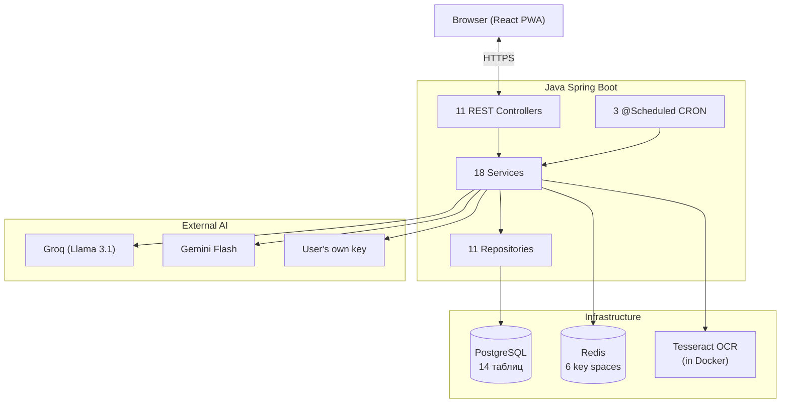
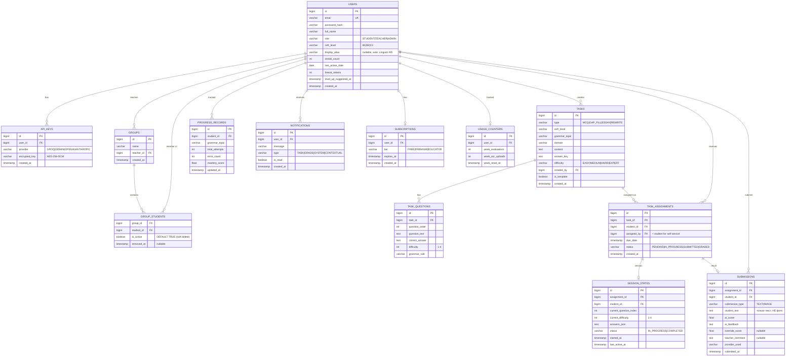
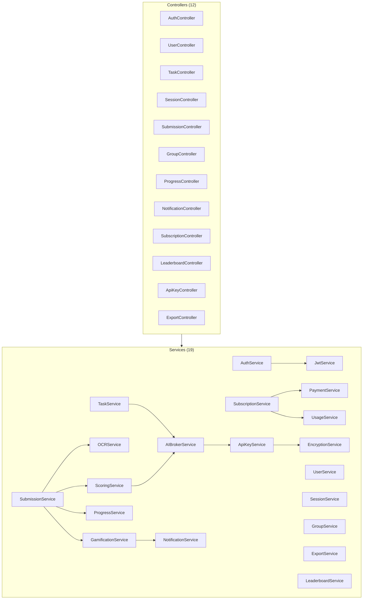
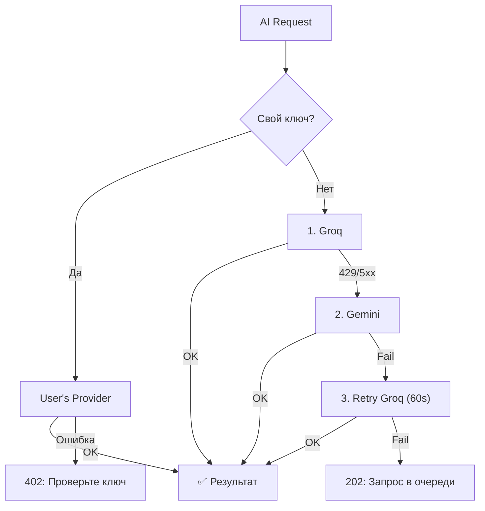

# 📚 Lingua Optima — Полная документация

> AI-платформа для изучения английского языка. Генерация заданий, проверка эссе, OCR домашних работ, адаптивное тестирование.  
> 📊 **Интерактивная презентация проекта**: [Открыть презентацию (presentation.html)](presentation.html)


### 🗂 Все файлы документации

| Раздел документации | Ссылка | Описание |
|---|---|---|
| **Главный обзор (README)** | [README.md](./README.md) | Архитектура, стек, БД, API, Безопасность |
| **Backend Specification** | [BACKEND.md](./BACKEND.md) | Все контроллеры, сервисы, репозитории, DTO, миграции, ошибки |
| **Frontend Specification** | [FRONTEND.md](./FRONTEND.md) | React-компоненты, Zustand-сторы, хуки, роутинг, дизайн-система |
| **AI & OCR Integration** | [AI_INTEGRATION.md](./AI_INTEGRATION.md) | Fallback-цепочка (Groq, Gemini, BYOK), промпты, Zero-Retention OCR, CAT |
| **DevOps & Deployment** | [DEVOPS.md](./DEVOPS.md) | Docker Compose, Nginx, CI/CD, переменные окружения `.env`, мониторинг |
| **Интерактивная презентация** | [presentation.html](presentation.html) | Полная интерактивная презентация проекта (Pitch Deck & Architecture) |
| **Doxygen API Reference** | [generated/html/index.html](./generated/html/index.html) | Скомпилированная Doxygen-документация по всем классам и методам |

---

## Оглавление

1. [Обзор проекта](#sec1)
2. [Ключевые решения](#sec2)
3. [Технологический стек](#sec3)
4. [Архитектура системы](#sec4)
5. [Файловая структура проекта](#sec5)
6. [База данных (ERD)](#sec6)
7. [REST API — Полная таблица](#sec7)
8. [Frontend — Страницы и Навигация](#sec8)
9. [Backend — Слои и Классы](#sec9)
10. [AI — Провайдеры и Промпты](#sec10)
11. [Подписки и Оплата (Stub)](#sec11)
12. [Безопасность](#sec12)
13. [DevOps и Деплой](#sec13)

---

## 1. Обзор проекта {#sec1}

**Lingua Optima** — платформа для изучения английского языка (уровни B1–C1 по CEFR), в которой:

- **Студенты** самостоятельно генерируют задания через AI, загружают фото домашних работ (OCR), пишут эссе и получают мгновенную обратную связь
- **Преподаватели** создают и деплоят задания группам, видят аналитику, корректируют AI-оценки, экспортируют отчёты

### 6 основных компонентов (из презентации)

| # | Компонент | Описание |
|---|---|---|
| 1 | Self-Service Task Generator | Генерация заданий через Llama 3.1 (Groq API) |
| 2 | Homework OCR Check | Загрузка фото → Tesseract OCR → AI проверка |
| 3 | AI Essay Scoring | Оценка по рубрике: TA, Coherence, LR, GR |
| 4 | Adaptive Tests | CAT-алгоритм: сложность подстраивается в реальном времени |
| 5 | Progress Dashboard | Трекинг грамматических пробелов, radar-чарт |
| 6 | Educator Portal | Деплой заданий, override оценок, экспорт |

---

## 2. Ключевые решения {#sec2}

| Вопрос | Решение | Обоснование |
|---|---|---|
| Лидерборд | **Только внутри группы** (нет глобального) | Приватность, фокус на группу учителя |
| Удаление студента из группы | **Soft delete** (`is_active=false`). Работы скрыты. При повторном добавлении — **восстанавливаются** | Учитель не теряет историю при возврате студента |
| Оплата | **Заглушка** — полная инфраструктура ошибок, но stub всегда одобряет | Для тестов; реальные платежи требуют юридической подготовки |
| AI провайдер | **Комбо:** Groq (задания) + Gemini (эссе) + Tesseract (OCR). Всё бесплатно | Бюджет $0 |
| Self-service задания | Автоматический self-assignment (`assigned_by = student`) | Унифицирует flow для студенческих и учительских заданий |
| Хранение изображений | **Zero-Retention OCR** — фото только в RAM, никогда не на диск | GDPR, биометрия рукописи |

---

## 3. Технологический стек {#sec3}


---

## 4. Архитектура системы {#sec4}



---

## 5. Файловая структура проекта {#sec5}

```
lingua_optima/
├── presentation.html                  — Оригинальная презентация
├── docker-compose.yml                 — PostgreSQL + Redis + Backend + Frontend
├── .env.example                       — Переменные окружения
├── .github/workflows/ci.yml           — CI/CD pipeline
│
├── docs/                              — Документация
│   ├── README.md                      — Мастер-документ (ЭТОТ ФАЙЛ)
│   ├── BACKEND.md                     — Детали бэкенда
│   ├── FRONTEND.md                    — Детали фронтенда
│   ├── AI_INTEGRATION.md             — AI провайдеры, промпты, OCR
│   └── DEVOPS.md                      — Docker, CI/CD, деплой
│
├── backend/                           — Java Spring Boot 3
│   ├── build.gradle
│   ├── Dockerfile
│   ├── src/main/java/com/linguaoptima/api/
│   │   ├── LinguaOptimaApplication.java
│   │   │
│   │   ├── config/                          ── Конфигурация
│   │   │   ├── SecurityConfig.java          — Filter chain, CORS, JWT filter
│   │   │   ├── JwtAuthenticationFilter.java — Извлечение Bearer → SecurityContext
│   │   │   ├── RedisConfig.java             — RedisTemplate, сериализаторы
│   │   │   ├── CorsConfig.java              — Allowed origins
│   │   │   ├── SchedulingConfig.java        — @EnableScheduling
│   │   │   └── WebConfig.java               — Multipart limit 10MB
│   │   │
│   │   ├── controller/                      ── REST API
│   │   │   ├── AuthController.java          — /register, /login, /refresh, /logout, /logout-all, /forgot-password
│   │   │   ├── UserController.java          — /me (GET, PUT, DELETE), /me/password
│   │   │   ├── TaskController.java          — /generate, /preview, /{id}/assign, /template
│   │   │   ├── SessionController.java       — /start, /active, /{id}/next-question, /{id}/answer, /{id}/complete
│   │   │   ├── SubmissionController.java    — /text, /image, /{id}, /my, /{id}/override
│   │   │   ├── GroupController.java         — CRUD группы + студенты
│   │   │   ├── ProgressController.java      — /me, /student/{id}, /group/{id}
│   │   │   ├── NotificationController.java  — /stream (SSE), /{id}/read
│   │   │   ├── SubscriptionController.java  — /me, /upgrade, /downgrade, /usage
│   │   │   ├── ApiKeyController.java        — CRUD AI-ключей
│   │   │   ├── LeaderboardController.java   — /group/{groupId} (ТОЛЬКО группа!)
│   │   │   └── ExportController.java        — /report/group/{id}, /report/student/{id}
│   │   │
│   │   ├── dto/
│   │   │   ├── request/                     ── 12 Request DTO
│   │   │   │   ├── RegisterRequest.java     — email, password, fullName, role
│   │   │   │   ├── LoginRequest.java        — email, password
│   │   │   │   ├── TaskParamsRequest.java   — cefrLevel, grammarTopic, domain, taskType, difficulty
│   │   │   │   ├── AssignTaskRequest.java   — groupIds[], dueDate
│   │   │   │   ├── TextSubmissionRequest.java — text, assignmentId, type
│   │   │   │   ├── OverrideRequest.java     — overrideScore, teacherComment
│   │   │   │   ├── AnswerRequest.java       — questionId, answer
│   │   │   │   ├── CreateGroupRequest.java  — name
│   │   │   │   ├── AddStudentRequest.java   — email
│   │   │   │   ├── CreateApiKeyRequest.java — provider, rawKey
│   │   │   │   ├── UpgradeRequest.java      — targetTier, paymentToken (stub)
│   │   │   │   └── ChangePasswordRequest.java — oldPassword, newPassword
│   │   │   │
│   │   │   └── response/                   ── 14 Response DTO
│   │   │       ├── TokenResponse.java       — accessToken, user info
│   │   │       ├── UserResponse.java        — id, email, fullName, role, cefrLevel, displayAlias, streakCount
│   │   │       ├── TaskResponse.java        — id, type, cefrLevel, content, questions
│   │   │       ├── QuestionResponse.java    — id, text, options, difficulty
│   │   │       ├── AnswerFeedbackResponse.java — isCorrect, correctAnswer, explanation
│   │   │       ├── SubmissionResultResponse.java — originalText, corrections, score, rubric
│   │   │       ├── ProgressResponse.java    — grammarTopic, attempts, errors, mastery
│   │   │       ├── GroupResponse.java       — id, name, studentCount, avgScore
│   │   │       ├── LeaderboardEntryResponse.java — rank, displayAlias, weeklyScore
│   │   │       ├── SubscriptionResponse.java — tier, expiresAt
│   │   │       ├── UsageResponse.java       — weekEvals, weekOcr, limits
│   │   │       ├── PaymentResultResponse.java — success, transactionId, errorCode
│   │   │       ├── NotificationResponse.java — id, message, type, isRead
│   │   │       └── ErrorResponse.java       — status, message, timestamp, errors[]
│   │   │
│   │   ├── domain/                          ── JPA Entities
│   │   │   ├── User.java                    — Роли, CEFR, streaks, displayAlias
│   │   │   ├── ApiKey.java                  — Зашифрованные AI-ключи
│   │   │   ├── Task.java                    — Задания (тип, контент, ключ)
│   │   │   ├── TaskQuestion.java            — Вопросы для CAT
│   │   │   ├── TaskAssignment.java          — Назначение задания студенту
│   │   │   ├── SessionState.java            — Состояние адаптивной сессии
│   │   │   ├── Submission.java              — Результат (AI + override)
│   │   │   ├── ProgressRecord.java          — Mastery по теме
│   │   │   ├── Group.java                   — Группы студентов (soft delete)
│   │   │   ├── Notification.java            — Уведомления
│   │   │   ├── Subscription.java            — FREE/PREMIUM/EDUCATOR
│   │   │   ├── UsageCounter.java            — Еженедельные счётчики
│   │   │   └── enums/                       — 10 enum-классов
│   │   │
│   │   ├── repository/                      ── 11 Spring Data JPA Repositories
│   │   │
│   │   ├── service/                         ── Бизнес-логика
│   │   │   ├── AuthService.java             — Регистрация, вход, JWT refresh
│   │   │   ├── JwtService.java              — Генерация/валидация JWT
│   │   │   ├── UserService.java             — Профиль, смена пароля, GDPR удаление
│   │   │   ├── TaskService.java             — Генерация через AI, деплой
│   │   │   ├── SessionService.java          — CAT адаптивный алгоритм
│   │   │   ├── SubmissionService.java       — Отправка текста/фото
│   │   │   ├── ScoringService.java          — Оценка грамматики и эссе
│   │   │   ├── OCRService.java              — Tesseract, Zero-Retention
│   │   │   ├── ProgressService.java         — Mastery, CEFR auto-leveling
│   │   │   ├── GroupService.java            — Группы, soft delete студентов
│   │   │   ├── NotificationService.java     — SSE, push
│   │   │   ├── GamificationService.java     — Streaks, freeze tokens
│   │   │   ├── SubscriptionService.java     — Тарифы, проверка квот
│   │   │   ├── PaymentService.java          — ЗАГЛУШКА (всегда success)
│   │   │   ├── UsageService.java            — Счётчики, лимиты
│   │   │   ├── ExportService.java           — PDF/CSV генерация
│   │   │   ├── ApiKeyService.java           — AES-256 шифрование ключей
│   │   │   ├── EncryptionService.java       — AES-256-GCM
│   │   │   ├── LeaderboardService.java      — Рейтинг внутри группы
│   │   │   └── ai/
│   │   │       ├── AIBrokerService.java     — Маршрутизация: выбор провайдера, fallback
│   │   │       ├── AIProvider.java          — Интерфейс: complete(prompt) → String
│   │   │       ├── GroqProvider.java        — Llama 3.1 70B (free tier)
│   │   │       ├── GeminiProvider.java      — Gemini 1.5 Flash (free tier)
│   │   │       ├── OpenAIProvider.java      — Для пользовательских ключей
│   │   │       └── AnthropicProvider.java   — Для пользовательских ключей
│   │   │
│   │   ├── scheduler/                       ── CRON-задачи
│   │   │   ├── StreakScheduler.java          — 01:00 ежедневно: проверка стриков
│   │   │   ├── UsageResetScheduler.java     — 00:00 понедельник: сброс счётчиков
│   │   │   └── NotificationScheduler.java   — 09:00 ежедневно: контекстные уведомления
│   │   │
│   │   ├── exception/                       ── Обработка ошибок
│   │   │   ├── GlobalExceptionHandler.java  — @ControllerAdvice
│   │   │   ├── OcrException.java            — 422: «Фото нечёткое»
│   │   │   ├── AIServiceException.java      — 503: «AI недоступен»
│   │   │   ├── QuotaExceededException.java  — 429: «Лимит исчерпан»
│   │   │   ├── PaymentException.java        — 402: ошибки оплаты
│   │   │   ├── ResourceNotFoundException.java — 404
│   │   │   ├── UnauthorizedException.java   — 401
│   │   │   └── ForbiddenException.java      — 403
│   │   │
│   │   └── util/
│   │       ├── PromptTemplates.java         — Шаблоны промптов для AI
│   │       └── CefrTopicRegistry.java       — Маппинг CEFR → темы
│   │
│   └── src/main/resources/
│       ├── application.yml
│       ├── application-dev.yml
│       └── application-prod.yml
│
└── frontend/                           — React + TypeScript + PWA
    ├── package.json
    ├── Dockerfile
    ├── vite.config.ts
    ├── tailwind.config.ts              — Цвета, шрифты
    ├── public/
    │   ├── manifest.json               — PWA manifest
    │   └── sw.js                       — Service Worker
    └── src/
        ├── main.tsx
        ├── App.tsx                     — Router + Layout
        ├── api/                        — 12 API-модулей (axios)
        │   ├── axiosInstance.ts        — Interceptors, silent JWT refresh
        │   ├── authApi.ts
        │   ├── taskApi.ts
        │   ├── sessionApi.ts
        │   ├── submissionApi.ts
        │   ├── progressApi.ts
        │   ├── groupApi.ts
        │   ├── notificationApi.ts
        │   ├── subscriptionApi.ts
        │   ├── apiKeyApi.ts
        │   ├── exportApi.ts
        │   └── leaderboardApi.ts
        ├── components/
        │   ├── common/                 — 10 общих компонентов
        │   │   ├── Navbar.tsx          — Logo, навигация, уведомления, аватар, остаток evals
        │   │   ├── Footer.tsx          — Privacy, Terms, Help
        │   │   ├── ProtectedRoute.tsx
        │   │   ├── RoleGuard.tsx
        │   │   ├── UpgradeWall.tsx     — Модалка при исчерпании лимита
        │   │   ├── OfflineBanner.tsx
        │   │   ├── CefrBadge.tsx
        │   │   ├── LoadingSpinner.tsx
        │   │   ├── Toast.tsx
        │   │   └── ConfirmDialog.tsx
        │   ├── student/                — 12 студенческих компонентов
        │   │   ├── Dashboard.tsx
        │   │   ├── GenerateTask.tsx
        │   │   ├── TaskView.tsx
        │   │   ├── AdaptiveSession.tsx — CAT + resume session
        │   │   ├── OcrSubmit.tsx
        │   │   ├── EssayEditor.tsx
        │   │   ├── AIReview.tsx
        │   │   ├── MyUnits.tsx
        │   │   ├── Progress.tsx
        │   │   ├── GroupLeaderboard.tsx — Только внутри группы!
        │   │   └── LevelUpModal.tsx
        │   ├── teacher/                — 5 учительских компонентов
        │   │   ├── TeacherDashboard.tsx
        │   │   ├── StudentGroups.tsx
        │   │   ├── ConfigureTask.tsx
        │   │   ├── SubmissionsReview.tsx
        │   │   └── ExportReports.tsx
        │   └── auth/
        │       ├── LoginPage.tsx
        │       └── ForgotPassword.tsx
        ├── hooks/                      — 6 кастомных хуков
        ├── store/                      — 4 Zustand store
        ├── types/                      — 8 TypeScript интерфейсов
        ├── utils/                      — Утилиты
        └── pages/                      — 6 route-level страниц
```

---

## 6. База данных (ERD) {#sec6}



---

## 7. REST API {#sec7}

| Метод | Путь | Роль | Описание |
|---|---|---|---|
| **Auth** | | | |
| POST | `/api/auth/register` | Public | Регистрация по Email и паролю |
| POST | `/api/auth/login` | Public | Вход по Email и паролю → JWT |
| POST | `/api/auth/google` | Public | Вход / регистрация через Google OAuth2 ID Token → JWT |
| POST | `/api/auth/refresh` | Cookie | Обновление access token |

| POST | `/api/auth/logout` | Any | Выход (удаление refresh из Redis) |
| DELETE | `/api/auth/logout-all` | Any | Выход со всех устройств |
| POST | `/api/auth/forgot-password` | Public | Запрос сброса пароля |
| **User** | | | |
| GET | `/api/users/me` | Any | Текущий профиль |
| PUT | `/api/users/me` | Any | Обновление профиля |
| PUT | `/api/users/me/password` | Any | Смена пароля |
| DELETE | `/api/users/me` | Any | Удаление аккаунта (GDPR) |
| **Tasks** | | | |
| POST | `/api/tasks/generate` | Any | Генерация задания через AI |
| POST | `/api/tasks/preview` | Any | Preview без сохранения |
| GET | `/api/tasks` | Any | Список заданий |
| GET | `/api/tasks/{id}` | Any | Получить задание |
| POST | `/api/tasks/{id}/assign` | TEACHER | Назначить группам |
| POST | `/api/tasks/template` | TEACHER | Сохранить как шаблон |
| **Sessions (CAT)** | | | |
| POST | `/api/sessions/start` | STUDENT | Начать адаптивный тест |
| GET | `/api/sessions/active` | STUDENT | Резюм прерванной сессии |
| GET | `/api/sessions/{id}/next-question` | STUDENT | Следующий вопрос |
| POST | `/api/sessions/{id}/answer` | STUDENT | Отправить ответ |
| POST | `/api/sessions/{id}/complete` | STUDENT | Завершить тест |
| **Submissions** | | | |
| POST | `/api/submissions/text` | STUDENT | Отправить текст/эссе |
| POST | `/api/submissions/image` | STUDENT | Загрузить фото (OCR) |
| GET | `/api/submissions/my` | STUDENT | Мои результаты |
| GET | `/api/submissions/{id}` | Any | Конкретный результат |
| PUT | `/api/submissions/{id}/override` | TEACHER | Корректировка оценки |
| **Groups** | | | |
| GET | `/api/groups` | TEACHER | Список групп |
| POST | `/api/groups` | TEACHER | Создать группу |
| POST | `/api/groups/{id}/students` | TEACHER | Добавить студента (или реактивировать) |
| DELETE | `/api/groups/{id}/students/{uid}` | TEACHER | Убрать студента (soft delete) |
| DELETE | `/api/groups/{id}` | TEACHER | Удалить группу |
| **Progress** | | | |
| GET | `/api/progress/me` | STUDENT | Мой прогресс |
| GET | `/api/progress/student/{id}` | TEACHER | Прогресс студента |
| GET | `/api/progress/group/{id}` | TEACHER | Прогресс группы |
| **Leaderboard** | | | |
| GET | `/api/leaderboard/group/{id}` | Any (в группе) | Рейтинг внутри группы |
| **Notifications** | | | |
| GET | `/api/notifications/stream` | Any | SSE соединение |
| GET | `/api/notifications/unread-count` | Any | Кол-во непрочитанных |
| PATCH | `/api/notifications/{id}/read` | Any | Пометить прочитанным |
| **Subscriptions** | | | |
| GET | `/api/subscriptions/me` | Any | Текущий тариф |
| POST | `/api/subscriptions/upgrade` | Any | Повышение тарифа (stub) |
| POST | `/api/subscriptions/downgrade` | Any | Понижение тарифа |
| GET | `/api/subscriptions/usage` | Any | Остаток evaluations |
| **API Keys** | | | |
| GET | `/api/api-keys` | Any | Список ключей |
| POST | `/api/api-keys` | Any | Добавить ключ |
| DELETE | `/api/api-keys/{id}` | Any | Удалить ключ |
| **Export** | | | |
| GET | `/api/export/report/group/{id}` | TEACHER | Отчёт по группе |
| GET | `/api/export/report/student/{id}` | TEACHER | Отчёт по студенту |

---

## 8. Frontend {#sec8}

### Routing

| Путь | Компонент | Роль | Описание |
|---|---|---|---|
| `/` | Landing | Public | Главная страница |
| `/login` | LoginPage | Public | Вход / Регистрация |
| `/forgot-password` | ForgotPassword | Public | Сброс пароля |
| `/dashboard` | Dashboard | STUDENT | Дашборд студента |
| `/generate` | GenerateTask | STUDENT | Генерация задания |
| `/task/:id` | TaskView | STUDENT | Выполнение задания |
| `/session/:id` | AdaptiveSession | STUDENT | CAT тест |
| `/ocr` | OcrSubmit | STUDENT | Загрузка фото |
| `/essay/:id` | EssayEditor | STUDENT | Написание эссе |
| `/review/:id` | AIReview | STUDENT | Результат AI проверки |
| `/units` | MyUnits | STUDENT | Библиотека заданий |
| `/progress` | Progress | STUDENT | Мой прогресс |
| `/leaderboard/:groupId` | GroupLeaderboard | STUDENT | Рейтинг группы |
| `/teacher` | TeacherDashboard | TEACHER | Панель учителя |
| `/teacher/groups` | StudentGroups | TEACHER | Управление группами |
| `/teacher/configure` | ConfigureTask | TEACHER | Создание задания |
| `/teacher/submissions` | SubmissionsReview | TEACHER | Проверка работ |
| `/teacher/export` | ExportReports | TEACHER | Экспорт отчётов |
| `/profile` | ProfilePage | Any | Профиль и настройки |
| `/subscription` | SubscriptionPage | Any | Управление подпиской |

---

## 9. Backend {#sec9}

### Слои и зависимости



### CRON-задачи

| Класс | Cron | Описание |
|---|---|---|
| `StreakScheduler` | `0 0 1 * * *` (01:00 ежедневно) | Проверка `last_active_date`. Freeze token или сброс streak |
| `UsageResetScheduler` | `0 0 0 * * MON` (00:00 понедельник) | Сброс `week_evaluations` и `week_ocr_uploads` |
| `NotificationScheduler` | `0 0 9 * * *` (09:00 ежедневно) | Контекстные push: «Вы ошибались в Passive Voice» |

---

## 10. AI {#sec10}

### Провайдеры

| Задача | Провайдер | Лимит (free) | Fallback |
|---|---|---|---|
| Генерация заданий | Groq (Llama 3.1 70B) | 14 400 req/day | → Gemini → retry → queue |
| Оценка эссе | Gemini 1.5 Flash | 1 500 req/day | → Groq → retry → queue |
| OCR | Tesseract (tess4j, локально) | ∞ | OcrException → 422 |
| Свой ключ | OpenAI / Anthropic / Groq / Gemini | По лимиту юзера | Ошибка ключа → 402 |

### Fallback Chain



---

## 11. Подписки {#sec11}

### Тарифы

| | FREE | PREMIUM | EDUCATOR |
|---|---|---|---|
| AI evaluations | 10/неделя | ∞ | ∞ |
| OCR загрузки | 3/неделя | ∞ | ∞ |
| CEFR уровни | B1, B2 | B1, B2, C1 | B1, B2, C1 |
| Прогресс (полный) | ✗ | ✓ | ✓ |
| Группы | — | — | до 200 студентов |
| Deploy заданий | — | — | ✓ |
| Override оценок | — | — | ✓ |
| Экспорт отчётов | — | — | ✓ |
| API доступ | — | — | ✓ |

### Заглушка оплаты

`PaymentService.processPayment()` **всегда** возвращает `{success: true, transactionId: "STUB-xxx"}`.

Инфраструктура ошибок полностью готова:

| Код ошибки | HTTP | Когда |
|---|---|---|
| `PAYMENT_FAILED` | 402 | Общая ошибка |
| `CARD_DECLINED` | 402 | Карта отклонена |
| `INSUFFICIENT_FUNDS` | 402 | Недостаточно средств |
| `EXPIRED_CARD` | 402 | Срок карты истёк |
| `NETWORK_ERROR` | 503 | Ошибка сети платёжной системы |
| `PROVIDER_ERROR` | 503 | Ошибка на стороне провайдера |

Stub никогда не вернёт эти ошибки, но фронтенд и `GlobalExceptionHandler` готовы их обработать.

---

## 12. Безопасность {#sec12}

| Угроза | Защита |
|---|---|
| XSS | Access JWT в JS memory (не localStorage). React auto-escape. CSP headers |
| CSRF | SameSite=Strict на refresh cookie |
| Утечка API ключей | AES-256-GCM шифрование, расшифровка только в RAM на время вызова |
| Биометрия | Zero-Retention OCR: byte[] → process → null → GC |
| Перебор паролей | BCrypt(12), rate limit: 10 попыток / 15 мин (Redis) |
| Изоляция данных | RBAC: учитель видит только своих студентов (группы + `is_active`) |
| GDPR | DELETE /users/me: анонимизация submissions, удаление PII |

### Redis Key Space

| Ключ | Тип | TTL | Назначение |
|---|---|---|---|
| `refresh_tokens:{userId}:{device}` | STRING | 30 дней | Hash refresh-токена |
| `rate_limit:{userId}:ai` | STRING | 24 часа | Счётчик AI-запросов |
| `rate_limit:{userId}:auth` | STRING | 15 мин | Попытки входа |
| `ai_cache:{sha256(prompt)}` | STRING | 1 час | Кеш одинаковых промптов |
| `notifications:{userId}` | LIST | 7 дней | Pending push для SSE |

---

## 13. DevOps {#sec13}

### Локальный запуск

```bash
# 1. Поднять БД
docker compose up -d db redis

# 2. Backend
cd backend && ./gradlew bootRun

# 3. Frontend
cd frontend && npm install && npm run dev

# Доступ: localhost:5173 (front), localhost:8080 (API)
```

### Docker Compose (Production)

```bash
docker compose up --build
```

Сервисы: `backend` (Java + Tesseract), `frontend` (Nginx), `db` (PostgreSQL), `redis`.

---

## 📎 Документация проекта и интерактивные материалы

| Документ | Формат | Описание |
|---|---|---|
| [Интерактивная презентация проекта (Pitch Deck)](presentation.html) | HTML | Интерактивная презентация концепции, бизнес-модели, UI/UX и архитектуры |
| [README.md (Главный документ)](./README.md) | Markdown | Мастер-индекс, общее руководство и сводная спецификация |
| [BACKEND.md](./BACKEND.md) | Markdown | Детальное описание всех Java-классов, полная API-таблица, ERD, Redis, CRON, exceptions |
| [FRONTEND.md](./FRONTEND.md) | Markdown | Компоненты, хуки, Zustand-хранилища, роутинг, PWA, дизайн-система |
| [AI_INTEGRATION.md](./AI_INTEGRATION.md) | Markdown | Провайдеры, промпты, fallback-цепочка, кеширование, OCR pipeline, CAT алгоритм |
| [DEVOPS.md](./DEVOPS.md) | Markdown | Docker, Dockerfile, CI/CD, Flyway-миграции, мониторинг, security checklist |
| [Doxygen Generated API Reference](./generated/html/index.html) | HTML (Doxygen) | Автоматически скомпилированная Doxygen-документация всех классов и функций |
